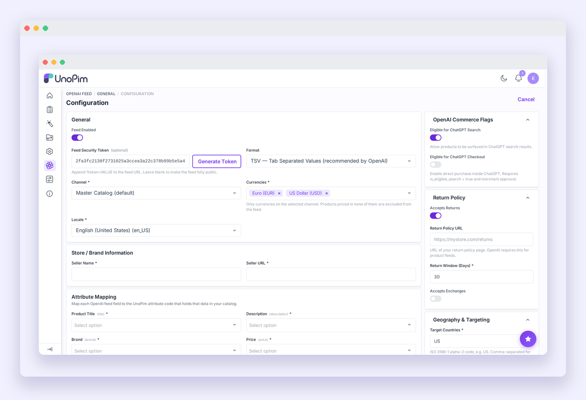
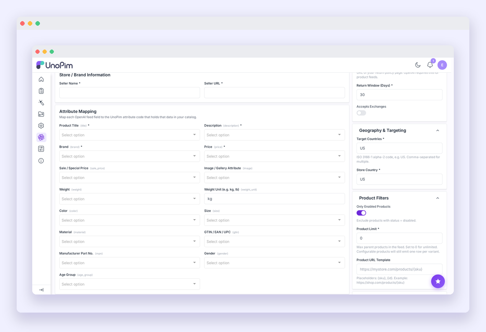
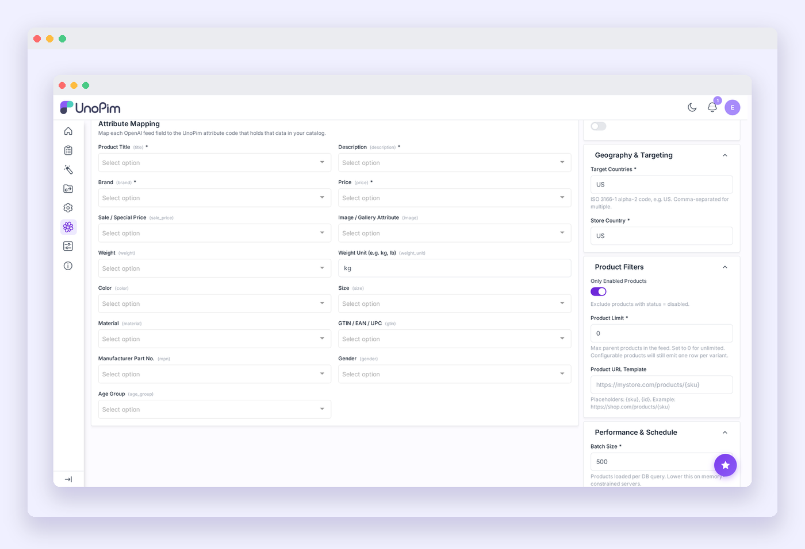

# Configuration

Navigate to **Admin Panel → OpenAI Feed → Configuration** to open the settings form. All settings are saved when you click **Save** at the bottom.

---

## General

| Field | Description |
|---|---|
| **Feed Enabled** | Toggle the feed on or off. The public URL returns a 403 when the feed is disabled. |
| **Feed Security Token** | A 48-character hex token appended to the public feed URL. Click **Generate Token** to create one. Leave blank to make the feed fully public (not recommended for production). |
| **Format** | Output format: **TSV** (recommended by OpenAI) or **JSON**. |
| **Channel** | The UnoPim channel whose products are included in the feed. |
| **Currencies** | One or more currencies. Each product is priced in the first currency it has a price for. Products with no price in any selected currency are excluded from the feed. |
| **Locale** | Locale used for translatable attributes (product name, description, etc.). |

---

## Store / Brand Information

This information is embedded in every row of the feed for attribution and return policy purposes.

| Field | Description |
|---|---|
| **Seller Name** | Your store or brand name. Maximum 70 characters. |
| **Seller URL** | The homepage URL of your store (e.g. `https://mystore.com`). |

---

## OpenAI Commerce Flags

Controls where your products appear in ChatGPT.

| Field | Description |
|---|---|
| **Eligible for ChatGPT Search** | When on, products can surface in ChatGPT conversational search responses. |
| **Eligible for ChatGPT Checkout** | When on, users can purchase directly from within ChatGPT. Requires `is_eligible_search` to also be enabled. |

---

## Return Policy

OpenAI includes return policy details on product pages shown to ChatGPT users.

| Field | Description |
|---|---|
| **Accepts Returns** | Toggle on if your store accepts returns. |
| **Return Policy URL** | Direct link to your return policy page. Required by OpenAI for product feeds. |
| **Return Window (Days)** | Number of days a customer has to initiate a return (default: 30). |
| **Accepts Exchanges** | Toggle on if your store accepts exchanges. |

---

## Geography & Targeting

| Field | Description |
|---|---|
| **Target Countries** | Comma-separated ISO 3166-1 alpha-2 country codes where your products are available (e.g. `US,CA,GB`). |
| **Store Country** | The country your store is based in (e.g. `US`). |

---

## Attribute Mapping

Map each OpenAI feed field to the UnoPim attribute that holds that data in your catalog.

| OpenAI Field | Description | Required |
|---|---|---|
| **Product Title** | Product name shown in ChatGPT results. | Yes |
| **Description** | Product description (HTML stripped, max 5,000 characters). | Yes |
| **Brand** | Brand or manufacturer name. | Yes |
| **Price** | Regular selling price. | Yes |
| **Sale / Special Price** | Discounted price, if applicable. | — |
| **Image / Gallery Attribute** | Main product image or gallery attribute. | Yes |
| **Weight** | Product weight value. | — |
| **Weight Unit** | Unit for weight (e.g. `kg`, `lb`). Defaults to `kg`. | — |
| **Color** | Color super-attribute for configurable products. Used to build `variant_dict`. | For variants |
| **Size** | Size super-attribute for configurable products. Used to build `variant_dict`. | For variants |
| **Material** | Product material attribute. | — |
| **GTIN / EAN / UPC** | Global trade item number (barcode). Strongly recommended. | — |
| **Manufacturer Part No.** | MPN for the product. | — |
| **Gender** | Target gender (e.g. `male`, `female`, `unisex`). | — |
| **Age Group** | Target age group (e.g. `adult`, `kids`). | — |

> [!TIP]
> For configurable products, map **Color** and **Size** to your actual super-attribute codes. These are used to populate the `variant_dict` field that ChatGPT uses to show variant selectors on product listings.

Any field left unmapped is omitted from the feed output.

---

## Product Filters

| Field | Description |
|---|---|
| **Only Enabled Products** | When on, products with status = disabled are excluded from the feed. |
| **Product Limit** | Maximum number of parent products in the feed. Set to `0` for no limit. Configurable products still emit one row per variant regardless of this limit. |
| **Product URL Template** | Template for building product page URLs. Use `{sku}` or `{id}` as placeholders (e.g. `https://mystore.com/products/{sku}`). |

---

## Performance & Schedule

| Field | Description |
|---|---|
| **Batch Size** | Number of products loaded per database query (10–5,000). Default is 500. Lower this value if you see memory errors on large catalogs. |
| **Cron Interval (hours)** | How often the feed regenerates automatically via the Laravel scheduler (1–168 hours). Default is 6 hours. |

> [!NOTE]
> The extension registers its own cron entry automatically via the service provider. You do not need to edit `bootstrap/app.php`. The only server-level requirement is that `php artisan schedule:run` runs every minute — see [Automated generation](./feed-generation#automated-generation-cron).

---

Click **Save** to apply all settings. The next feed generation will use the updated configuration.
