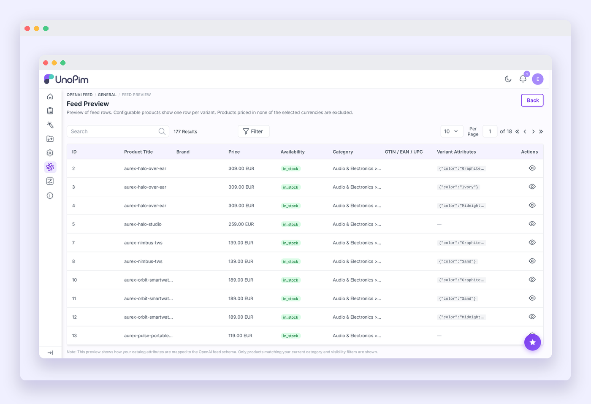
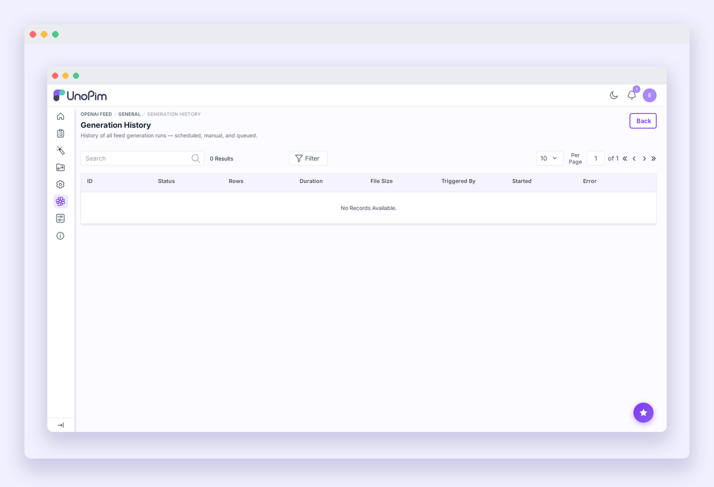

# Generating & Submitting the Feed

## Dashboard

Navigate to **Admin Panel → OpenAI Feed → General** to open the feed dashboard.


The dashboard shows:

- **Feed Status** — whether the feed is currently enabled or disabled.
- **Last Generated** — timestamp of the most recent successful generation.
- **File Size** — size of the currently live feed file.
- **Last Run** — timestamp of the last generation attempt (success or failure).
- **Recent Generation History** — the last 5 generation runs with status, rows exported, duration, file size, and trigger source.

The status updates automatically via polling — you can watch a generation in progress without refreshing the page.

---

## Generating the feed

### Manual generation

Click **Generate Now** on the dashboard. The job is dispatched to the queue and the history table updates in real time as it runs.

> [!NOTE]
> Make sure a queue worker is running before triggering a manual generation (see [Installation → Step 6](./installation#step-6-start-the-queue-worker)). If the queue driver is set to `sync`, the generation runs inline and may time out on large catalogs.

---

### Automated generation (cron)

The extension registers a scheduled task automatically. To enable it, add the following line to your server's crontab:

```bash
* * * * * cd /path-to-your-unopim && php artisan schedule:run >> /dev/null 2>&1
```

The scheduler runs every minute and triggers feed regeneration at the interval you configured in **Configuration → Cron Interval**. The cron task uses `withoutOverlapping()` so a slow generation on a large catalog will never trigger a second run before the first finishes.

---

### CLI generation

Trigger generation directly from the command line:

```bash
# Run inline (no queue required)
php artisan openai-feed:generate

# Dispatch to the background queue
php artisan openai-feed:generate --queue

# Preview 5 rows without writing a file
php artisan openai-feed:generate --dry-run

# Generate and print the public feed URL
php artisan openai-feed:generate --show-url
```

| Option | Description |
|---|---|
| *(none)* | Runs feed generation synchronously in the terminal. |
| `--queue` | Dispatches the generation job to the queue and returns immediately. |
| `--dry-run` | Prints a 5-row preview table without writing the feed file. Useful for verifying attribute mapping before a full run. |
| `--show-url` | After generation, prints the full public feed URL with your security token. |

---

## Feed preview

Navigate to **Admin Panel → OpenAI Feed → General → Preview Feed** to browse the products that will be included in the feed.



The preview datagrid shows each product row with its mapped values — Item ID, Product Title, Brand, Price, Availability, Category, GTIN, and Variant Attributes. Click the eye icon on any row to see the full field-by-field mapping for that product or variant.

Use the preview to verify your attribute mapping is correct before submitting the feed URL to ChatGPT.

> [!TIP]
> If products are missing from the preview, check **Configuration → Product Filters**. Products with no price in any selected currency are silently excluded, as are disabled products when **Only Enabled Products** is turned on.

---

## Generation history

Navigate to **Admin Panel → OpenAI Feed → General → View All** to see the full generation history.



| Column | What to look for |
|---|---|
| **Status** | Green = success; red = failed. Expand a failed row to see the error message. |
| **Rows** | A sudden drop in rows may indicate a filter change or products being disabled. |
| **Duration** | Steady growth over time = catalog is growing. A spike = database slowdown. |
| **File Size** | Useful to confirm the feed file was not truncated. |
| **Triggered By** | `manual`, `cron`, or `api`. |

---

## Submitting to ChatGPT

Once the feed has been generated successfully:

1. Run the following to get your public feed URL:
   ```bash
   php artisan openai-feed:generate --show-url
   ```
   The URL will look like:
   ```
   https://your-domain.com/openai-feed/products?token=<your-token>
   ```

2. Go to [chatgpt.com/merchants](https://chatgpt.com/merchants) and sign in.
3. Add a new product feed and paste the URL.
4. ChatGPT will fetch and index your products. Indexing may take some time after the initial submission.

> [!NOTE]
> The token in the URL is the same token shown in **Configuration → Feed Security Token**. If you regenerate the token in settings, update the URL in the ChatGPT Merchant Portal immediately — the old URL will stop working.

---

## Feed status endpoint

A lightweight status endpoint is available for uptime monitoring or integration checks:

```
GET /openai-feed/status
```

Returns JSON with the feed's enabled state, last generation time, file size, format, channel, and locale. No token is required.

---

## Troubleshooting

**Generate Now button does nothing / generation stays in "Running" indefinitely**
Check that a queue worker is running: `php artisan queue:work --queue=system,completeness,default`. Check the Laravel log at `storage/logs/laravel.log` for job errors.

**Feed URL returns 403**
The feed is either disabled in settings, or the token in the URL does not match the one saved in **Configuration → Feed Security Token**.

**Products are missing from the feed or preview**
Check **Configuration → Product Filters**: disabled products are excluded when *Only Enabled Products* is on; products without a price in any selected currency are always excluded; the *Product Limit* may be cutting the catalog short.

**Attribute values are empty in the preview**
Open **Configuration → Attribute Mapping** and confirm each field points to an attribute that has data for your products. Use the **dry-run** CLI option to inspect a small sample without generating the full file.

**Memory errors during generation on large catalogs**
Lower the **Batch Size** in **Configuration → Performance & Schedule**. Try 100–200 for catalogs over 50,000 SKUs, and make sure the job runs via `--queue` with a worker that has a sufficient `--memory` limit.
