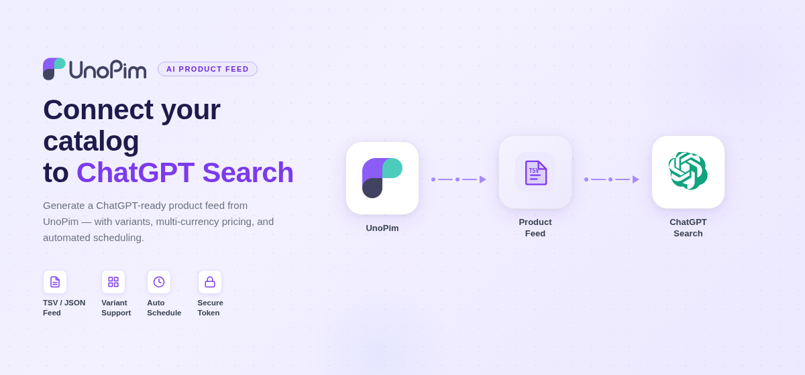

# AI Product Feed (OpenAI / ChatGPT)

 

  

 

The **AI Product Feed** extension connects your UnoPim product catalog to **ChatGPT Search and Commerce**. It generates a feed file in TSV or JSON format, protects it with a secure token, and serves it at a public URL you register at `chatgpt.com/merchants`. Once registered, your products can surface directly in ChatGPT shopping responses and checkout flows.

---

## How it works

1. Configure the feed once — channel, locale, currencies, seller info, and attribute mapping.
2. Generate the feed manually, on a schedule, or from the CLI.
3. Submit the public feed URL (with your security token) to the ChatGPT Merchant Portal.
4. ChatGPT fetches and indexes your products. Your catalog stays current as the feed regenerates automatically.

---

## Features

- **Multi-format** — TSV (recommended by OpenAI) or JSON output.
- **Variant support** — configurable products are flattened to one row per variant, with a `variant_dict` field for each attribute combination.
- **Multi-currency** — select multiple currencies; products are priced in the first matching currency.
- **ChatGPT eligibility flags** — control whether products appear in ChatGPT Search, ChatGPT Checkout, or both.
- **Secure token** — a 48-character cryptographic token protects the feed URL; regenerate at any time.
- **Attribute mapping** — map any UnoPim attribute to OpenAI's required fields (title, description, brand, price, GTIN, image, and more).
- **Product filters** — include only enabled products, exclude specific product types, set a product limit.
- **Dashboard** — real-time status with feed size, last generation time, and the last 5 generation runs.
- **Generation history** — full audit log of every run: status, rows exported, duration, file size, and trigger source.
- **Feed preview** — browse how products map to feed columns before submitting to ChatGPT.
- **Flexible generation** — manual from the admin panel, automated via cron, or on-demand from the CLI.
- **Performance** — configurable batch size processes large catalogs without memory issues.

---

## Requirements

| Requirement | Version |
|---|---|
| UnoPim | 3.0.0 |
| PHP | 8.4.1 or higher |
| Laravel | 13.x |
| Database | MySQL 8.0+ or PostgreSQL 16+ |
| Queue driver | `database` or `redis` recommended for background generation |

---

## In this guide

- [Installation](./installation)
- [Configuration](./configuration)
- [Generating & Submitting the Feed](./feed-generation)
