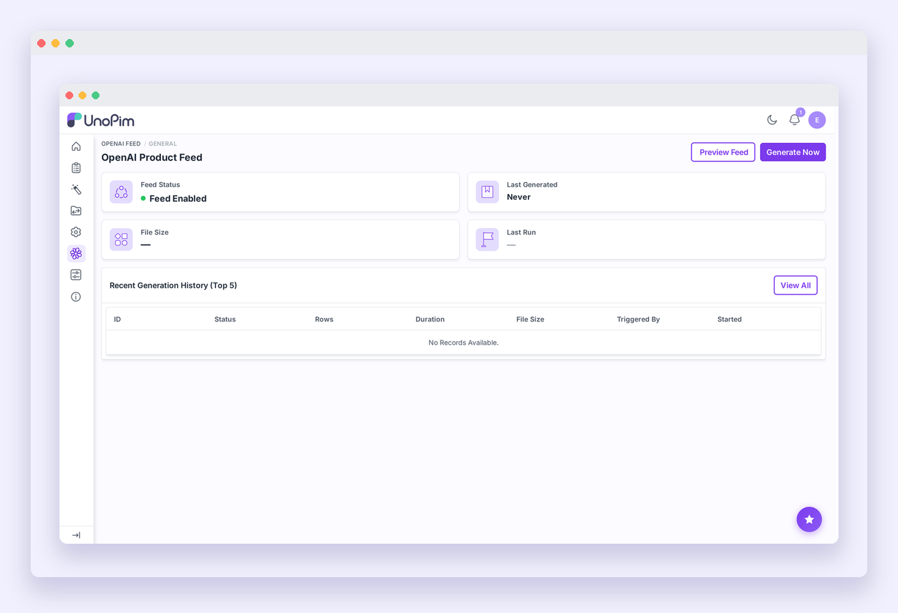

# Installation

Follow the steps below to install the AI Product Feed extension. You will need terminal access to your server.

---

## Step 1 — Place the package files

Unzip the extension archive. Inside you will find a `packages` folder — merge it into the **root directory** of your UnoPim project so the package ends up at:

```
packages/Webkul/OpenAIFeed/
```

---

## Step 2 — Register the service provider

Open `bootstrap/providers.php` and add the service provider:

```php
use Webkul\OpenAIFeed\Providers\OpenAIFeedServiceProvider;

return [
    // ...existing providers...
    OpenAIFeedServiceProvider::class,
];
```

> [!NOTE]
> This registers `OpenAIFeedServiceProvider` in Laravel so the extension can load its routes, views, database migrations, and menu entries during application startup.

---

## Step 3 — Update Composer autoload

Open `composer.json` and add the following under `autoload > psr-4`:

```json
"Webkul\\OpenAIFeed\\": "packages/Webkul/OpenAIFeed/src"
```

> [!TIP]
> This configures PSR-4 autoloading so PHP can resolve classes under the `Webkul\OpenAIFeed` namespace from the package directory without a full Composer install.

---

## Step 4 — Run the setup commands

Run these commands one at a time. Wait for each to complete before moving to the next.

**Refresh the Composer autoloader**
```bash
composer dump-autoload
```

**Run database migrations**
```bash
php artisan migrate
```

**Run the installer**
```bash
php artisan openai-feed:install
```

**Clear the application cache**
```bash
php artisan optimize:clear
```

| Command | Purpose |
|---|---|
| `composer dump-autoload` | Regenerates Composer's autoloader mapping to include the newly added namespace. |
| `php artisan migrate` | Creates the `openai_feeds` and `openai_feed_logs` database tables. |
| `php artisan openai-feed:install` | Publishes assets, initialises the feed record, and generates a default security token. |
| `php artisan optimize:clear` | Clears all cached files (bootstrap, config, routes, views) to load the new extension. |

---

## Step 5 — Build front-end assets

If UI elements or icons are missing, build the package assets from inside the package directory:

```bash
cd packages/Webkul/OpenAIFeed
npm install && npm run build
```

| Command | Purpose |
|---|---|
| `npm install` | Installs the front-end build dependencies for the OpenAI Feed package. |
| `npm run build` | Compiles the Vite/Vue assets and copies them to the public directory. |

---

## Step 6 — Start the queue worker

Feed generation runs as a queued background job. Make sure a queue worker is running:

```bash
php artisan queue:work --queue=system,completeness,default
```

> [!NOTE]
> If your queue driver is set to `sync`, feed generation runs inline immediately without needing a worker. A real driver (`database` or `redis`) is recommended for large catalogs to avoid HTTP timeouts.

---

## Verify the installation

Log in to your UnoPim admin panel. An **OpenAI Feed** entry should appear in the left sidebar. Click it — the **OpenAI Product Feed** dashboard opens, confirming the extension is installed and ready to configure.



If the menu item does not appear, run `php artisan optimize:clear` again and hard-refresh the page.
