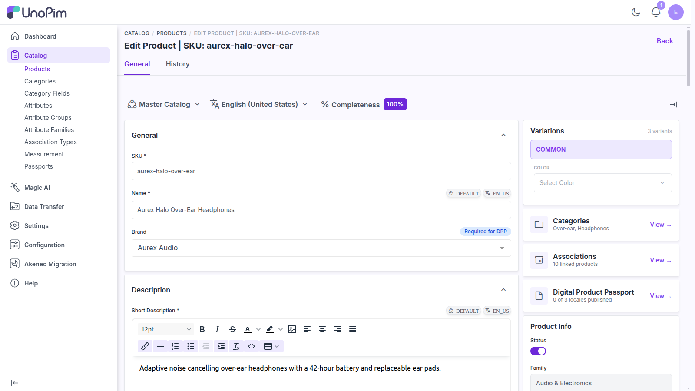

# Entity Mapping

This page describes what each Akeneo entity becomes in UnoPim — the field-level detail behind the [entity list](./run-migration#the-entities). Read it when you want to know exactly where your data will land, or when the Job Tracker log says a record was skipped and you need to know why.

Entities always import in **dependency order**, no matter which order you tick them in, so prerequisites exist before the records that need them.

---

## Locales

Akeneo locales become UnoPim locales, matched on **code**.

| Akeneo | UnoPim |
|---|---|
| `code` | `code` |
| `enabled` | Status (enabled / disabled) |

An existing UnoPim locale is never replaced — only its status is brought in line with Akeneo.

---

## Currencies

Akeneo currencies become UnoPim currencies, matched on **code** (upper-cased).

| Akeneo | UnoPim |
|---|---|
| `code` | `code`, upper-cased |
| `symbol` | Symbol — falls back to the code when Akeneo has none |
| `enabled` | Status (enabled / disabled) |

---

## Attributes

Attributes come across with their labels, flags, and — for select types — their full option list.

### Type mapping

| Akeneo type | UnoPim type |
|---|---|
| `pim_catalog_identifier` | `text` |
| `pim_catalog_text` | `text` |
| `pim_catalog_textarea` | `textarea` |
| `pim_catalog_simpleselect` | `select` |
| `pim_catalog_multiselect` | `multiselect` |
| `pim_catalog_boolean` | `boolean` |
| `pim_catalog_date` | `date` |
| `pim_catalog_number` | `text` *(with numeric validation)* |
| `pim_catalog_metric` | `text` *(with numeric validation)* |
| `pim_catalog_price` | `price` |
| `pim_catalog_price_collection` | `price` |
| `pim_catalog_image` | `image` |
| `pim_catalog_file` | `file` |
| `pim_catalog_asset_collection` | `asset` |
| `pim_catalog_reference_data_simpleselect` | `select` |
| `pim_catalog_reference_data_multiselect` | `multiselect` |
| `pim_catalog_table` | **Not supported — skipped** |
| `akeneo_reference_entity` | **Not supported — skipped** |
| `akeneo_reference_entity_collection` | **Not supported — skipped** |

An attribute with an unsupported type is skipped and the reason is written to the run log, so you can decide how to model it in UnoPim by hand.

### Flags

| Akeneo | UnoPim |
|---|---|
| `localizable` | Value per locale |
| `scopable` | Value per channel |
| `unique` | Is unique |
| `useable_as_grid_filter` | Is filterable |
| `wysiwyg_enabled` | Enable WYSIWYG |
| `sort_order` | Position |

### Existing attributes keep their type

If an attribute code already exists in UnoPim with a **different** type, the import updates its labels and flags but **keeps the existing type**, and logs that it did:

```
[attributes] 'weight' already exists as 'measurement' in UnoPim; keeping that type
instead of 'text' so stored values stay valid.
```

This protects data you have already stored — most importantly UnoPim **measurement** attributes, which Akeneo describes as plain metric attributes.

> [!TIP]
> If an earlier import rewrote a measurement attribute's type before this safeguard existed, `php artisan akeneo-migration:fix-attribute-types` restores it. See [Artisan Commands](./commands#akeneo-migration-fix-attribute-types).

### Options

Select and multiselect options are synced with their labels and sort order. Option codes are matched **case-insensitively**, and UnoPim's own spelling of the code is kept — so an Akeneo option `RED` resolves to an existing UnoPim option `red` rather than creating a duplicate.

---

## Attribute Groups

Akeneo attribute groups become UnoPim attribute groups, with their labels, matched on code.

---

## Attribute Families

Akeneo families become UnoPim attribute families. The family's attributes are placed into the attribute groups they belong to, in Akeneo's order.

- A family whose attributes resolve to **no** attribute groups is **skipped**, with a log line naming it. Import **Attributes** and **Attribute Groups** first and it will import cleanly.
- Re-importing an existing family **adds** attributes it does not yet have. It does not remove attributes you added in UnoPim.

---

## Categories

The Akeneo category tree becomes the UnoPim category tree.

- Records are sorted **parents-first** before importing, so a child never arrives before its parent.
- Akeneo labels become locale-specific category values.
- The parent link is resolved by code, preserving the shape of the tree.

---

## Channels

Akeneo channels (scopes) become UnoPim channels.

| Akeneo | UnoPim |
|---|---|
| `code` | `code` |
| `labels` | Channel name, per locale |
| `category_tree` | Root category — resolved by code |
| `locales` | The channel's locales |
| `currencies` | The channel's currencies, upper-cased |

If Akeneo's category tree has not been imported yet, the channel falls back to an existing root category rather than failing.

> [!NOTE]
> Import **Locales**, **Currencies**, and **Categories** before **Channels** — the default dependency order already does this for you.

---

## DAM Assets

*Available only when the [UnoPim DAM extension](https://packagist.org/packages/unopim/dam) is installed.*

Each Akeneo **asset family** becomes a directory in the DAM library, and each asset in it is downloaded and stored there.

- The file used is the asset family's **attribute as main media**.
- An asset with no main media is skipped, and logged.
- A media file that fails to download is skipped, and logged with the error.

Assets are processed in small batches (10 by default) because each one is a file download.

---

## Configurable Products (Akeneo Product Models)

Akeneo product models become UnoPim configurables bound to a **variant structure** — the object UnoPim 3.0 uses to describe a variant tree.

<br>

<div align="center">
  
</div>

<br>

### How the tree is built

An Akeneo family variant describes one or two `variant_attribute_sets`, each naming the **axes** that distinguish records at that depth. UnoPim expresses the same idea as a variant structure with `level_1` / `level_2` axes. The two line up one for one:

| Akeneo | UnoPim |
|---|---|
| Product model with **no parent** | `configurable`, bound to the variant structure |
| Product model **with a parent** (sub-model) | `variant_group` — the middle tier of a two-level tree |
| Product under a model | Variant, attached to the configurable or the variant group |
| Family variant | Variant structure — its axes and attribute placements |

Because the configurable points at a structure, it opens in UnoPim's **variant editor**. A configurable that only carried axes in the legacy pivot falls back to the pre-structure editor instead.

### Rules the importer follows

- **One structure per family variant.** Configurables migrated from the same Akeneo family variant share a structure rather than getting one each.
- **Structures with products are never rewritten.** If a structure already has products hanging off it, its levels and axes are left exactly as they are, and the run log says so.
- **Unusable axes are dropped, and logged.** An Akeneo axis that UnoPim will not accept as a variant axis is skipped. If a family variant ends up with **no** usable axis, no structure is created and the configurable falls back to carrying its axes in the legacy pivot — so it still renders, just in the older editor.
- **Flattened sub-models still work.** If a structure came out one level deep, a sub-model is mapped onto its root and remembered there, so the variants underneath still find a parent.
- **Out-of-order pages are handled.** Akeneo pages product models in no particular order. If a sub-model is read before its root, the root is fetched and imported on the spot rather than dropping the whole branch.
- **Re-running repairs.** The structure link and the axis pivot are rewritten on every run, so a tree migrated before this mapping existed is fixed by importing it again — no need to delete anything first.

> [!TIP]
> For configurables that were migrated **before** variant structures existed, `php artisan akeneo-migration:backfill-variant-structures` builds structures from what is already in the database. See [Artisan Commands](./commands#akeneo-migration-backfill-variant-structures).

---

## Products

Akeneo products become UnoPim products — simple ones on their own, and variants attached to the configurable or variant group they belong to.

### Values and scope

Akeneo's `locale` and `scope` on each value map directly onto UnoPim's value buckets:

| Akeneo value has | Stored in UnoPim as |
|---|---|
| neither locale nor scope | `common` |
| locale only | `locale_specific` |
| scope only | `channel_specific` |
| both | `channel_locale_specific` |

### Value conversion

| Type | How it is stored |
|---|---|
| **Price** | A map of currency → amount. |
| **Select** | The matching UnoPim option code (matched case-insensitively). An option with no match is left unresolved and logged. |
| **Multiselect** | A comma-separated list of resolved option codes. |
| **Boolean** | A true/false value. |
| **Date** | A **calendar date** (`YYYY-MM-DD`) — the time part of an Akeneo timestamp is dropped, which is what UnoPim's date attributes and the search index expect. |
| **Metric / measurement** | When the UnoPim attribute is a measurement attribute, the amount **and its unit** are kept as a measurement value. Otherwise only the amount is stored. |
| **Asset collection** | The matching DAM asset IDs, resolved through the recorded asset mappings. |
| **Image / file / gallery** | Downloaded from Akeneo and stored in UnoPim's public media storage. |

### Associations

Akeneo product associations are carried across onto UnoPim's product relations:

| Akeneo association type | UnoPim relation |
|---|---|
| `UPSELL`, `UP_SELL`, `UP_SELLS` | Up-sells |
| `CROSS_SELL`, `CROSSSELL`, `X_SELL` | Cross-sells |
| anything else | Related products |

Both associated products and associated product models are included. If a mapping for the Akeneo association type has been recorded, that mapping wins over the naming rule above.

### Categories

A product's Akeneo categories are applied by code, so the product lands in the same places in the tree it occupied in Akeneo.

### Skipped rows

| Log message | What it means |
|---|---|
| `skipped row N: missing identifier` | The Akeneo record has no identifier. |
| `'SKU' skipped: family not found` | The product's family has not been imported yet — run **Attribute Families** first. |
| `option 'X' has no match in attribute 'Y'` | The option code does not exist in UnoPim. Re-run **Attributes** to sync its options. |
| `media 'X' download failed` | The media file could not be fetched from Akeneo. |

---

## Mappings

Every record imported is recorded as a mapping of the Akeneo code to the UnoPim record it became. Those mappings are what let the plugin resolve relationships on later runs — a product's family, its categories, its DAM assets, its association types.

This is why you can migrate in **stages**: import structure today and products next week, and the products will still find everything they point at.

---

## Next Steps

- [Run a migration](./run-migration)
- [Artisan commands](./commands)
- [Migration history](./migration-history)
