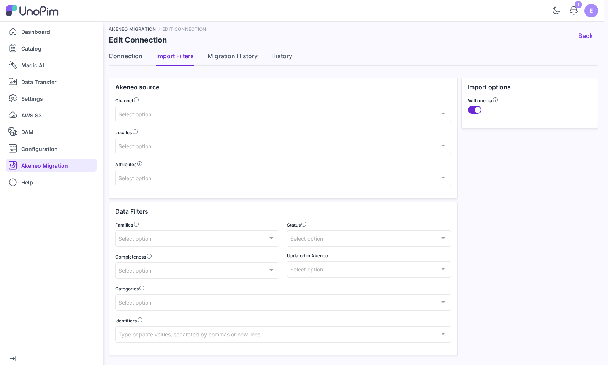

# Import Filters

By default a migration imports **everything** the Akeneo API connection exposes. The **Import Filters** tab on a connection narrows that down — to one channel, a few families, the products updated last week, a handful of identifiers — so you can migrate a slice of the catalog, test on a sample, or keep UnoPim in step with Akeneo without re-importing it all.

Filters are sent to the **Akeneo REST API** as search criteria, so only the matching records are downloaded. A filtered run is faster and lighter, not just smaller.

## Open the Import Filters Tab

Open a connection from **Akeneo Migration** in the sidebar and switch to the **Import Filters** tab. The tab needs the **Connections → Import Filters** permission — see [Permissions](./permissions).

 

  

 

Set the filters you need and leave the rest empty — an empty filter imports everything. Changing a value raises UnoPim's **global save bar**; press **Save changes** to store the filters on the connection.

> [!NOTE]
> Filters are saved on the **connection**, not on a single run. Every migration started from that connection uses them until you change them again.

## Available Filters

The tab is split into three panels.

### Akeneo source

| Filter | What it does |
|---|---|
| **Channel** | The Akeneo channel used for completeness and channel-specific values. Only products classified in the channel's **category tree** are imported. |
| **Locales** | Imports only values in these Akeneo locales. The list follows the selected channel. |
| **Attributes** | Imports only these attributes. |

### Data Filters

| Filter | What it does |
|---|---|
| **Families** | Imports only products and product models of these families. |
| **Status** | **All**, **Enable**, or **Disable**. Applies to products only — Akeneo product models have no status. |
| **Completeness** | **Complete on at least one selected locale** or **Complete on all selected locales** for the channel. Requires a **Channel**. |
| **Updated in Akeneo** | **Last N days**, **Since last import**, or **Between dates**. See below. |
| **Categories** | Imports only records in these categories or their child categories. |
| **Identifiers** | Product identifiers or product model codes, separated by commas or new lines. A product model code also brings in its variants and sub-models. |

### Import options

| Option | What it does |
|---|---|
| **With media** | On by default. Turn it off to import data only — product and configurable images and files are not downloaded. DAM assets are not affected. |

### Updated in Akeneo

| Option | Imports records updated in Akeneo… | Extra field |
|---|---|---|
| **Last N days** | in the last *N* days | **Number of days** |
| **Since last import** | since the last **completed** run of that entity on this connection | — |
| **Between dates** | between two dates | **From date** and **To date** |

**Since last import** is the easiest way to keep UnoPim in step with Akeneo: the first run imports everything, and every later run only picks up what changed. If an entity has never completed a run, it imports everything.

## Which Entity Uses Which Filter

Each entity applies only the filters that make sense for it — the rest are ignored for that entity:

| Entity | Filters applied |
|---|---|
| **Products**, **Associations** | Channel, Locales, Families, Categories, Status, Completeness, Updated in Akeneo, Identifiers, With media |
| **Configurable Products** | The same, **without** Status |
| **Attributes** | Attributes |
| **Attribute Families** | Families |
| **Categories** | Categories |
| Locales, Currencies, Attribute Groups, Channels, DAM Assets, Association Types | None — always imported in full |

> [!TIP]
> When a filter matches a variant product but not its product model — for example a variant updated yesterday whose parent was not — the Configurable Products import still reads that model and its ancestors. Filtered variants always arrive with their parent.

## Validation

Filters are checked when you save, and errors name the field by its label:

- **Completeness** needs a **Channel**.
- **Last N days** needs a **Number of days** of at least 1.
- **Between dates** needs a **From date** and a **To date**, and the To date cannot be before the From date.

## Where Filters Show Up Afterwards

- **History tab** — saving the filters adds a version to the connection's [History](./migration-history#connection-history-tab), listing each filter that changed with its old and new value. Saving without changes adds no version.
- **Migration History tab** — each run records the filters it used, shown in the **Filters** column and in the run's details. See [Migration History](./migration-history).

## Next Steps

- [Run a migration](./run-migration) with your filters
- [Review a run's filters](./migration-history) in the Migration History
