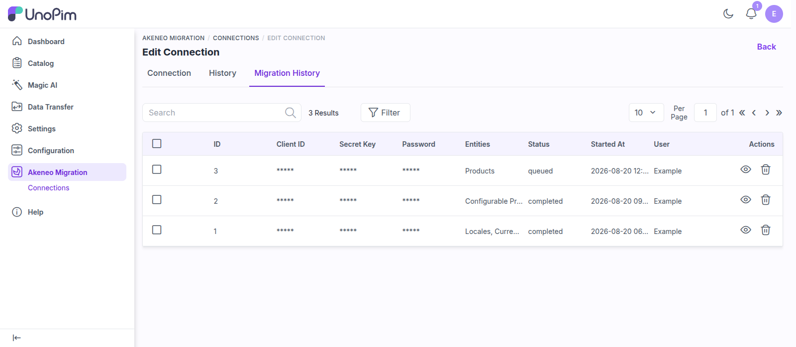
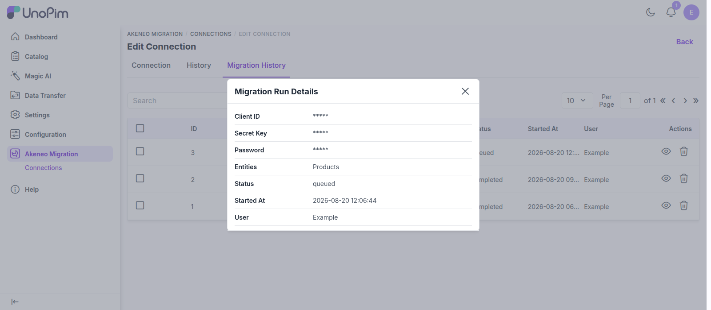

# Migration History

Every migration you start is recorded, giving you a full audit trail of what was imported, when, and by whom. Two tabs on a connection's edit page give you this visibility.

## Migration History Tab

Open a connection and switch to the **Migration History** tab. Each row represents one migration run.

 

  

 

| Column | Description |
|--------|-------------|
| **ID** | The run identifier. |
| **Client ID** | Masked (`*****`). |
| **Secret Key** | Masked (`*****`). |
| **Password** | Masked (`*****`). |
| **Entities** | The entities included in the run. |
| **Status** | The run's status (for example, *queued*). |
| **Started At** | When the run was started. |
| **User** | The admin user who started the run. |

> [!NOTE]
> Sensitive credentials — **Client ID**, **Secret Key**, and **Password** — are masked (`*****`) everywhere in the migration history, so your catalog moves securely.

## View Run Details

Use the **View** action on a row to open a **read-only details view** for that run, showing the same information for a single migration.

 

  

 

You can also **delete** a single run, or select multiple runs and delete them together.

> [!WARNING]
> Deleting a run removes it from the history only — it does **not** undo the imported data.

## Migration History vs. the Job Tracker

The two views answer different questions, and you will use both:

| | Migration History | [Job Tracker](./run-migration#follow-progress-in-the-job-tracker) |
|---|---|---|
| **Granularity** | One row per **run** you started | One row per **entity** in that run |
| **Shows** | Who started it, when, and which entities were selected | Live state, records processed, and downloadable logs |
| **Best for** | Auditing what was migrated and by whom | Watching progress and diagnosing a failure |

## Connection History Tab

The **History** tab on the same connection records **field-level changes** to the connection itself — so you can see what was edited, and when. It covers the connection's name, base URL, username, and status.

## Next Steps

- Need to migrate more entities? [Run another migration](./run-migration) — mappings from earlier runs are reused automatically.
- Control who can view, run, and delete migrations on the [Permissions](./permissions) page.
