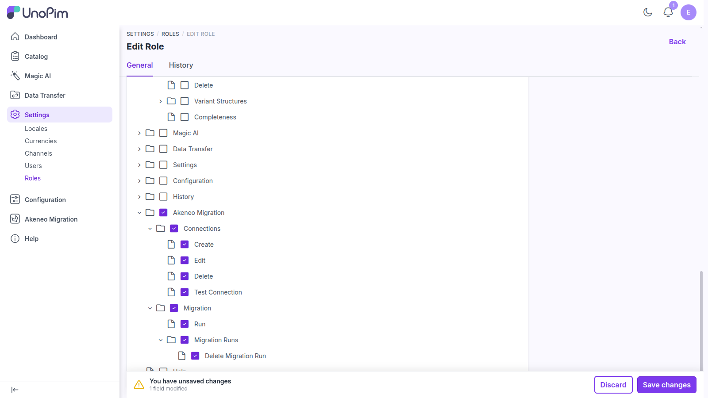

# Permissions

Every action in the Akeneo Migration plugin is governed by its own **permission (ACL)**. This means you can grant roles access to specific actions independently — for example, let one role manage connections while only senior users run or delete migrations.

Permissions are managed from UnoPim's role settings, under **Settings → Roles**, when editing a role's access.

 

  

 

Tick the permissions you want the role to have, then use **Save changes** on the save bar at the bottom of the page.

## Available Permissions

| Group | Permission | Allows the user to… |
|-------|-----------|---------------------|
| **Connections** | View | Open the Akeneo Migration section and view connections. |
| | Create | Create a new connection. |
| | Edit | Edit an existing connection. |
| | Delete | Delete a connection. |
| | Test Connection | Validate a connection's credentials against Akeneo. |
| **Migration** | Run | Start a migration for a connection. |
| | Migration Runs | View the migration history. |
| | Delete Migration Run | Delete one or more migration runs. |

> [!TIP]
> Because each action has its own permission, you can keep your migration process safe across larger teams — for example, granting broad read access to connections while restricting who can actually run or delete migrations.

## What a Role Sees

Permissions shape the interface, not just the API:

- Without **Connections → View**, the Akeneo Migration entry does not appear in the sidebar at all.
- Without **Connections → Create**, the **Create Connection** button is hidden on the listing.
- Without **Migration → Run**, the entity selection and **Start Migration** controls are hidden from the connection editor.
- Without **Delete Migration Run**, the delete action and the mass-delete checkboxes are hidden from the Migration History tab.

## Upgrading from an Earlier Version

The plugin's route names changed in 1.1.0, but its **ACL permission keys did not**. Roles you configured before the upgrade keep exactly the access they had — there is nothing to re-grant. See [What's New & Upgrading](./upgrading#route-changes).
