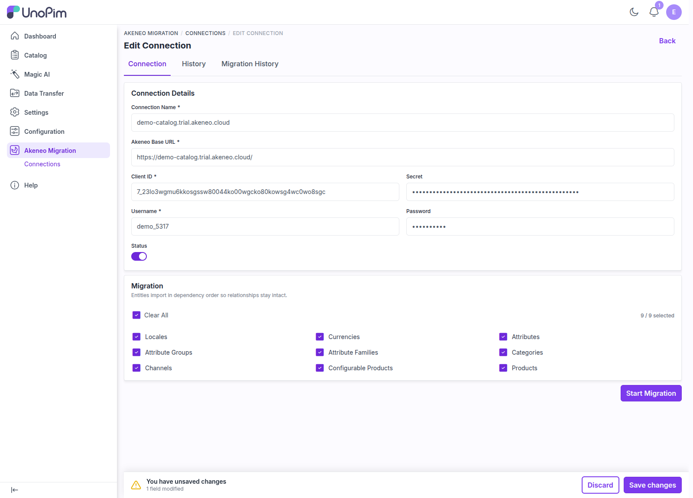
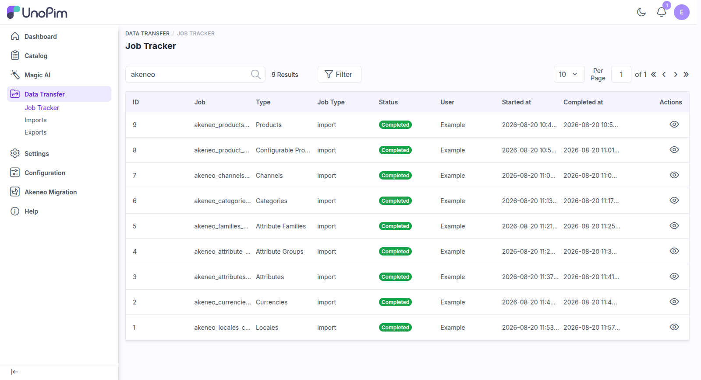

# Run a Migration

Once you have a working [connection](./create-connection), you can run a migration directly from its edit page.

## Select the Entities to Migrate

Open the connection and stay on the **Connection** tab. Under **Entities to migrate**, choose what you want to import. You can:

- Select individual entities, or
- Use the single **Select All / Clear All** toggle to migrate everything at once.

The counter on the right shows how many of the available entities are selected.

<br>

<div align="center">
  
</div>

<br>

> [!TIP]
> Your selection is **saved on the connection**. Changing it raises the save bar — press **Save changes** and the same set will be waiting for you the next time you open this connection.

## The Entities

The available entities are, in dependency order:

1. Locales
2. Currencies
3. Attributes
4. Attribute Groups
5. Attribute Families
6. Categories
7. Channels
8. DAM Assets *(only when the UnoPim DAM package is installed)*
9. Configurable Products
10. Products

> [!NOTE]
> Entities import in **dependency order** so relationships stay intact — regardless of the order in which you select them, the plugin always runs them structure-first. This guarantees that prerequisites (such as families and categories) exist before the records that depend on them (such as products).

For exactly what each one becomes on the UnoPim side — including how Akeneo product models turn into variant structures and how associations are carried over — see [Entity Mapping](./entity-mapping).

## Start the Migration

Click **Start Migration**. The selected entities are queued as a chain and run **sequentially**, and you are taken to the **Job Tracker** to follow progress.

> [!IMPORTANT]
> - You must select **at least one** entity before starting.
> - A **disabled** connection cannot be migrated — enable it first from the connection page.
> - Migrations run through UnoPim's queue. Make sure a queue worker is running (`php artisan queue:work`) unless your queue connection is `sync`.

## Follow Progress in the Job Tracker

The migration runs on UnoPim's native **Data Transfer** framework, so each entity appears as its own job in the **Job Tracker**, pre-filtered to Akeneo migration jobs.

<br>

<div align="center">
  
</div>

<br>

The listing **refreshes itself** while a job is pending or processing, so you can watch a long migration advance without pressing reload. From here you can also open a job and **download its detailed log** for auditing or troubleshooting.

The logs record, per entity:

- When the migration **started** for that entity.
- When it **finished**, with its state and the number of records processed.
- A clear message if **no records** were returned by Akeneo (verify the records exist in Akeneo and that the API connection's catalog exposes them).
- A clear message if the entity **failed**, including the error (verify the connection credentials are valid and that Akeneo is reachable).
- Per-record warnings — a skipped row, an unmappable attribute type, an option that had no match, a media download that failed.

> [!TIP]
> Because mappings between Akeneo and UnoPim records are recorded automatically, you can run the migration in **stages** — for example, structure first, then products later — and the plugin will reuse those mappings to keep relationships consistent across runs.

> [!NOTE]
> Akeneo migration job types can only be managed from the Akeneo Migration module. They are deliberately not offered in **Data Transfer → Imports**, because they read from the Akeneo API rather than from an uploaded file.

## Tuning a Large Migration

The plugin merges its defaults under the `akeneo_migration` config namespace. To change them, create `config/akeneo_migration.php` in your project and override only the keys you need:

```php
<?php

return [
    'batch_size'             => 100,
    'product_batch_size'     => 25,
    'asset_batch_size'       => 10,
    'media_download_timeout' => 30,
    'token_expiry_buffer'    => 300,
    'debug_logging'          => false,
];
```

| Key | Default | What it does |
|---|---|---|
| `batch_size` | `100` | Page size used when reading records from the Akeneo API. |
| `product_batch_size` | `25` | Products imported per batch — smaller, because each row can pull media. |
| `asset_batch_size` | `10` | DAM assets per batch — each one is a file download. |
| `media_download_timeout` | `30` | Seconds to wait for a single media file from Akeneo. |
| `token_expiry_buffer` | `300` | Seconds before expiry at which the Akeneo access token is refreshed. |
| `debug_logging` | `false` | Writes the raw Akeneo payload and the mapped UnoPim values to the run log. Very verbose — turn it on only while diagnosing a mapping problem. |

Run `php artisan config:clear` after changing the file.

> [!WARNING]
> Long product migrations write a job heartbeat as they work, so UnoPim will not reap them as stalled. Do not lower the batch sizes to `1` on a large catalog — you will multiply the number of API round trips without making the run more reliable.

## Next Steps

After a run completes, review what was imported in the [Migration History](./migration-history).
