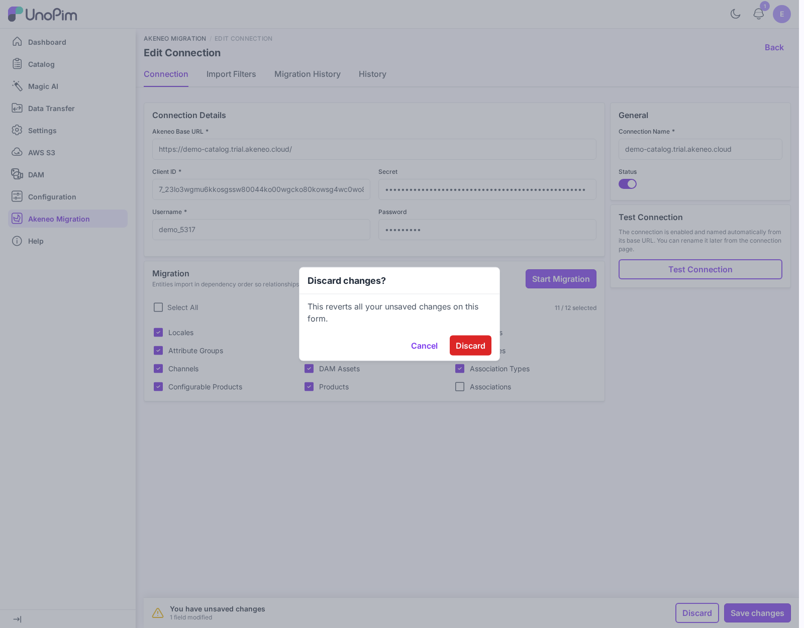

# What's New & Upgrading

Version **1.2.0** of the Akeneo to UnoPim Migration plugin adds **Import Filters**, records the filters each run used, versions every change to a connection in its History tab, and stores migrated media on AWS S3 when UnoPim uses it. It runs on **UnoPim 3.0.0**, like 1.1.0.

Coming from a build for UnoPim 2.1? Read [Upgrading from 1.0.x to 1.1.0](#upgrading-from-1-0-x-to-1-1-0) first.

---

## Upgrading from 1.1.0 to 1.2.0

The requirements are unchanged: **UnoPim 3.0.0**, **PHP 8.4.1+**, **Laravel 13**, and `akeneo/api-php-client` `^11.4`.

Run these from your **UnoPim project root**:

```bash
# 1. Replace the package code at packages/Webkul/AkeneoMigration

# 2. Re-run the install command — it is safe to run again
php artisan akeneo-migration:install
```

`akeneo-migration:install` runs three new migrations:

| Migration | What it does |
|---|---|
| `add_filters_to_akeneo_migration_runs_table` | Adds a nullable `filters` column to `akeneo_migration_runs`. Earlier runs keep an empty value and show `-` in the Filters column. |
| `convert_akeneo_migration_jobs_to_system_type` | Converts existing Akeneo migration jobs and their Job Tracker entries from `import` to `system` jobs. It is reversible. |
| `add_import_filters_permission_to_roles` | Grants the new **Import Filters** permission to every custom role that already has **Connections → Edit**. It is reversible. |

Your connections, mappings, and migration history are preserved. One permission was added — **Connections → Import Filters** — and roles that can edit connections receive it automatically. See [Permissions](./permissions).

---

## What's New in 1.2.0

### Import Filters

A new **Import Filters** tab on every connection narrows what a migration imports: channel, locales, families, categories, attributes, status, completeness, updated date (last N days, since last import, or between dates), and identifiers — plus a **With media** switch to skip media downloads. Filters are sent to the Akeneo API, so only matching records are downloaded. See [Import Filters](./import-filters).

<br>

<div align="center">
  
</div>

<br>

### A permission for Import Filters

The tab has its own permission, **Connections → Import Filters**, so you can let a role edit connections without changing what they import. Roles that already had **Connections → Edit** are granted it during the upgrade.

### Filters in the Migration History

Each run records the filters it used. They appear in a new **Filters** column on the Migration History tab and in the run's details view. See [Migration History](./migration-history).

### Every change is versioned in History

Saving import filters, or changing the entities selected for migration, adds a version to the connection's **History** tab. Each changed field is listed by its label with its old and new value; saving without changes adds no version.

### A simpler sidebar

**Akeneo Migration** is now a single sidebar item that opens the connections list — the **Connections** sub-menu is gone.

### Migration jobs are system jobs

Migration jobs run as UnoPim **system** jobs instead of imports, so the Job Tracker shows them with a View action and no Edit button. Starting a migration takes you straight to the Job Tracker again.

---

## Fixes in 1.2.0

- **Media works with AWS S3.** Product images and files are stored on UnoPim's default disk, so they go to S3 when the AWS integration is enabled instead of showing as broken.
- **Community Edition no longer fails on assets.** Asset Manager is Enterprise / Serenity only; on Community Edition the DAM Assets step is skipped with a warning.
- **No duplicate DAM assets.** Re-running a migration updates an asset imported before instead of adding a second copy.
- **Filtered variants keep their parent.** When a filter matches a variant but not its product model, the model and its ancestors are still imported.
- **Product model codes in Identifiers** import the model's variants and sub-models.
- **Works without DAM.** Akeneo asset-collection attributes are skipped with a warning when the DAM extension is not installed.
- **Clearer errors.** A connection whose credentials cannot be decrypted (for example after `APP_KEY` changed) names the cause and the fix; form and filter errors name the field by its label.
- **Translated everywhere.** Every message, job-log line, and console output is translated into all 33 UnoPim locales.

---

## Upgrading from 1.0.x to 1.1.0

Version **1.1.0** was the release for **UnoPim 3.0.0**. Nothing was removed and no feature changed shape — but the module moved onto UnoPim 3.0's single-page admin, mapped Akeneo product models onto real **variant structures**, and carried product **associations** across.

### Requirements Changed

| | 1.0.x | 1.1.0 |
|---|---|---|
| **UnoPim** | 2.1.0 | **3.0.0** |
| **PHP** | 8.3+ | **8.4.1+** |
| **Laravel** | 12 | **13** |
| **`akeneo/api-php-client`** | unpinned | **`^11.4`** |
| **Database** | MySQL | **MySQL 8.0 or PostgreSQL 16** |
| **Elasticsearch** | — | 8.17, optional |

> [!IMPORTANT]
> 1.1.0 requires **UnoPim 3.0.0**. Upgrade your UnoPim instance to 3.0 first, then upgrade this plugin.

---

### Upgrade Steps

Run these from your **UnoPim project root**, after your instance is on UnoPim 3.0.0:

```bash
# 1. Replace the package code at packages/Webkul/AkeneoMigration

# 2. Correct the Akeneo client constraint
composer require akeneo/api-php-client:^11.4
composer dump-autoload

# 3. Re-run the install command — it is safe to run again
php artisan akeneo-migration:install
```

`akeneo-migration:install` runs any new migrations, republishes the sidebar icon, and clears the config, route, view, and application caches so the renamed routes and menu load.

Your existing connections, mappings, and migration history are preserved. **ACL permission keys are unchanged**, so roles keep the access you already granted them.

---

### What's New in 1.1.0

#### The whole module runs on the single-page admin

UnoPim 3.0's admin behaves like a **single-page application**, and every Akeneo Migration screen is built on it.

Clicking a link no longer reloads the browser — UnoPim fetches the destination over **AJAX**, swaps the page body in place, and leaves the header, sidebar, theme, and scroll position alone. The URL and history still update, so **Back**, **Forward**, and bookmarks behave normally.

- Moving between Connections, the connection editor, and the Job Tracker is instant — the interface is never re-downloaded.
- Saving a connection or changing the entity selection posts over AJAX and confirms with a flash message. No reload, nothing else on the page lost.
- The **Job Tracker** listing refreshes itself while a migration job is pending or processing, so progress updates without you pressing reload.

#### A global save bar with Discard and Save

Editing a connection — or ticking a different set of entities to migrate — raises UnoPim's global save bar. It tells you how many fields changed and offers **Discard** and **Save changes**.

<br>

<div align="center">
  
</div>

<br>

Navigating away with unsaved work asks for confirmation first, so a half-finished edit is never silently thrown away.

#### Connection screens use core components

The connection listing and editor were rebuilt on UnoPim's own page header, breadcrumbs, and shared datagrid, and on the `primary-*` design tokens. They now follow your theme, including **dark mode**, and behave like every other listing in UnoPim — search, filters, pagination, and mass delete included.

Creating a connection is now a **modal** on the listing rather than a separate page.

#### Akeneo product models become UnoPim variant structures

This is the largest functional addition. An Akeneo **family variant** is now translated into a UnoPim **variant structure**:

- A parentless product model becomes a `configurable` bound to that structure.
- A sub-model becomes the `variant_group` node UnoPim uses for the middle tier of a two-level tree.
- Products underneath attach as variants of the right node.

Because the configurable points at a structure, it opens in UnoPim 3.0's variant editor rather than the pre-structure fallback. See [Entity Mapping](./entity-mapping#configurable-products-akeneo-product-models) for the full detail, including what happens when an axis is not usable in UnoPim.

#### Product associations come across

Akeneo product associations are mapped onto UnoPim relations — **related products**, **up-sells**, and **cross-sells** — for both products and product models.

#### Entity selection is remembered

The entities you tick on a connection are stored on that connection. Reopen it a week later and your selection is still there, ready to run again.

---

### Fixes in 1.1.0

- **Migrations run again on 3.0.** UnoPim 3.0 refuses an import with no source file; an Akeneo job now streams straight from the REST API instead.
- **Long runs are no longer reaped as stalled.** The importer writes UnoPim 3.0's job heartbeat while it works.
- **Products index into Elasticsearch again.** Dates are stored as calendar dates and measurement values keep their unit, so the indexer accepts them.
- **Channels import into an empty catalog on PostgreSQL.** A missing root category used to be written as id `0`.
- **The Job Tracker filter reset works again** — the listing route was renamed from `data-transfer/tracker` to `data-transfer/job-tracker`.
- **Attribute types are preserved.** If an attribute already exists in UnoPim with a different type, the import keeps the existing type instead of rewriting it, and logs that it did — stored values stay valid.

---

### Route Changes

Connection routes were renamed. If you link to the module from your own code or bookmarks, update them:

| Previous | 1.1.0 |
|---|---|
| `akeneo_migration.credentials.*` | `akeneo_migration.connections.*` |
| `/akeneo-migration/credentials` | `/akeneo-migration/connections` |

> [!NOTE]
> **ACL permission keys did not change** — they are still `akeneo_migration.credentials.*` and `akeneo_migration.migration.*`. Existing roles keep working untouched. See [Permissions](./permissions).

---

## Repairing a Catalog Migrated by an Older Version

If you migrated with an earlier build, some records may carry data in the older shape. Three Artisan commands repair them in place — no re-import needed:

```bash
# Configurables that have axes but no variant structure
php artisan akeneo-migration:backfill-variant-structures --dry-run
php artisan akeneo-migration:backfill-variant-structures

# Measurement attributes whose type was rewritten to a scalar type
php artisan akeneo-migration:fix-attribute-types

# Multiselect arrays and ISO timestamps in stored product values
php artisan akeneo-migration:fix-product-values
```

Re-running the **Configurable Products** import also repairs structure bindings — the importer rewrites the structure link and the `super_attributes` pivot on every run, so a tree migrated before variant structures existed is fixed by importing it again rather than deleting it first.

Full detail on each command is in [Artisan Commands](./commands).

---

## Next Steps

- [Installation](./installation)
- [Entity Mapping](./entity-mapping)
- [Artisan Commands](./commands)
