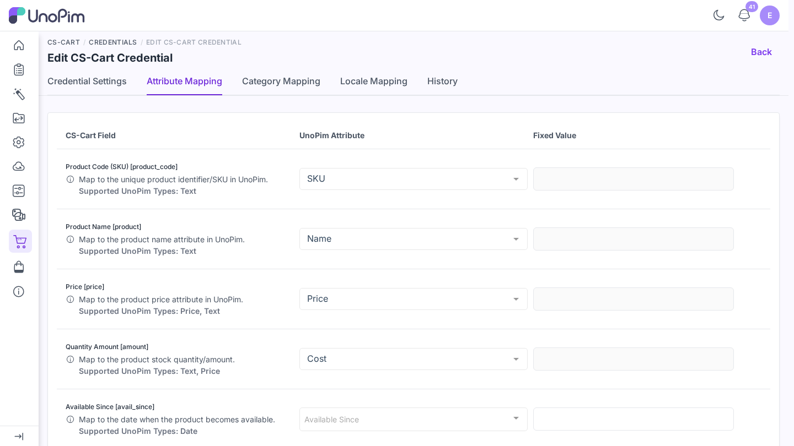
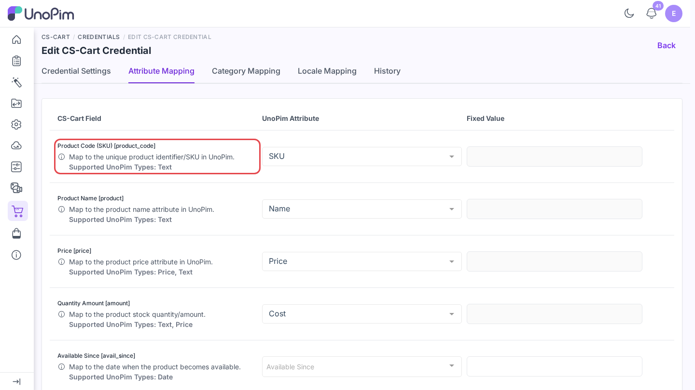
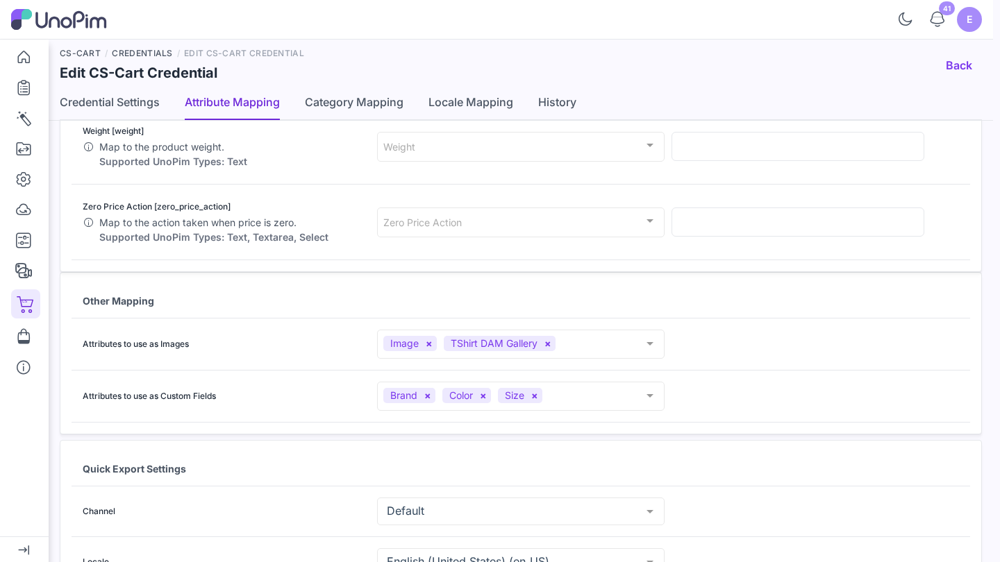
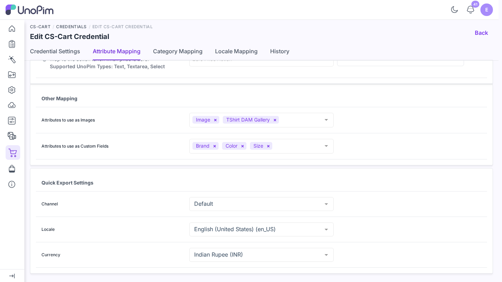

# Map attributes

A CS-Cart product has fixed fields such as `product_code`, `product`, `price`, and `full_description`, plus the **features** of your store. The **Attribute Mapping** tab tells the connector which UnoPim attribute fills each field.

**Open it from:** *CS-Cart → Credentials → (edit a credential) → Attribute Mapping*

The tab has three sections: the standard fields, **Other Mapping**, and **Quick Export Settings**.

## Standard fields

Every CS-Cart product field is one row:

| Column | Meaning |
|--|--|
| **CS-Cart Field** | The CS-Cart field the value goes into. |
| **UnoPim Attribute** | The UnoPim attribute that supplies the value. The **Supported UnoPim Types** are listed under each field name. |
| **Fixed Value** | A constant sent for every product instead of an attribute, e.g. `N` for *Free Shipping*. |

The dropdown only offers attributes whose type fits the field. *Price* accepts price or text attributes, *Free Shipping* accepts boolean ones, and *Full Description* accepts textarea or text ones.

### Fields you must map

| CS-Cart Field | Typical UnoPim attribute |
|--|--|
| **Product Code (SKU)** | `sku` |
| **Product Name** | `name` |

Also map **Price**. The mapping saves without it, but CS-Cart refuses to create a product that has no price. Such products are skipped and the job log shows *Skipped (sku): CS-Cart needs a price in (currency) before it can create the product.*

Fields left empty are not sent, so CS-Cart keeps its own value for them.

> [!TIP]
> If an attribute is missing from the dropdown, check its **type** in *Catalog → Attributes*. It probably does not match the field.

## Other Mapping

| Setting | What it does |
|--|--|
| **Attributes to use as Images** | Image, gallery, or asset attributes whose files become the CS-Cart product images. Used when an export or import runs **With Media**. |
| **Attributes to use as Custom Fields** | Attributes sent as CS-Cart **features**. Run [Export attributes](./export-attributes) for them first so the features exist in CS-Cart. |

Select and multiselect attributes are sent with their options as feature variants. Variant axes of configurable products, such as *color* and *size*, are sent as features automatically.

## Quick Export Settings

Pick the **Channel**, **Locale**, and **Currency** that [Quick export](./quick-export) reads values from. Quick export does not start until these three are set on the default credential.

## Save

Click **Save changes** in the bar at the bottom. You see *Attribute mapping updated successfully.*

The next job uses the new mapping. A job that is already running keeps the mapping it started with.
