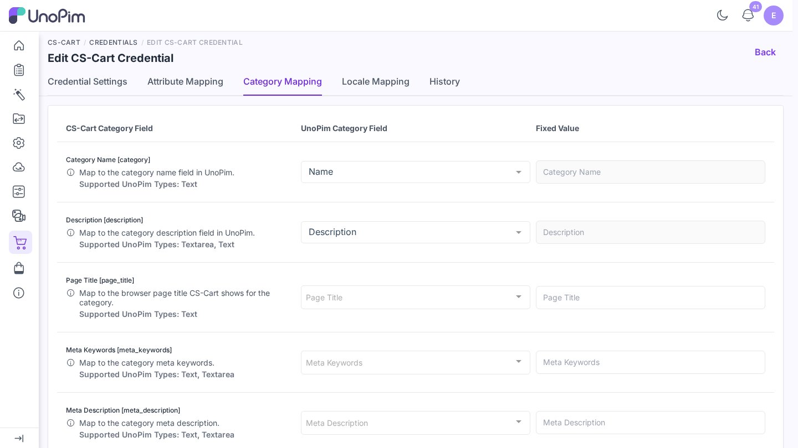

# Map categories

The **Category Mapping** tab tells the connector which UnoPim category field fills each CS-Cart category field, and which field holds the category image.

**Open it from:** *CS-Cart → Credentials → (edit a credential) → Category Mapping*

## Category fields

| CS-Cart Category Field | What it holds |
|--|--|
| **Category Name** *(required)* | The category name. Usually mapped to `name`. |
| **Description** | The category description. |
| **Page Title** | The browser page title CS-Cart shows for the category. |
| **Meta Keywords** | The category meta keywords. |
| **Meta Description** | The category meta description. |
| **Position** | The sort position of the category. |
| **Status** | The category status. CS-Cart expects `A` for active and `D` for disabled. |
| **Product Details View** | The product details template CS-Cart uses for the category. |

Each row takes a **UnoPim Category Field** or a **Fixed Value**. A fixed value suits fields that are the same for every category, such as `A` for **Status**.

## Category Media

Pick the **Category field to use as the image**. The image UnoPim holds in that field becomes the CS-Cart category image when a [category export](./export-categories) runs **With Media**. A [category import](./import-categories) writes the CS-Cart image back into the same field.

## Save

Click **Save changes** in the bar at the bottom. You see *Category mapping updated successfully.*
