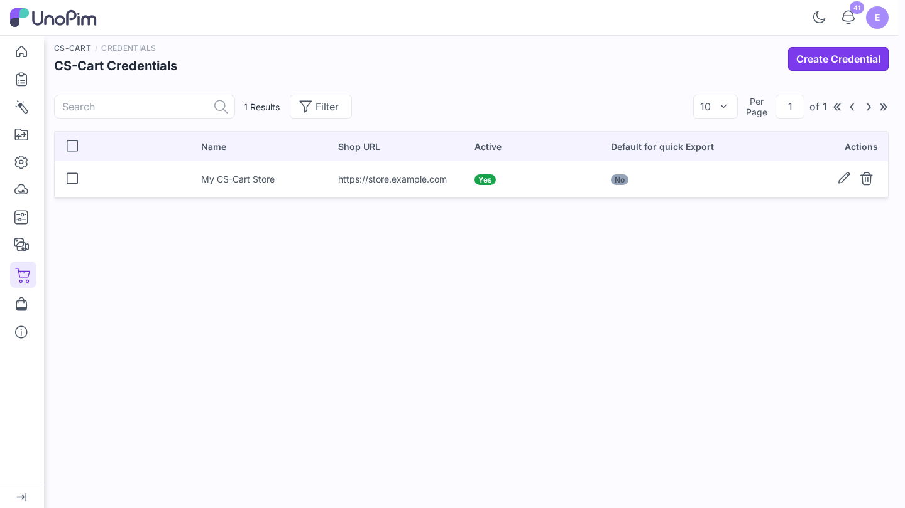
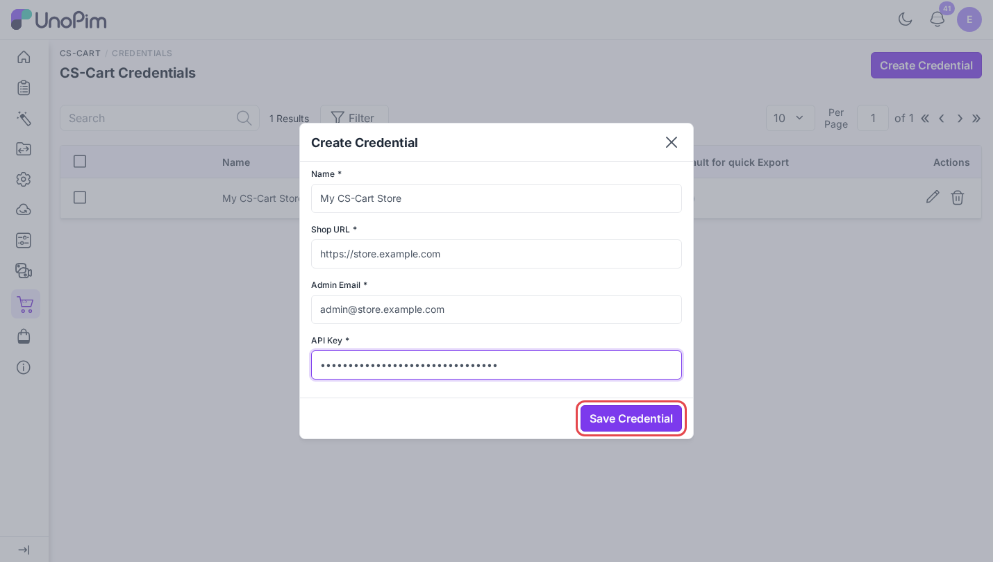
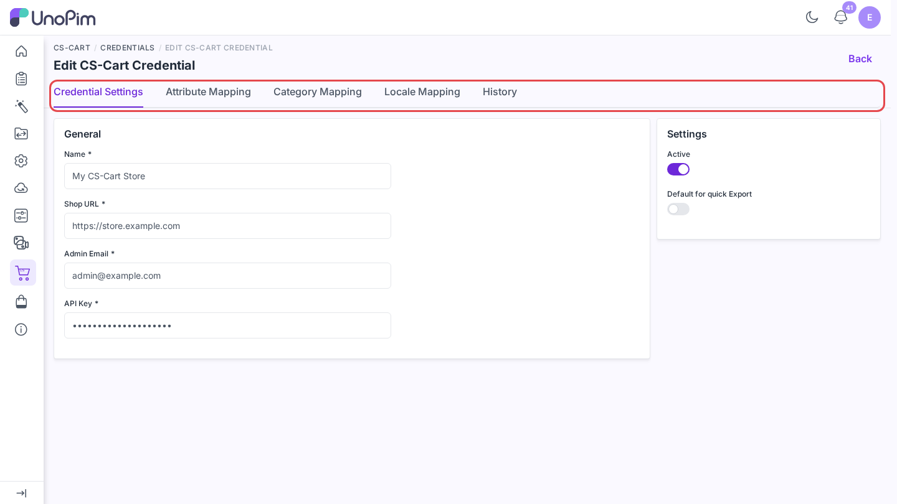
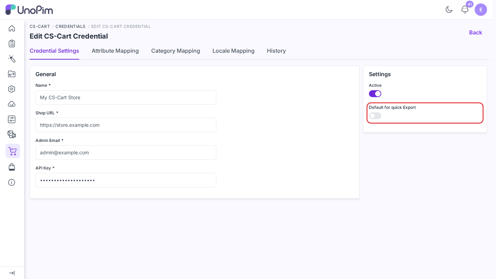
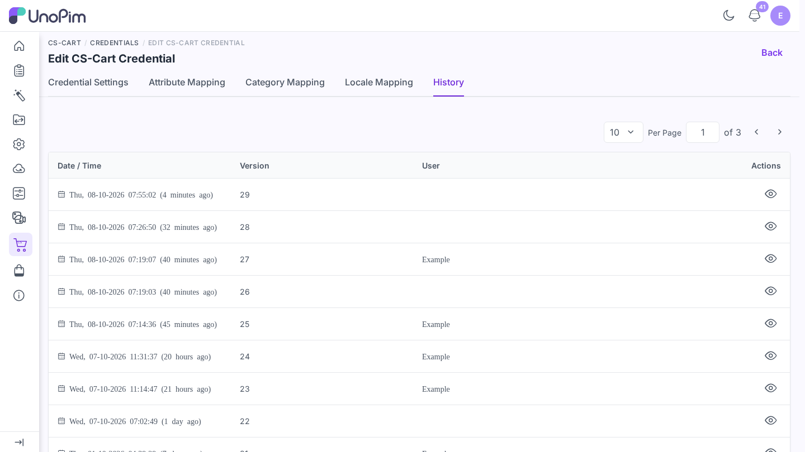

# Add CS-Cart credentials

A credential stores the connection to one CS-Cart store. Add at least one before you import or export anything.

**Open it from:** *CS-Cart → Credentials*

## The credentials list

Each row shows one credential:

| Column | Meaning |
|--|--|
| **Name** | The label you gave it. |
| **Shop URL** | The CS-Cart store URL. |
| **Active** | Whether jobs can use this credential. |
| **Default for quick Export** | Whether [Quick export](./quick-export) uses this credential. |

Search by name, sort a column, or click **Filter** to narrow the list. The pencil icon edits a row and the trash icon deletes it. Tick several rows to **Update Status** or **Delete** them at once.

## Add a credential

Click **Create Credential** in the top-right corner and fill in:

| Field | What goes here |
|--|--|
| **Name** | Any label, e.g. *Production Store*. |
| **Shop URL** | Your CS-Cart store URL, including `https://`. |
| **Admin Email** | The email of the CS-Cart admin who has API access. |
| **API Key** | The key from *Customers → Administrators → (user) → API access* in CS-Cart. |

Click **Save Credential**.

The connector calls the CS-Cart API before it saves. If the store does not answer, you see *Unable to connect to CS-Cart. Please verify your Shop URL, Admin Email, and API Key are correct.* and nothing is stored.

> [!NOTE]
> The Shop URL must be a public address. A URL that points to `localhost` or a private network is refused with *The shop URL must point to a publicly reachable host.* For a local test store, set `CSCART_ALLOW_LOOPBACK=true` in UnoPim's `.env`. Never turn it on in production. The API key is stored encrypted.

After saving, you land on the edit page.

## Edit a credential

Click the pencil icon on a row. The edit page has these tabs:

| Tab | What it does |
|--|--|
| **Credential Settings** | Change the connection details and switches. |
| **Attribute Mapping** | Map UnoPim attributes to CS-Cart product fields - see [Map attributes](./attribute-mapping). |
| **Category Mapping** | Map UnoPim category fields to CS-Cart category fields - see [Map categories](./category-mapping). |
| **Locale Mapping** | Map each UnoPim locale to a CS-Cart language - see [Map locales](./locale-mapping). |
| **History** | Every change made to this credential. |

### Credential Settings

| Field | What it does |
|--|--|
| **Name / Shop URL / Admin Email** | Edit the values you set when creating. |
| **API Key** | Shown masked. Leave the mask to keep the current key, or type a new key to replace it. |
| **Active** | Turn the credential on or off. Inactive credentials do not appear in import and export profiles. |
| **Default for quick Export** | Use this credential for [Quick export](./quick-export). Only one credential is the default. |

Click **Save changes** in the bar at the bottom.

## Delete a credential

Click the trash icon on a row and confirm, or tick several rows and pick **Delete**.

Deleting a credential does **not** remove anything already sent to CS-Cart. It only stops future jobs from using it.

## See change history

The **History** tab lists every change to the credential: name, URL, status, and mapping edits. The API key itself is never shown.

