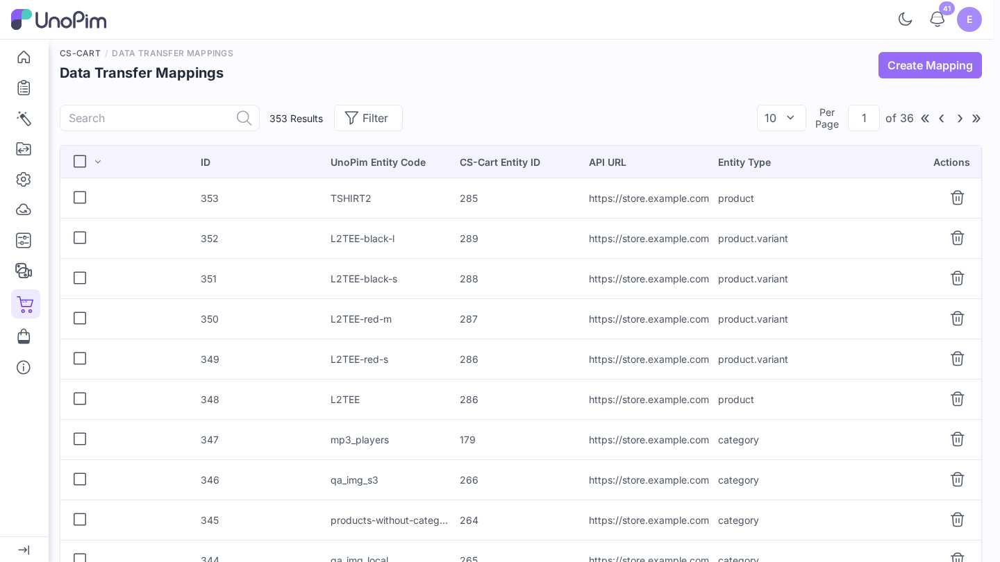
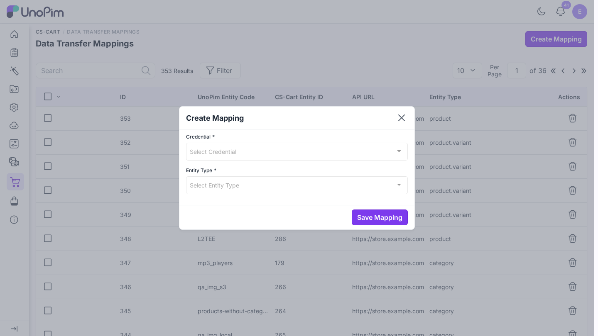

# Data transfer mappings

The connector remembers which UnoPim record matches which CS-Cart record. That link is a **data transfer mapping**. It is how a second export updates a CS-Cart product instead of creating a copy.

Exports and imports create mappings for you. Use this page to see them, and to link records that already exist on both sides before your first sync.

**Open it from:** *CS-Cart → Data Transfer Mappings*

## The list

| Column | Meaning |
|--|--|
| **ID** | Row number. |
| **UnoPim Entity Code** | The attribute code, category code, or SKU in UnoPim. |
| **CS-Cart Entity ID** | The matching ID in CS-Cart. |
| **API URL** | The CS-Cart store the link belongs to. |
| **Entity Type** | What is linked: attribute, option, category, or product. |

Delete one row with the trash icon, or tick several and delete them together.

## Link existing records

Do this when your store and UnoPim already hold the same attributes or categories. Without a link, the first export creates a second copy in CS-Cart.

1. Click **Create Mapping**.
2. Fill in:

| Field | What goes here |
|--|--|
| **Credential** | The CS-Cart store. |
| **Entity Type** | **Attribute** or **Category**. |
| **UnoPim Entity** | The UnoPim attribute or category. |
| **CS-Cart Entity** | The matching CS-Cart feature or category. |

3. Click **Save Mapping**. You see *Mapping created successfully.*

A record can be linked once per store. A second link shows *Mapping already exists for this UnoPim entity in this CS-Cart store.* or *This CS-Cart entity is already mapped to another UnoPim entity.*

> [!WARNING]
> Deleting a mapping does not delete the record on either side. It only removes the link, so the next export may create a second copy in CS-Cart.
