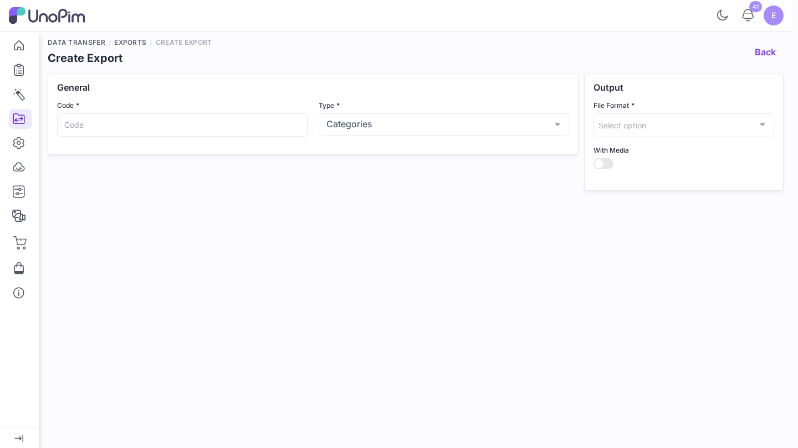
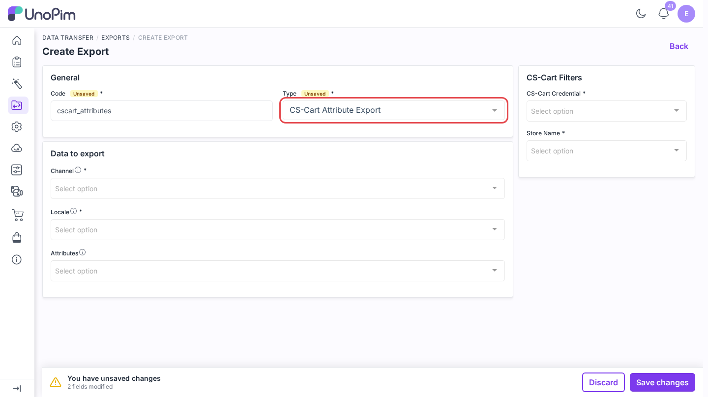
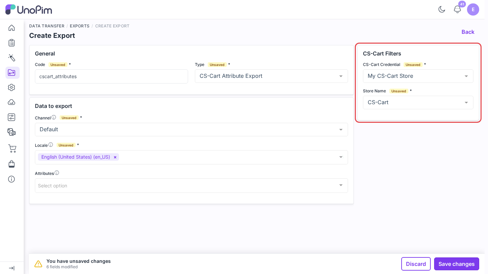
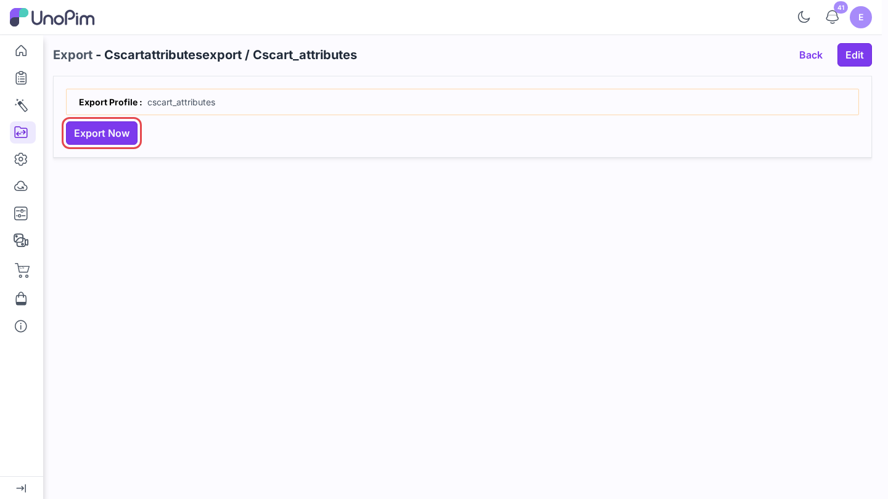
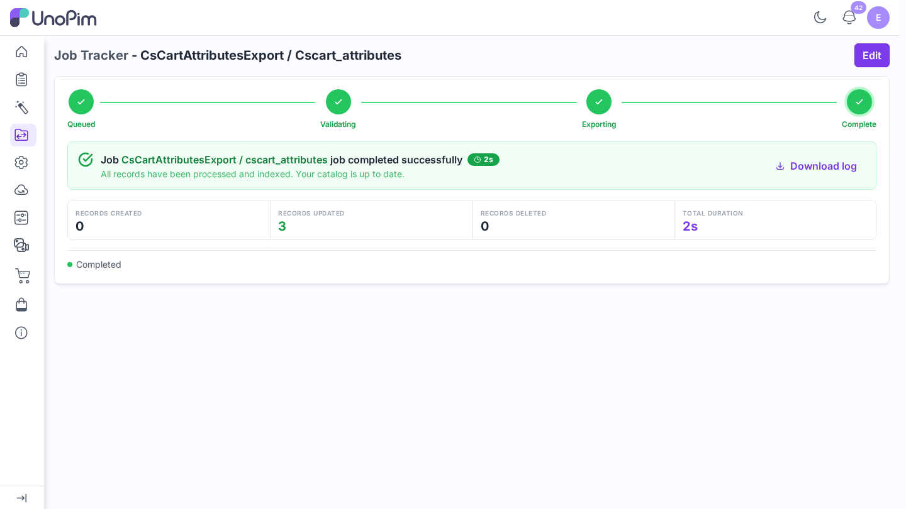

# Export attributes

Send UnoPim attributes to CS-Cart as **features**. Run this before exporting products that use those attributes, so CS-Cart has a feature to hold their values.

> **Before you start.** Add a [credential](./credentials), [map your locales](./locale-mapping), and list the attributes under **Attributes to use as Custom Fields** in [Map attributes](./attribute-mapping#other-mapping). Only those attributes are exported.

**Open it from:** *Data Transfer → Exports*

## 1. Create the profile

1. Open **Data Transfer → Exports** and click **Create Export**.

2. **Type** - pick **CS-Cart Attribute Export**.
3. **Code** - a short identifier, e.g. `cscart_attributes`.

## 2. Fill the filters

| Filter | Required | What it does |
|--|--|--|
| **CS-Cart Credential** | ✓ | The CS-Cart store to export to. |
| **Store Name** | ✓ | The CS-Cart storefront (company). The list is read live from the store. |
| **Channel** | ✓ | The UnoPim channel whose values are exported. |
| **Locale** | ✓ | One or more locales. Each must be [mapped](./locale-mapping). |
| **Attributes** | - | Export only some of the custom-field attributes. Leave empty for all of them. |

## 3. Run it

Click **Save changes** in the bar at the bottom. UnoPim opens the profile page. Click **Export Now**.

The job runs in the queue. Follow it on **Data Transfer → Job Tracker**, where each batch shows how many records were created, updated, or skipped.

## What happens

| UnoPim attribute type | CS-Cart feature type |
|--|--|
| select | Select box (S) |
| multiselect | Multiple checkboxes (M) |
| boolean | Single checkbox (C) |
| number | Number (N) |
| date | Date (D) |
| any other | Text (T) |

- Options of select and multiselect attributes become feature **variants**.
- If no attribute is listed as a custom field, the job finishes with a warning and exports nothing.
- An attribute used as a variant axis, such as *color* or *size*, is created as a variation feature so CS-Cart can build variation groups from it.
