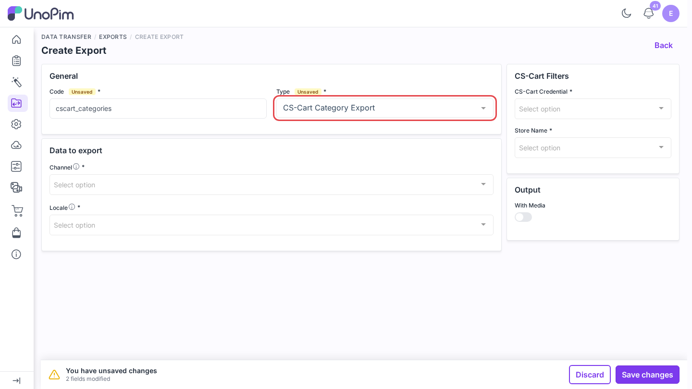
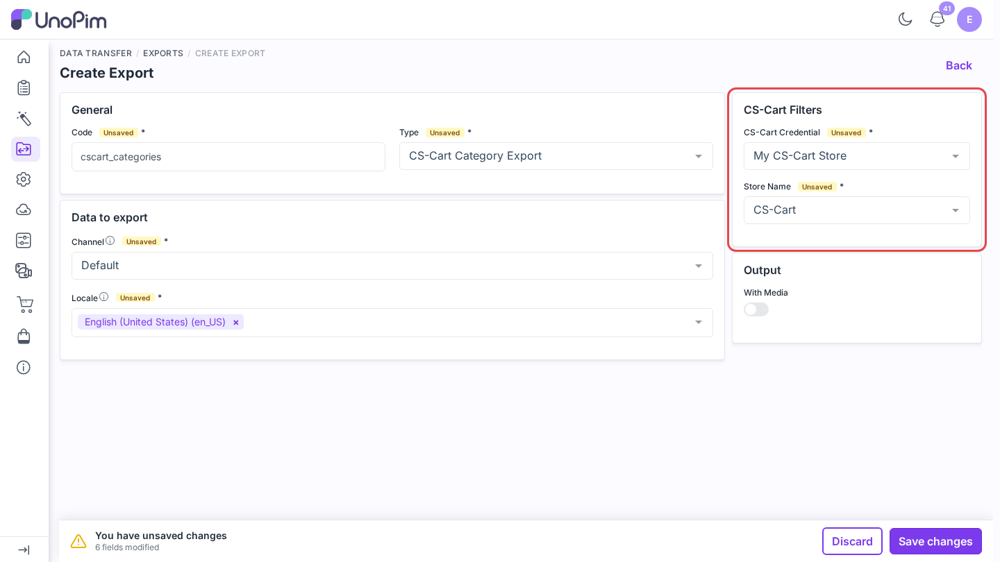
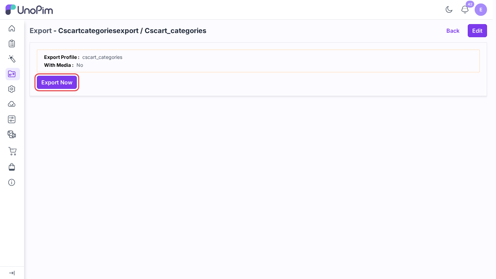
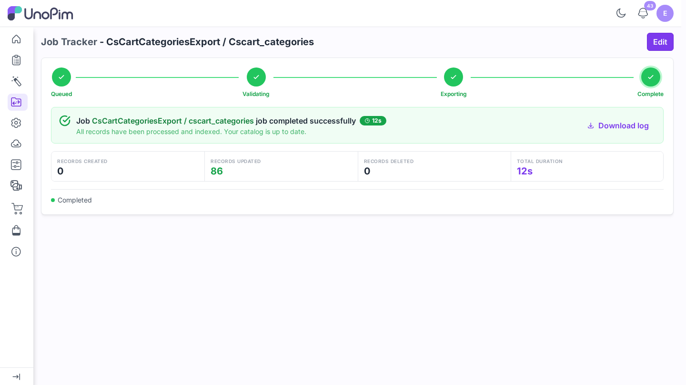

# Export categories

Send your UnoPim category tree to CS-Cart with its parent and child links, and optionally its images.

> **Before you start.** Add a [credential](./credentials), [map your locales](./locale-mapping), and [map category fields](./category-mapping).

**Open it from:** *Data Transfer → Exports*

## 1. Create the profile

1. Open **Data Transfer → Exports** and click **Create Export**.

2. **Type** - pick **CS-Cart Category Export**.
3. **Code** - a short identifier, e.g. `cscart_categories`.

## 2. Fill the filters

| Filter | Required | What it does |
|--|--|--|
| **CS-Cart Credential** | ✓ | The CS-Cart store to export to. |
| **Store Name** | ✓ | The CS-Cart storefront (company). The list is read live from the store. |
| **Channel** | ✓ | The UnoPim channel whose values are exported. |
| **Locale** | ✓ | One or more locales. Each must be [mapped](./locale-mapping). |
| **With Media** | - | Also send the category image from the field set in [Category Media](./category-mapping#category-media). |

## 3. Run it

Click **Save changes** in the bar at the bottom. UnoPim opens the profile page. Click **Export Now**.

The job runs in the queue. Follow it on **Data Transfer → Job Tracker**, where each batch shows how many records were created, updated, or skipped.

## What happens

- Every category under the channel's **root category** is exported. The root itself is not, so its direct children become top-level categories in CS-Cart.
- Parents are always sent before their children, so the tree keeps its shape.
- A category that was exported before is updated in place. The link is kept in [Data Transfer Mappings](./data-transfer-mappings).
