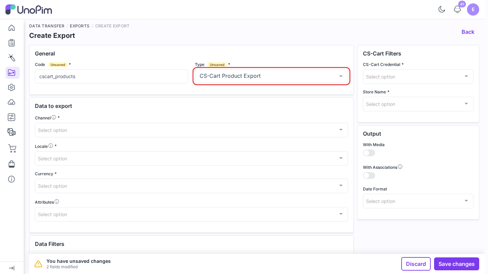
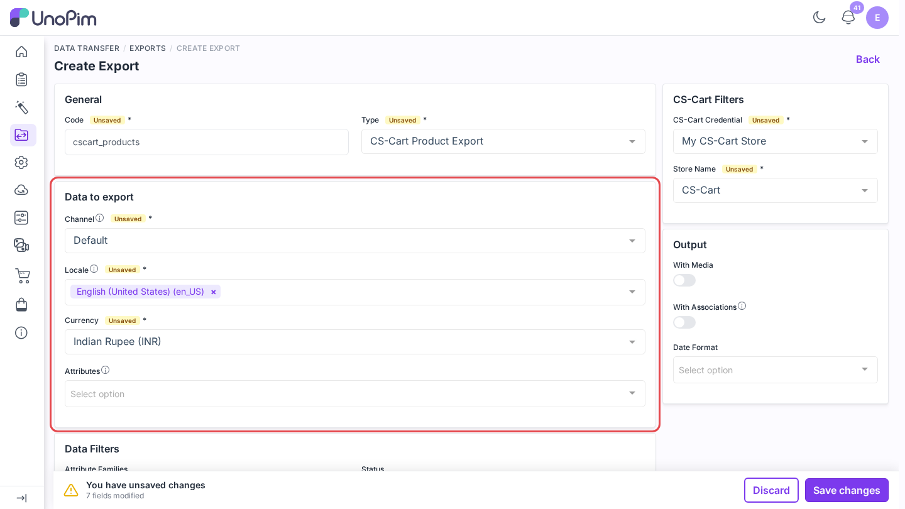
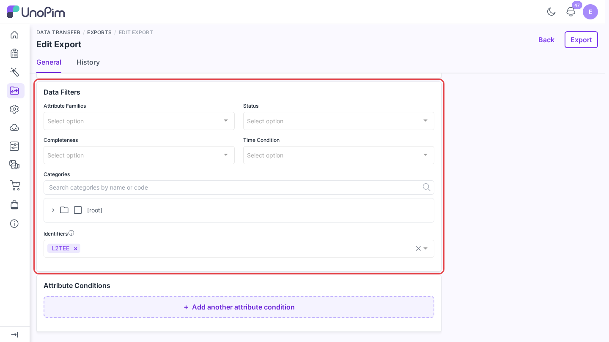
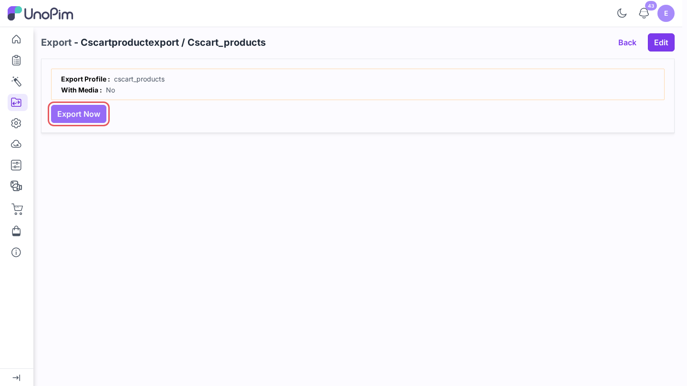
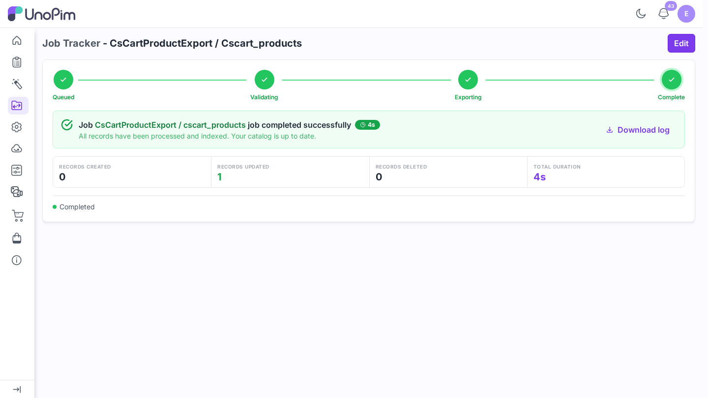

# Export products

Send UnoPim products to CS-Cart with their field values, features, categories, prices, stock, status, and images.

> **Before you start.** Add a [credential](./credentials), [map locales](./locale-mapping) and [attributes](./attribute-mapping), then run [Export attributes](./export-attributes) and [Export categories](./export-categories) once so CS-Cart has the features and categories your products use.

**Open it from:** *Data Transfer → Exports*

## 1. Create the profile

1. Open **Data Transfer → Exports** and click **Create Export**.

2. **Type** - pick **CS-Cart Product Export**.
3. **Code** - a short identifier, e.g. `cscart_products`.

## 2. Fill the filters

| Filter | Required | What it does |
|--|--|--|
| **CS-Cart Credential** | ✓ | The CS-Cart store to export to. |
| **Store Name** | ✓ | The CS-Cart storefront (company). The list is read live from the store. |
| **Channel** | ✓ | The UnoPim channel whose values are exported. |
| **Locale** | ✓ | One or more locales. Each must be [mapped](./locale-mapping). |
| **Currency** | ✓ | The currency the price is read from. |
| **Attributes** | - | Send only these mapped attributes. |
| **Attribute Families / Status / Completeness / Categories** | - | Export only products that match. |
| **Time Condition** | - | Export only products changed in the last *n* days or between two dates. |
| **Identifiers** | - | Export only these SKUs. Leave empty for every product. |
| **With Media** | - | Also send the images from **Attributes to use as Images**. |

Scroll down to **Data Filters** to narrow the export by family, status, completeness, change date, category, or SKU (**Identifiers**). **Attribute Conditions** below it lets you add rules on attribute values.

## 3. Run it

Click **Save changes** in the bar at the bottom. UnoPim opens the profile page. Click **Export Now**.

The job runs in the queue. Follow it on **Data Transfer → Job Tracker**, where each batch shows how many records were created, updated, or skipped.

## What happens

- **Simple products** become CS-Cart products. **Configurable products** become a **variation group**: the first variant carries the group and the others join it. A two-level product (for example color, then size) is flattened into one group.
- The product status is sent as `A` (enabled) or `D` (disabled).
- Products are linked to CS-Cart categories through the [category export](./export-categories) mappings.
- A product with no price in the selected currency is skipped with *Skipped (sku): CS-Cart needs a price in (currency) before it can create the product.*
- With **With Media** on, images missing from storage are skipped and the images already in CS-Cart are kept.
