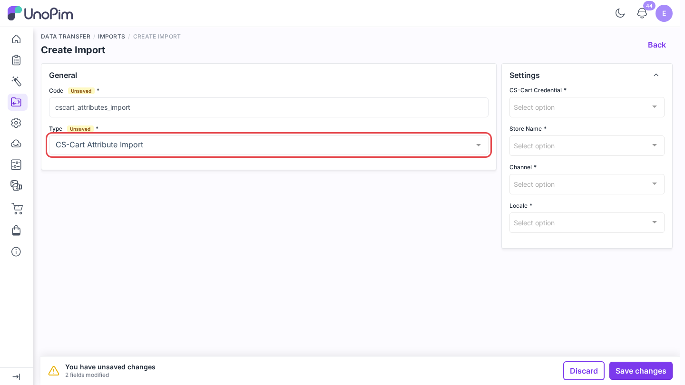
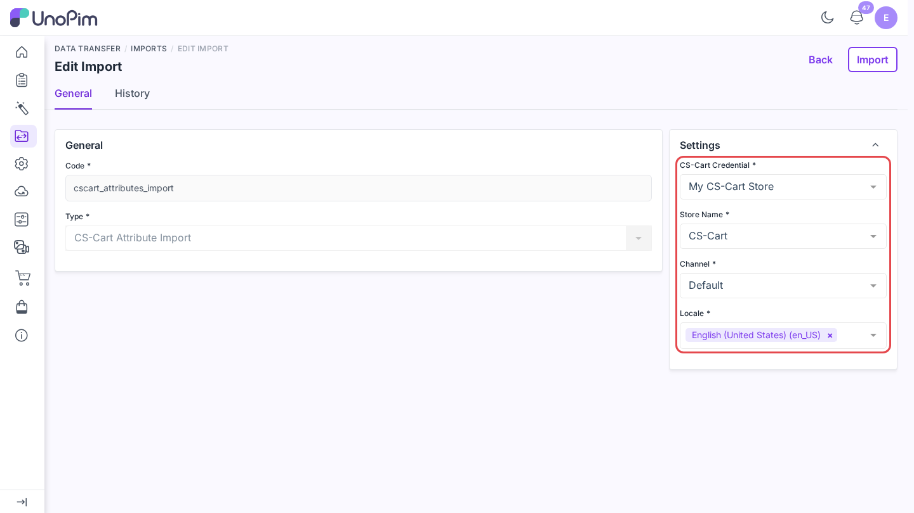
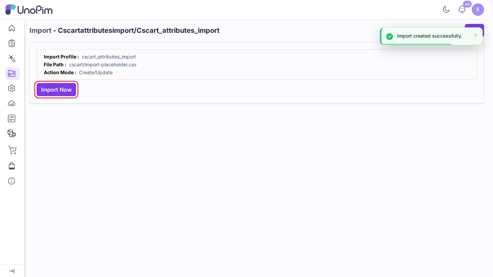
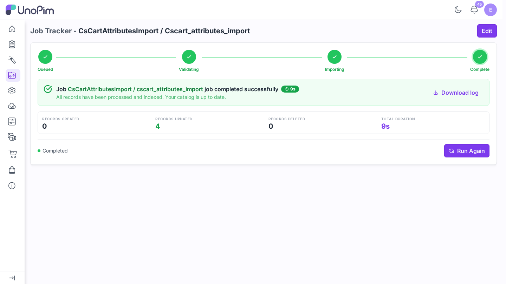

# Import attributes

Pull CS-Cart **features** into UnoPim as attributes, so you can enrich them in UnoPim and send them back later.

> **Before you start.** Add a [credential](./credentials) and [map your locales](./locale-mapping). In CS-Cart, give every feature you want a **Feature code** - it becomes the UnoPim attribute code.

**Open it from:** *Data Transfer → Imports*

## 1. Create the profile

1. Open **Data Transfer → Imports** and click **Create Import**.

2. **Type** - pick **CS-Cart Attribute Import**.
3. **Code** - a short identifier, e.g. `cscart_attributes_import`.

## 2. Fill the filters

| Filter | Required | What it does |
|--|--|--|
| **CS-Cart Credential** | ✓ | The CS-Cart store to import from. |
| **Store Name** | ✓ | The CS-Cart storefront (company) to read. |
| **Channel** | ✓ | The channel the import runs for. |
| **Locale** | ✓ | One or more locales to fill. Each must be [mapped](./locale-mapping). |

## 3. Run it

Click **Save changes** in the bar at the bottom. UnoPim opens the profile page. Click **Import Now**.

The job runs in the queue. Follow it on **Data Transfer → Job Tracker**.

## What happens

| CS-Cart feature type | UnoPim attribute type |
|--|--|
| S, E, I (select-type features) | select |
| Multiple checkboxes (M) | multiselect |
| Single checkbox (C) | boolean |
| Number (N) | number |
| Date (D) | date |
| Text and others | text |

- The attribute code is the feature's **Feature code**, or the code it was exported with. A feature with no code is skipped with *Skipped CS-Cart feature (name) (ID …): it has no feature code to use as the UnoPim attribute code.*
- Feature variants become attribute options. A new option gets a code made from its label, e.g. *Dark Red* becomes `dark_red`. An existing option keeps its code and only its labels are updated.
- An attribute that already exists in UnoPim is updated, not duplicated.
