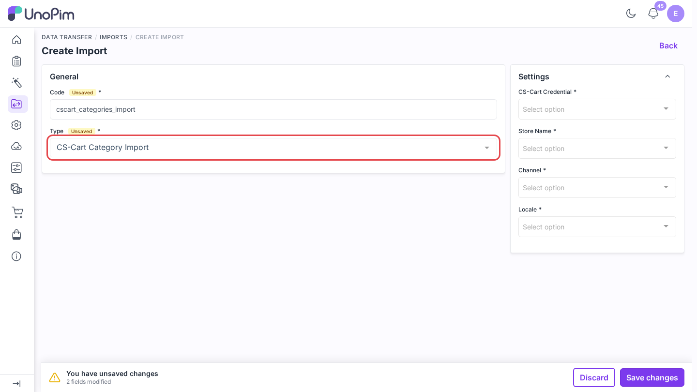
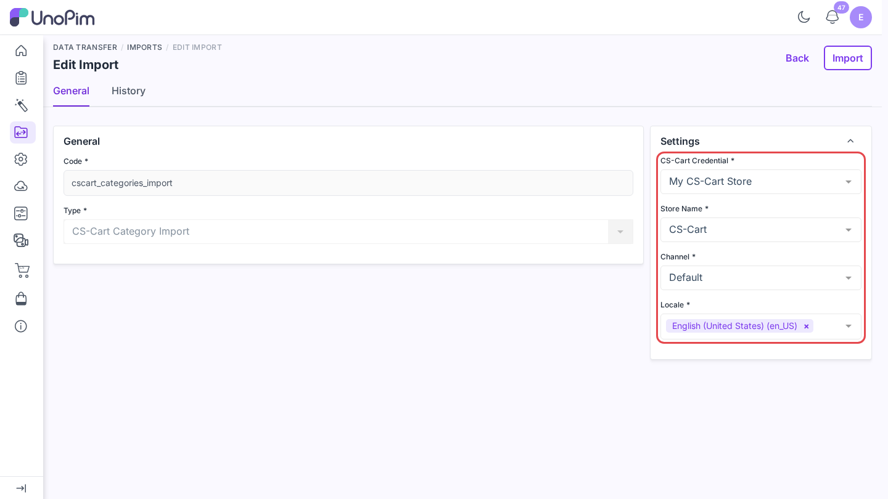
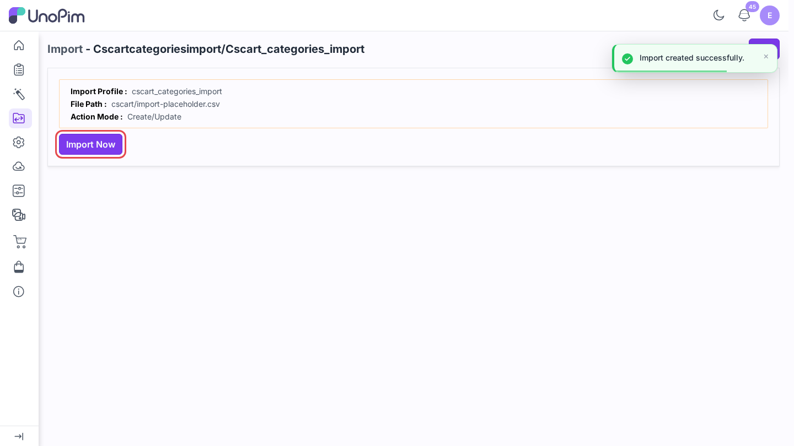
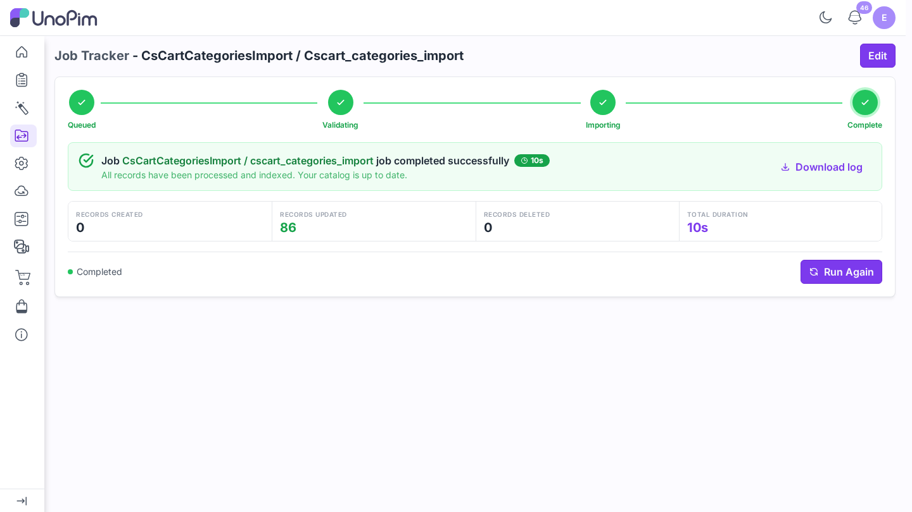

# Import categories

Pull your CS-Cart category tree into UnoPim with its parent and child links and its images.

> **Before you start.** Add a [credential](./credentials), [map your locales](./locale-mapping), and [map category fields](./category-mapping).

**Open it from:** *Data Transfer → Imports*

## 1. Create the profile

1. Open **Data Transfer → Imports** and click **Create Import**.

2. **Type** - pick **CS-Cart Category Import**.
3. **Code** - a short identifier, e.g. `cscart_categories_import`.

## 2. Fill the filters

| Filter | Required | What it does |
|--|--|--|
| **CS-Cart Credential** | ✓ | The CS-Cart store to import from. |
| **Store Name** | ✓ | The CS-Cart storefront (company) to read. |
| **Channel** | ✓ | Top-level CS-Cart categories are placed under this channel's root category. |
| **Locale** | ✓ | One or more locales to fill. Each must be [mapped](./locale-mapping). |

## 3. Run it

Click **Save changes** in the bar at the bottom. UnoPim opens the profile page. Click **Import Now**.

The job runs in the queue. Follow it on **Data Transfer → Job Tracker**.

## What happens

- The category code is the code it was exported with, or else its CS-Cart **SEO name**. When two categories share an SEO name, the second one gets its own code.
- Field values land in the UnoPim fields set in [Map categories](./category-mapping).
- When a **Category Media** field is set, the CS-Cart category image is downloaded into it.
- A category that already exists in UnoPim is updated in place.
