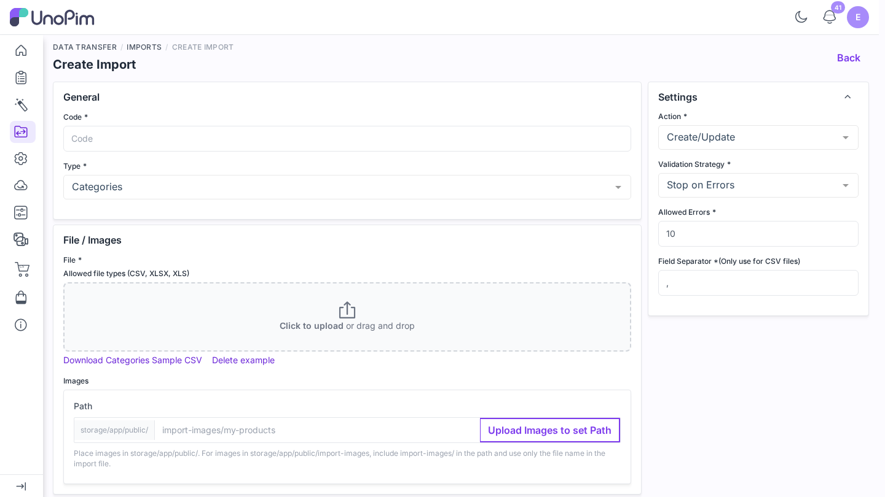
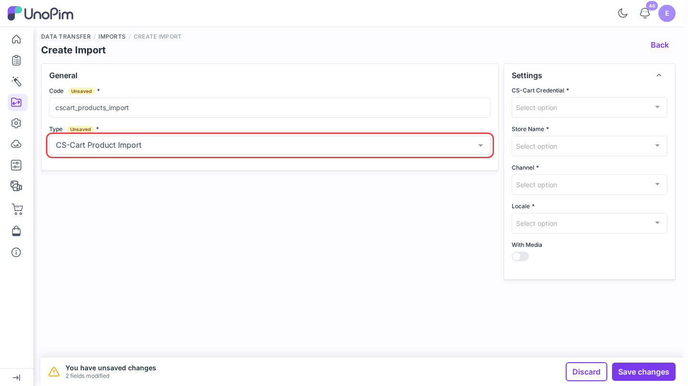
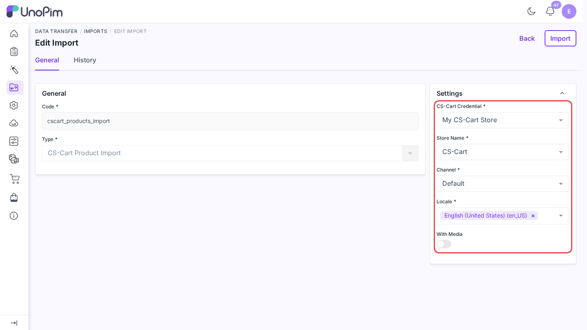
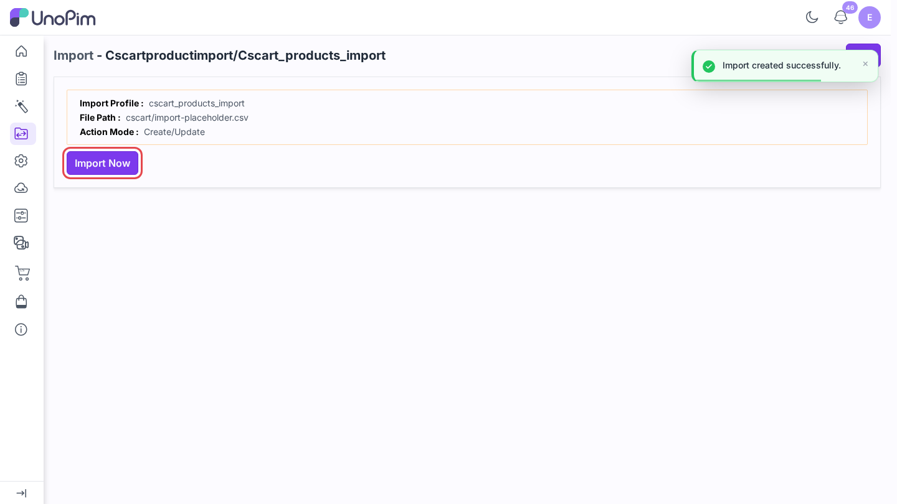
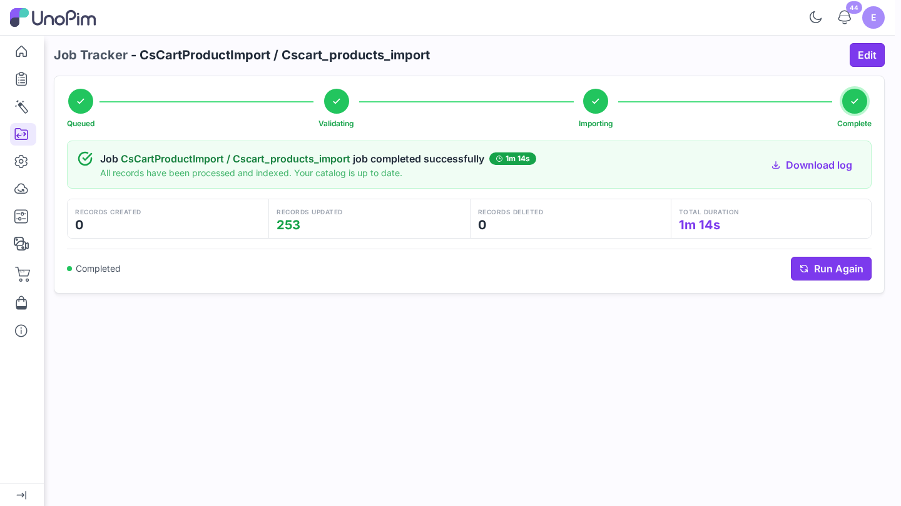

# Import products

Pull CS-Cart products into UnoPim so you can enrich them - better descriptions, more locales, richer attributes - and send them back later.

> **Before you start.** Add a [credential](./credentials), [map locales](./locale-mapping) and [attributes](./attribute-mapping), then run [Import attributes](./import-attributes) and [Import categories](./import-categories) so the products find their attributes and categories.

**Open it from:** *Data Transfer → Imports*

## 1. Create the profile

1. Open **Data Transfer → Imports** and click **Create Import**.

2. **Type** - pick **CS-Cart Product Import**.
3. **Code** - a short identifier, e.g. `cscart_products_import`.

## 2. Fill the filters

| Filter | Required | What it does |
|--|--|--|
| **CS-Cart Credential** | ✓ | The CS-Cart store to import from. |
| **Store Name** | ✓ | The CS-Cart storefront (company) to read. |
| **Channel** | ✓ | The channel whose values are filled. Prices are saved in this channel's base currency. |
| **Locale** | ✓ | One or more locales to fill. Each must be [mapped](./locale-mapping). |
| **With Media** | - | Download product images into the attributes set under **Attributes to use as Images**. |

## 3. Run it

Click **Save changes** in the bar at the bottom. UnoPim opens the profile page. Click **Import Now**.

The job runs in the queue. Follow it on **Data Transfer → Job Tracker**.

## What happens

- The SKU is the CS-Cart **product code**. A product whose SKU exists in UnoPim is updated; a new one is created in the **Default** attribute family.
- CS-Cart **variation groups** come back as a configurable product with its variants, and the variant axes (such as *color* or *size*) are set on it.
- Features fill the mapped attributes; select and multiselect values are matched to the attribute's options.
- With **With Media** on, the CS-Cart product images are downloaded into the image attributes.
