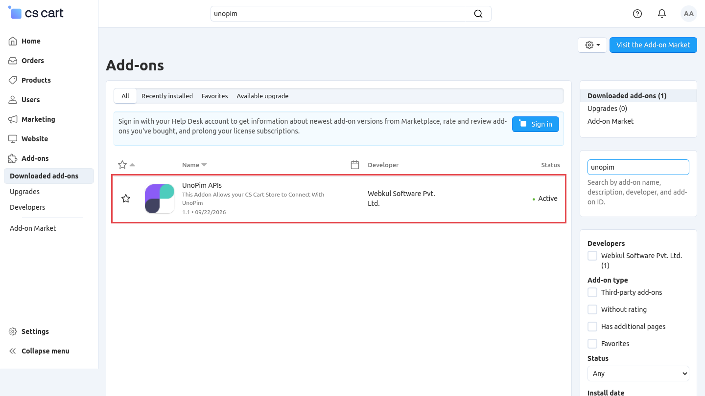
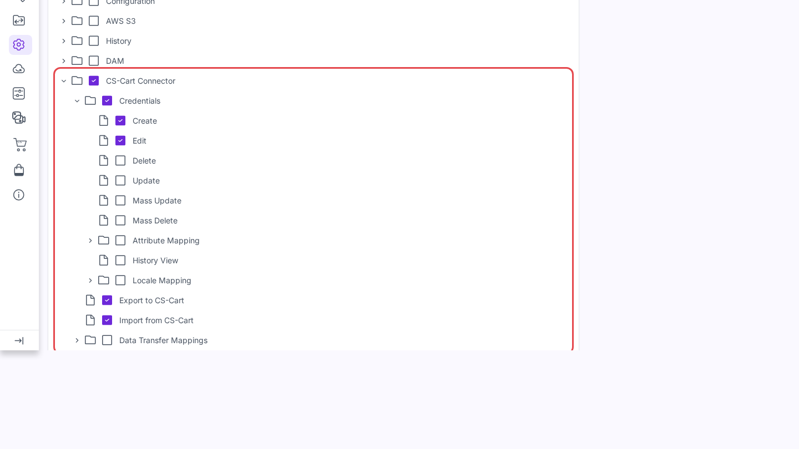

# Installation

The connector has two parts: a **CS-Cart add-on** that adds the API endpoints UnoPim needs, and the **UnoPim package**. Install both. Once done, see [Add CS-Cart credentials](./credentials).

## 1. Install the CS-Cart add-on

CS-Cart does not expose features, options, or product variations through its REST API on its own. The `cscart_unopim` add-on adds them.

| Endpoint | Used for |
|---|---|
| `/api/features` | Attributes, and the connection check when you save a credential |
| `/api/options` | Select and multiselect option values |
| `/api/product_variations`, `/api/product_variations_groups` | Configurable products |

1. Find `cscart_unopim.zip` in the connector package, under `CsCartModule/`.
2. In the CS-Cart admin, open **Add-ons → Manage add-ons**, click **+**, choose **Local**, upload the zip, and install it.
3. Open **Customers → Administrators**, edit the admin user UnoPim will use, switch on **API access**, and copy the **API key**.



> [!TIP]
> Upgrading from the older `cscart_akeneo` add-on? CS-Cart treats the new one as a separate add-on. Uninstall **Akeneo API's** first, install `cscart_unopim.zip`, then clear the CS-Cart cache by adding `?cc` to any admin URL.

## 2. Add the package to UnoPim

Unzip the extension and move the package folder into your UnoPim project:

```
packages/Webkul/CsCartConnector/
```

In your project's root `composer.json`, add the namespace:

```json
"autoload": {
    "psr-4": {
        "Webkul\\CsCartConnector\\": "packages/Webkul/CsCartConnector/src"
    }
}
```

## 3. Register the provider

In `bootstrap/providers.php`:

```php
use Webkul\CsCartConnector\Providers\CsCartConnectorServiceProvider;

return [
    // ...
    CsCartConnectorServiceProvider::class,
];
```

## 4. Run the install command

```bash
composer dump-autoload
php artisan cscart-package:install
php artisan optimize:clear
php artisan queue:restart
```

| Command | Purpose |
|---|---|
| `composer dump-autoload` | Loads the new `Webkul\CsCartConnector` namespace. |
| `php artisan cscart-package:install` | Asks to run the migrations (default yes), then publishes the connector assets. |
| `php artisan optimize:clear` | Clears cached config, routes, and views so UnoPim sees the connector. |
| `php artisan queue:restart` | Tells running queue workers to reload the new code. |

## 5. Keep a queue worker running

```bash
php artisan queue:work
```

Every import and export runs as a queued job. Without a worker, jobs stay pending. In production, keep the worker alive with Supervisor, systemd, or Horizon.

## 6. Give your role permission

Open **Settings → Roles**, edit the role, and tick what it may do under **CS-Cart Connector**:

| Permission | Covers |
|---|---|
| **Credentials** | Create, Edit, Update, Delete, Mass Update, and Mass Delete credentials. |
| **Credentials → Attribute Mapping** | Update the attribute and category mapping, and add or remove additional attributes. |
| **Credentials → Locale Mapping** | Update the locale mapping. |
| **Credentials → History View** | See the change history of a credential. |
| **Data Transfer Mappings** | Create, Delete, and Mass Delete [data transfer mappings](./data-transfer-mappings). |
| **Export to CS-Cart** | Run export profiles and quick export. |
| **Import from CS-Cart** | Run import profiles and quick import. |



Without these, the menu and buttons stay hidden.

## Check it worked

1. **Menu.** A **CS-Cart** menu appears in the sidebar with **Credentials** and **Data Transfer Mappings**.
2. **Credential.** **CS-Cart → Credentials → Create Credential** saves only when the store answers. A wrong URL or key shows an error.
3. **Export types.** **Data Transfer → Exports → Create Export** lists **CS-Cart Attribute Export**, **CS-Cart Category Export**, and **CS-Cart Product Export**.
4. **Import types.** **Data Transfer → Imports → Create Import** lists **CS-Cart Attribute Import**, **CS-Cart Category Import**, and **CS-Cart Product Import**.

If a check fails, confirm the add-on is installed in CS-Cart, the queue worker is running, and you ran `php artisan optimize:clear`.
