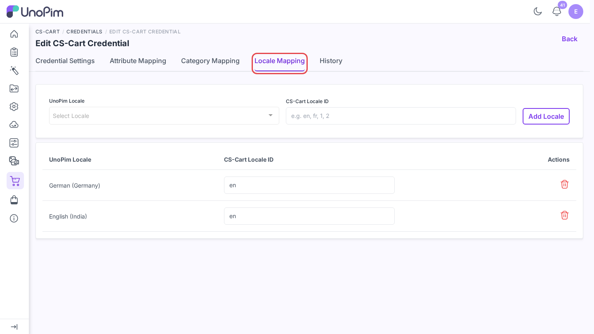
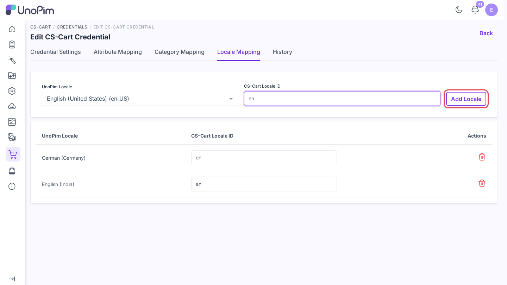
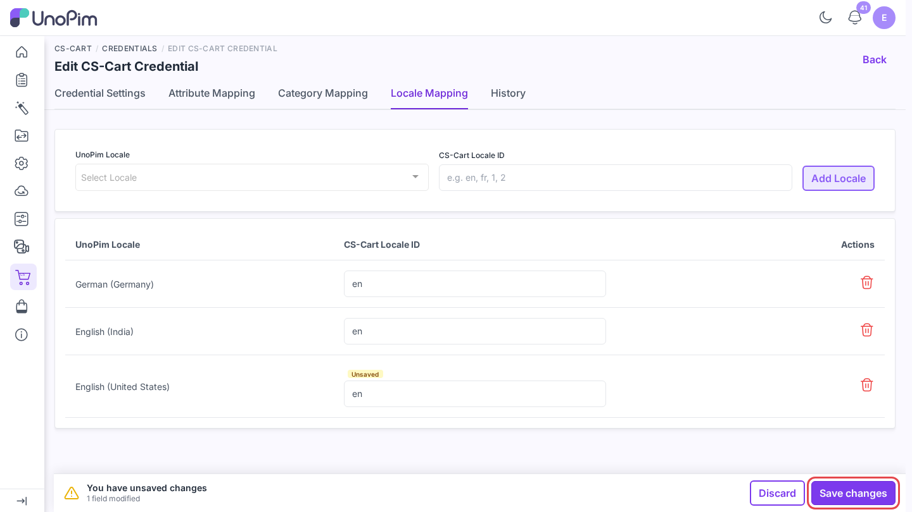

# Map locales

CS-Cart names its languages with short codes such as `en`, `fr`, or `de`. UnoPim uses locale codes such as `en_US` or `fr_FR`. The **Locale Mapping** tab tells the connector which CS-Cart language each UnoPim locale reads from and writes to.

**Open it from:** *CS-Cart → Credentials → (edit a credential) → Locale Mapping*

## Steps

1. Open the credential and click the **Locale Mapping** tab.

2. Pick a UnoPim **Locale**, type the matching **CS-Cart Locale ID** (for example `en`), and click **Add Locale**.

3. Repeat for every locale you plan to import or export.
4. Click **Save changes** in the bar at the bottom. You see *Locale mapping updated successfully.*

## Example

| UnoPim locale | CS-Cart Locale ID |
|--|--|
| `en_US` | `en` |
| `fr_FR` | `fr` |
| `de_DE` | `de` |

Find the code of each language in the CS-Cart admin under *Administration → Languages → Manage languages*.

## Notes

- Each UnoPim locale can be mapped once. A second row for the same locale shows *Mapping for this locale already exists.*
- Both fields are needed. An empty one shows *Both Locale and CS-Cart Locale ID are required.*
- A job stops if one of its locales is not mapped, with *The selected locale [en_US] is not mapped in CS-Cart. Please configure it in the Credential settings.*
