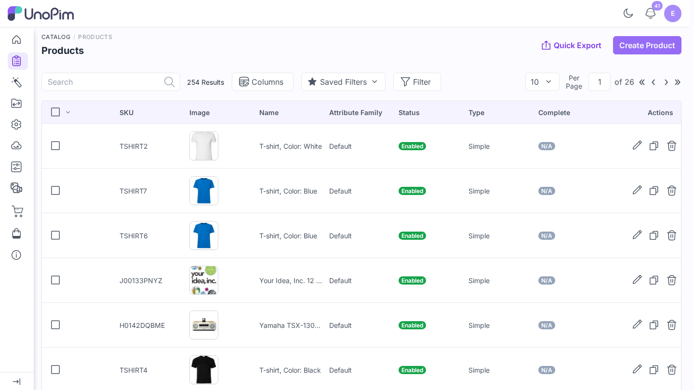
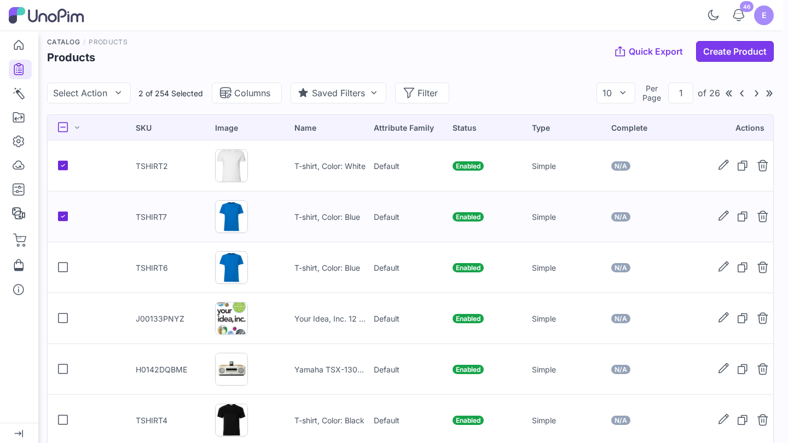
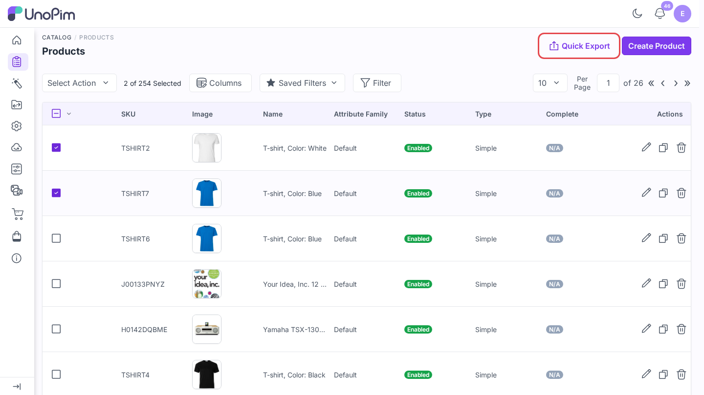
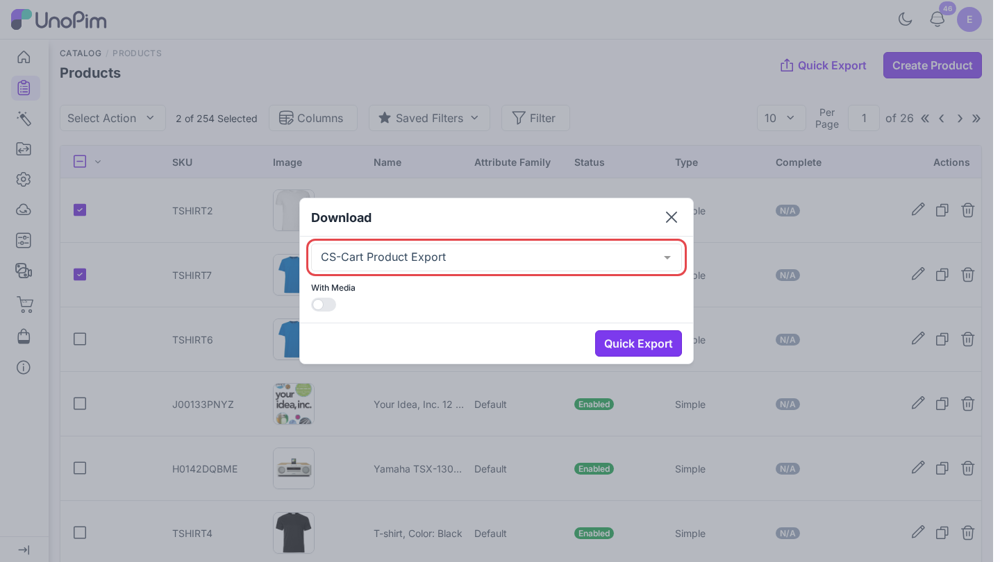
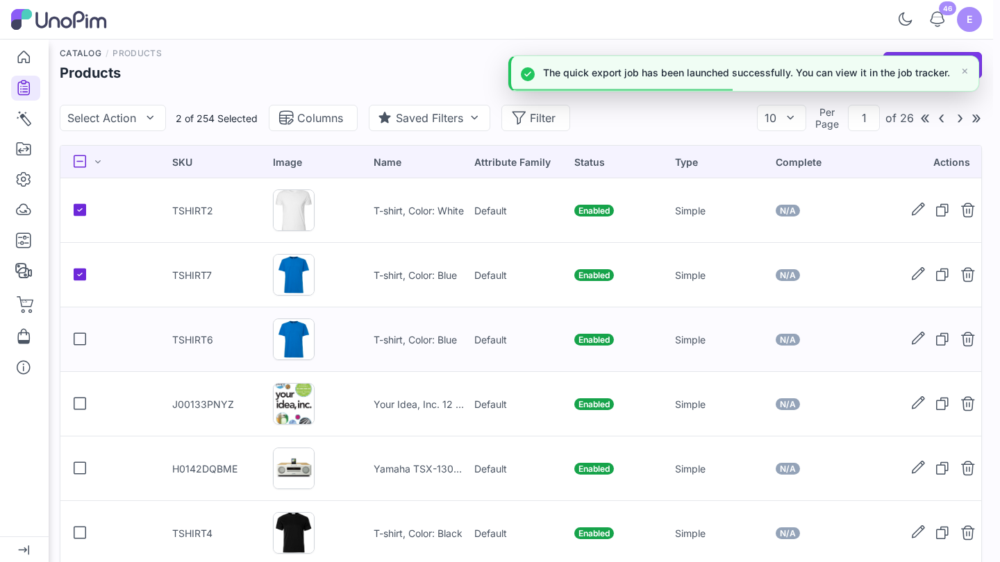

# Quick export

Send selected products to CS-Cart straight from the product grid, without creating an export profile.

> **Before you start.** On one credential, switch on **Default for quick Export** in [Credential Settings](./credentials#credential-settings), and set its **Quick Export Settings** (channel, locale, currency) in [Map attributes](./attribute-mapping#quick-export-settings). Quick export always uses that credential.

**Open it from:** *Catalog → Products*

## Steps

1. Open **Catalog → Products**.

2. Tick the products to send.

3. Click **Quick Export**.

4. In the dialog, pick **CS-Cart Product Export** as the format, switch **With Media** on if images should go too, and click **Quick Export**.

You see *The quick export job has been launched successfully. You can view it in the job tracker.*

## What it uses

| Setting | Comes from |
|--|--|
| **Credential** | The credential marked **Default for quick Export**. |
| **Channel / Locale / Currency** | That credential's **Quick Export Settings**. |
| **Fields and features** | That credential's [attribute mapping](./attribute-mapping). |
| **Products** | The ticked rows. A ticked variant sends its whole configurable product. |
| **With Media** | The switch in the dialog. |

For other locales, another credential, or filters, use a full [export profile](./export-products).

## If it does not start

| Message | Fix |
|--|--|
| *None of the credentials are set as default for quick export.* | Switch on **Default for quick Export** on a credential. |
| *Quick export settings are not configured in the default credential set for quick export.* | Set channel, locale, and currency under **Quick Export Settings**. |
| **CS-Cart Product Export** is missing from the format list | Your role needs the **Export to CS-Cart** permission. |
