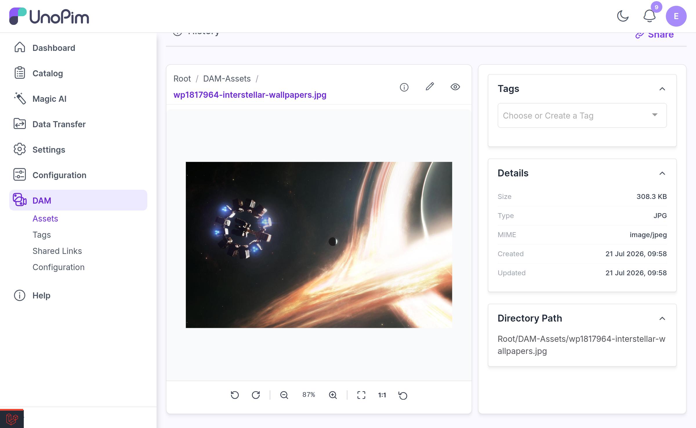
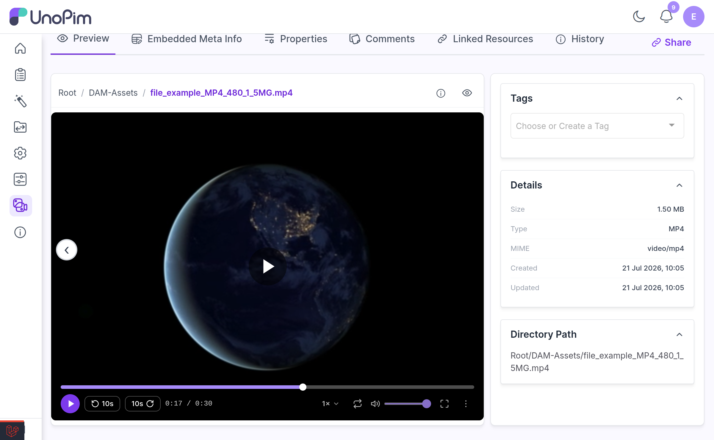
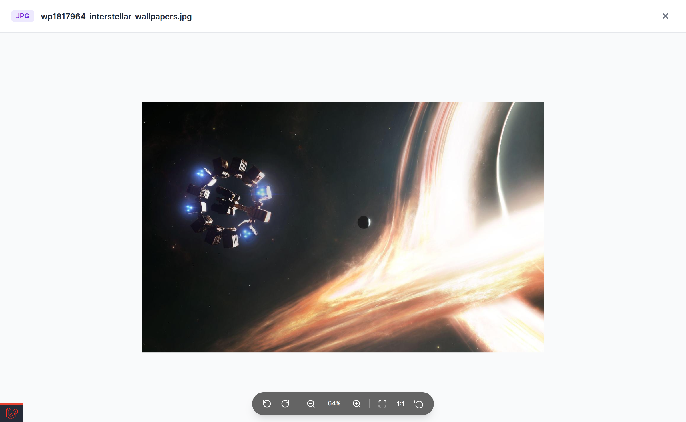

# Previewing Assets

Every asset in the library can be previewed in place — no downloading, no external viewer. Images, video, audio, and PDFs each get a purpose-built viewer.

---

## Opening a Preview

Click anywhere on an asset card in the gallery to open its preview. The hover action buttons (edit, download, delete) keep working independently, so clicking a button does not open the preview.

The preview also renders inline on the **asset edit page**, so you can see the file while you edit its tags and properties.

> [!NOTE]
> Opening a preview requires the **View** permission (`dam.asset.view`).

---

## Image Preview

Images open in a viewer with full zoom and pan support:

| Control | What it does |
|---|---|
| **Zoom in / out** | Scale the image up or down |
| **Fit to screen** | Scale the image to fit the viewport |
| **Actual size** | Reset to actual pixel size (1:1) |
| **Rotate left / right** | Turn the image 90° at a time |
| **Reset all** | Undo zoom, pan and rotation in one click |
| **Pan** | Click and drag to move around a zoomed image |
| **Double-click** | Toggle between fit and zoomed |



### Mouse and keyboard shortcuts

The viewer is built for people who page through a lot of images, so the common actions are on the keyboard and the scroll wheel.

| Shortcut | Action |
|---|---|
| **Scroll wheel** | Zoom in and out, centred on the pointer |
| `+` | Zoom in |
| `-` | Zoom out |
| `R` | Rotate right |
| `L` | Rotate left |
| `0` | Reset zoom, pan and rotation |
| `Esc` | Close the preview |

The same zoomable viewer is used on the [public share page](./shared-links.md), so people you share a link with get the same experience.

---

## Video and Audio Preview

Video and audio files play in a custom player rather than the browser's default controls.

| Control | What it does |
|---|---|
| **Play / pause** | Start and stop playback |
| **Scrub bar** | Jump to any point |
| **Back 10s / Forward 10s** | Skip in 10-second steps |
| **Volume** | Adjust level |
| **Mute** (`M`) | Silence without changing the level |
| **Speed** | Change playback rate |
| **Loop** (`L`) | Repeat the file continuously |
| **Picture in Picture** | Pop the video into a floating window so you can keep working |
| **Fullscreen** (`F`) | Fill the screen |
| **More Actions → Copy Link** | Copy a direct link to the file (confirms with *"Copied!"*) |
| **More Actions → Open in New Tab** | Open the raw file in its own tab |



For audio files, DAM reads the **embedded ID3 cover art** and uses it as both the asset thumbnail in the gallery and the backdrop of the audio player.

---

## PDF Preview

PDFs render page-by-page inside the browser using PDF.js — you can page through the document without leaving DAM.

---

## Thumbnails for PDFs and Videos

DAM generates **real thumbnails** for PDFs (first page) and videos (first frame) when they are uploaded. The work happens on the queue, so the thumbnail appears shortly after upload completes.

This requires two tools to be installed on the server:

| Tool | Used for |
|---|---|
| `ffmpeg` | Video first-frame thumbnails |
| `poppler-utils` (provides `pdftoppm`) | PDF first-page thumbnails |

If either is missing, the gallery falls back to a generic file-type icon and a warning is written to the log — nothing breaks, you just do not get a real preview image.

### Backfilling existing assets

Assets uploaded before this feature existed will not have thumbnails. Generate them in bulk:

```bash
php artisan dam:backfill-thumbnails
```

See [Artisan Commands](./commands.md#dambackfill-thumbnails) for the options.

---

## The Info Panel

You do not need to open the asset edit page to check a file's details. The preview carries an **info** control — and the asset card shows *"Click for full details"* on hover — which opens a **File Info** panel:

| Field | Example |
|---|---|
| **File Name** | `hero-banner.jpg` |
| **Type** | Image, with a colour-coded extension badge |
| **Size** | `2.4 MB` |
| **Path** | `Root / Campaigns / Summer 2026` |
| **MIME** | `image/jpeg` |
| **Dimensions** | `1920 × 1080` |
| **Created at** | Upload date |
| **Updated at** | Last modified date |



---

## Reading the Asset Card

Cards in the gallery are designed so you can identify a file without opening it:

| Cue | Meaning |
|---|---|
| **Colour-coded extension badge** | The file type at a glance — PDF, MP4, XLSX and so on each get their own colour |
| **Play overlay** | The asset is a video |
| **Audio icon or cover art** | The asset is audio; embedded album art is used when present |
| **Faded thumbnail** | A real thumbnail has not been generated yet |

Hovering a card reveals its action buttons — **Preview**, **Edit image**, download and delete — which work independently of the card click.

When a directory is empty, DAM shows a dedicated empty state rather than a blank pane.

---

## Metadata

The **Metadata** tab on the asset edit page shows the technical metadata extracted from the file — dimensions, camera data, codec, duration, and so on, depending on the file type. This data is extracted once at upload and stored, so the tab loads instantly.

> [!IMPORTANT]
> Full metadata extraction needs **`exiftool`** on the server. Without it DAM falls back to PHP's basic EXIF reader, which covers images only — IPTC, XMP and audio ID3 tags are not read, and audio cover art never appears. Nothing in the UI explains the shortfall, so if the Metadata tab looks unexpectedly thin, check `exiftool -ver` first. See [Installation](./installation.md#optional-server-tools).

> [!NOTE]
> The Metadata tab is permission-gated. A role needs **Embedded Meta Info** (`dam.asset.meta_data`) to see it.

---

## Breadcrumbs and Navigation

Both the gallery and the asset edit page show the **full ancestor path** of the asset as a breadcrumb. Every segment is a link that jumps straight to that directory.

The **previous / next** arrows on the asset edit page move between assets **within the same directory**, and the position counter (`3 of 48`) reflects that directory's scope — not the whole library.

---

## Downloading

| Action | What you get |
|---|---|
| **Download** | The original file, exactly as uploaded |
| **Download Zip** | The asset packaged inside a ZIP container |
| **Custom Download** | An image converted to a chosen format (JPG, PNG, WebP, JPEG) and, optionally, resized to custom dimensions |

> [!NOTE]
> **Custom Download on an SVG** rasterises the vector first, which requires the PHP **`imagick`** extension. Without it, converting an SVG fails while other formats keep working.

Each of these is separately permissioned — see [Setup](./setup.md).

---

## Related

- [Image Editor](./image-editor.md) — cropping, adjusting, and replacing backgrounds
- [Shared Links](./shared-links.md) — letting people outside UnoPim view an asset
- [Artisan Commands](./commands.md) — thumbnail backfill
