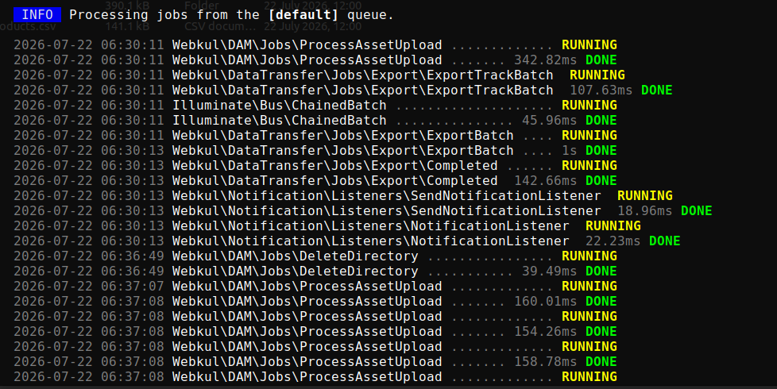

# Background Operations

Some DAM actions are too slow to finish inside a web request. Deleting a folder with 40,000 assets, copying a directory tree, or moving a large selection would time out if DAM tried to do it while you waited.

Instead these run as **queued background jobs**. DAM starts the job, returns immediately, and then polls for progress while you carry on working.

---

## Which Actions Run in the Background

| Action | Where you trigger it |
|---|---|
| **Delete directory** | Tree right-click, Explorer context menu, API |
| **Rename directory** | Tree right-click, Explorer |
| **Copy directory** | Tree right-click, Explorer clipboard paste |
| **Copy directory structure** | *Copy Directory Structure* / *Copy structure to…* |
| **Move directory structure** | Dragging a folder to a new parent |
| **Mass move** | Explorer → *Move to…* |
| **Mass copy** | Explorer → *Copy to…* |

Everything else — uploading a handful of files, renaming an asset, tagging — happens immediately in the request.

---

## What You See

While a job runs, DAM shows a progress indicator with a running message:

- *"Deleting directory 'Campaigns'…"*
- *"Copying directory 'Brand Assets'…"*
- *"Moving asset 'hero-banner.jpg'…"*
- *"Processing 240 assets…"*



If a job takes longer than the UI expects, the message changes to:

> *"Operation is still running in the background"*

That is informational, not an error. The job is fine — it is simply large.

You can navigate away, open another tab, or close the page entirely. The job keeps running on the server and finishes without you.

---

## The Queue Worker Is Required

> [!IMPORTANT]
> **Background operations only complete if a queue worker is running.** Without one, the job is written to the queue and sits there forever. The folder you deleted appears to hang mid-operation, and nothing in the UI explains why.

Start a worker with:

```bash
php artisan queue:work
```

In production, run it under a process supervisor so it restarts automatically:

```bash
sudo supervisorctl status unopim-worker
```

See [Artisan Commands](./commands.md) for the wider command reference and [Installation](./installation.md) for the recommended queue setup.

> [!TIP]
> If a bulk action seems stuck, check the worker first — it is by far the most common cause. `php artisan queue:failed` lists jobs that errored out.

---

## Progress Is Per User

Progress is tracked against **your admin account and the operation type**. Two administrators running a mass copy at the same time each see their own progress, not each other's.

Because tracking is per operation type, starting a second mass copy while your first is still running replaces the progress you are watching. Let one finish before starting the next.

---

## When Something Fails

If a job fails, the failure is recorded against the operation and surfaced in the UI with the reason — a permissions problem, a disk that is not writable, or a target folder that was deleted mid-operation.

Partial results are **not rolled back**. A mass move that fails halfway leaves the already-moved files at the destination. Re-running the operation on what remains is safe.

Server-side logs carry the full detail:

```bash
tail -f storage/logs/laravel.log
```

---

## Related

- [Explorer View](./explorer.md) — where most bulk operations are started
- [Directory & Asset Management](./directory-and-asset-management.md) — folder copy, move and delete
- [Artisan Commands](./commands.md) — queue and maintenance commands
