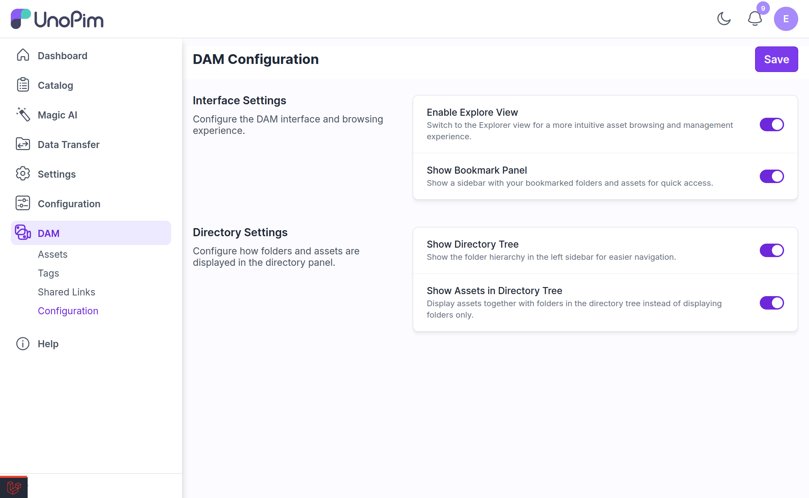
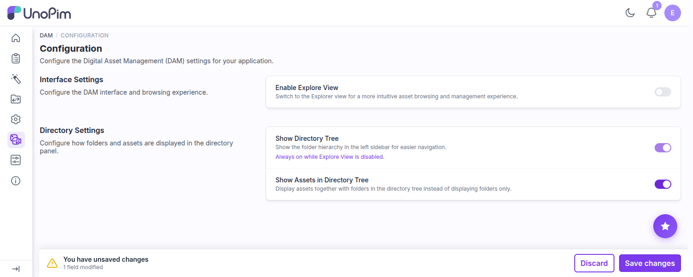

# Configuration

DAM has a settings page at **DAM → Configuration** for changing how the media library behaves — without editing `.env` or redeploying.



Change what you need and click **Save changes**. You will see *"Configuration saved successfully."* The relevant caches are cleared for you automatically.

> [!NOTE]
> Viewing the page requires `dam.configuration.index`; saving requires `dam.configuration.update`. Without the update permission the form is shown read-only.

---

## Unsaved Changes

Nothing on this page is applied until you save it. As soon as you move a toggle, a bar appears along the bottom telling you how many fields you have changed:



| Action | What it does |
|---|---|
| **Save changes** | Applies every pending toggle and clears the caches |
| **Discard** | Puts every toggle back to the last saved state |

If you try to leave with changes still pending, you are asked to confirm first, so a half-made change cannot be lost by accident. This covers both cases: clicking a link elsewhere in the admin — which no longer reloads the page, see [A Single-Page Experience](./index.md#a-single-page-experience) — and closing or reloading the tab outright.

---

## Interface Settings

*Configure the DAM interface and browsing experience.*

| Setting | Default | What it does |
|---|---|---|
| **Enable Explore View** | Off | Replaces the default asset grid with the multi-tab folder [Explorer](./explorer.md). |
| **Show Bookmark Panel** | Off | Shows a sidebar of bookmarked folders for quick access. *This row only appears once Explore View is on.* |

## Directory Settings

*Configure how folders and assets are displayed in the directory panel.*

| Setting | Default | What it does |
|---|---|---|
| **Show Directory Tree** | On | Shows the folder hierarchy in the left sidebar. |
| **Show Assets in Directory Tree** | Off | Assets appear as leaf nodes inside the tree, not just folders. *This row only appears while Show Directory Tree is on.* |

---

## How the Toggles Affect Each Other

These four switches are interdependent, which is why some of them appear, disappear, or move on their own as you click. The rules are:

| What you do | What happens automatically |
|---|---|
| Turn **Enable Explore View** on | **Show Bookmark Panel** appears and is switched **on** for you |
| Turn **Enable Explore View** off | **Show Bookmark Panel** is hidden, and **Show Directory Tree** is forced on and locked |
| Turn **Show Directory Tree** on | **Show Assets in Directory Tree** appears and is switched **on** for you |
| Turn **Show Directory Tree** off | **Show Assets in Directory Tree** is hidden |

> [!IMPORTANT]
> **Show Directory Tree cannot be turned off while Explore View is off.** With no Explorer to browse in, the tree is the only way to navigate, so DAM forces it on, greys the toggle out, and shows the hint *"Always on while Explore View is disabled."* Turn Explore View on first if you want to hide the tree.

Enabling a parent switches its child on as a convenience, not a constraint — you are free to switch the child back off afterwards and save.

---

### Show Assets in Directory Tree

Off by default, and that default is deliberate. With it on, the tree loads assets as well as folders, which is convenient on a small library and slow on a large one.

When enabled, assets load **lazily** — DAM fetches directories in batches of **100** with a **Load more** control, and only pulls a directory's assets when you actually expand it. Even so, on libraries with tens of thousands of assets you will feel the difference. Leave it off unless you need it.

---

## Environment Variables

The four settings above can also be set in `.env`. They map like this:

| Env var | Setting | Default |
|---|---|---|
| `DAM_TREE_SHOW_ASSETS` | Show Assets in Directory Tree | `false` |
| `DAM_EXPLORER_ENABLED` | Enable Explore View | `false` |
| `DAM_EXPLORER_BOOKMARKS_ENABLED` | Show Bookmark Panel | `false` |
| `DAM_EXPLORER_SHOW_TREE` | Show Directory Tree | `true` |

> [!IMPORTANT]
> **The Configuration page wins over `.env`.** These four values are read from the database on every DAM request and override whatever `.env` says. If you set `DAM_EXPLORER_ENABLED=true` in `.env` but the toggle is off on the Configuration page, Explorer stays **off**.
>
> Treat the Configuration page as the source of truth and use `.env` only for the upload settings below, which have no UI.

### Upload tuning (env only)

These four have no Configuration-page equivalent and must be set in `.env`:

| Env var | Default | What it does |
|---|---|---|
| `DAM_UPLOAD_CONCURRENCY` | `4` | How many files upload in parallel. Raise it on a fast connection, lower it if your server struggles. |
| `DAM_UPLOAD_RESUME_ENABLED` | `true` | Whether an interrupted upload can be resumed after a browser refresh. |
| `DAM_UPLOAD_RESUME_MAX_BYTES` | `524288000` (500 MB) | The largest batch that will be stashed for auto-resume. Bigger batches show *"Batch too large to auto-resume after refresh"*. |
| `DAM_UPLOAD_RESUME_STALE_HOURS` | `24` | How long a stashed, unfinished upload stays resumable before it is discarded. |

```ini
DAM_UPLOAD_CONCURRENCY=6
DAM_UPLOAD_RESUME_ENABLED=true
DAM_UPLOAD_RESUME_MAX_BYTES=524288000
DAM_UPLOAD_RESUME_STALE_HOURS=24
```

### Asset bundle imports (env only)

These bound what a ZIP uploaded to a product or category import may expand to — see [Importing an asset bundle](./import-assets.md#importing-an-asset-bundle-zip). The defaults are deliberately wide, because a bundle legitimately carries video and other large binaries; they are a guard against a malicious archive, not a limit on your assets.

| Env var | Default | What it caps |
|---|---|---|
| `DAM_IMPORT_BUNDLE_MAX_ENTRY_SIZE` | `524288000` (500 MB) | The largest single file in the archive |
| `DAM_IMPORT_BUNDLE_MAX_TOTAL_SIZE` | `5368709120` (5 GB) | The total size everything expands to |
| `DAM_IMPORT_BUNDLE_MAX_ENTRIES` | `50000` | How many files the archive may contain |
| `DAM_IMPORT_BUNDLE_MAX_COMPRESSION_RATIO` | `200` | How far one entry may expand before it is treated as a zip bomb |

```ini
DAM_IMPORT_BUNDLE_MAX_ENTRY_SIZE=524288000
DAM_IMPORT_BUNDLE_MAX_TOTAL_SIZE=5368709120
DAM_IMPORT_BUNDLE_MAX_ENTRIES=50000
DAM_IMPORT_BUNDLE_MAX_COMPRESSION_RATIO=200
```

An import that trips one of these stops with a message naming the limit, for example *"The archive expands to more than 5120 MB."*

Remember to clear config cache after editing `.env`:

```bash
php artisan config:clear
```

---

## Related

- [Explorer View](./explorer.md) — what the Explorer toggle turns on
- [Uploading Assets](./uploading-assets.md) — the upload behaviour these settings tune
- [Importing Assets](./import-assets.md) — where the bundle limits apply
- [Setup](./setup.md) — granting the Configuration permission
