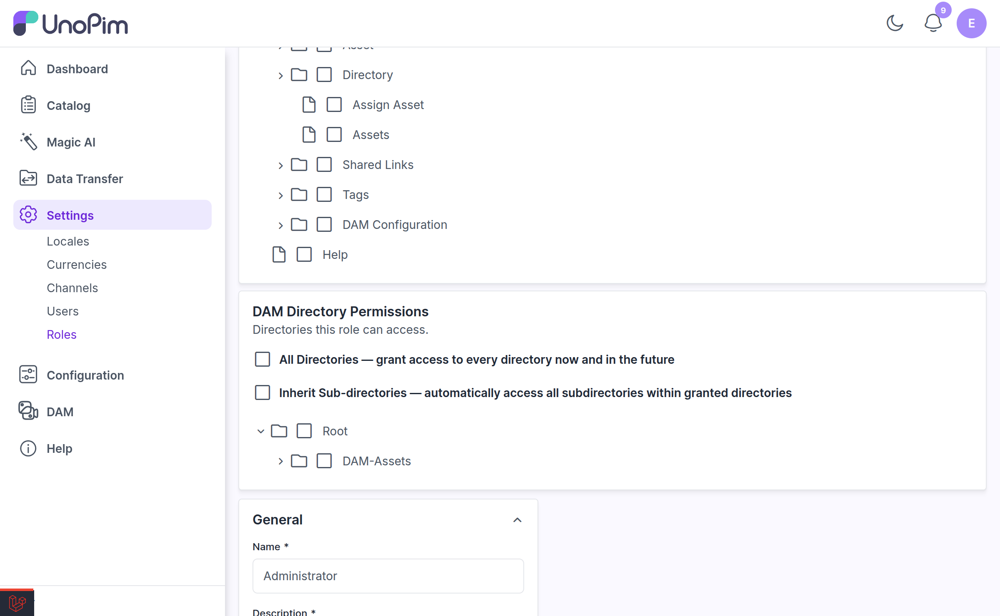
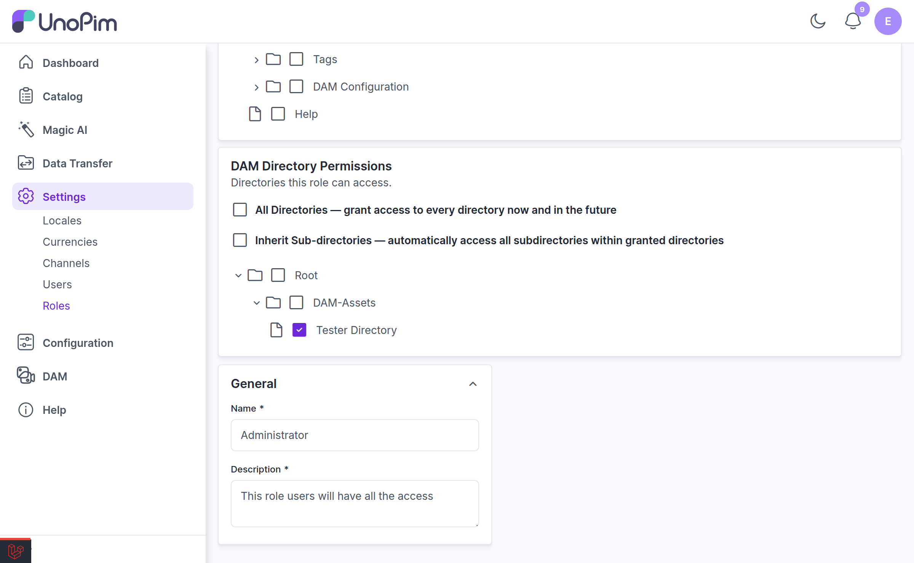
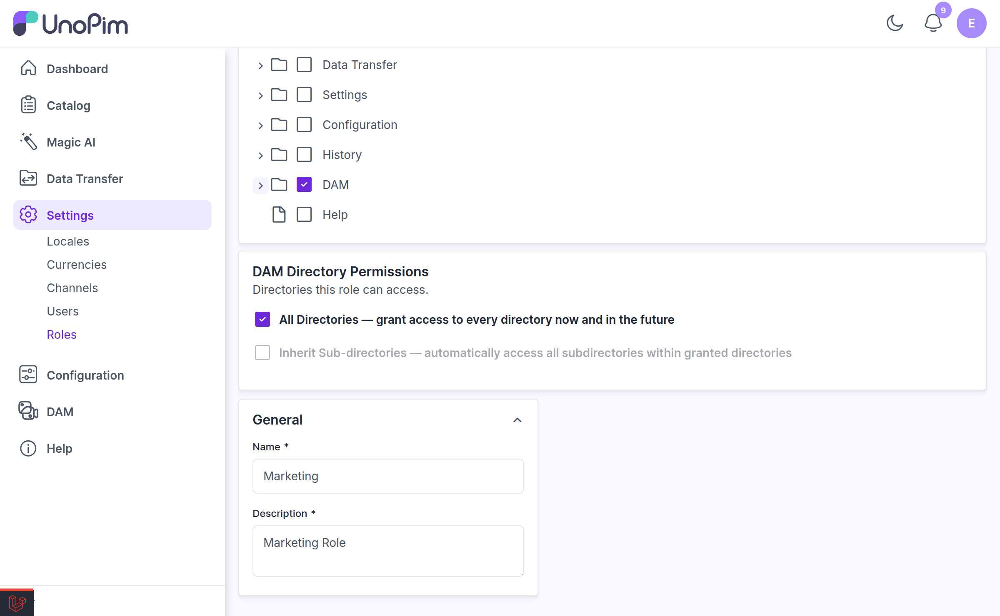

# Directory Permissions

Standard UnoPim permissions decide **what** a role can do in DAM — upload, delete, share. Directory permissions decide **where** they can do it.

This lets you give the Marketing team full run of `Root / Marketing` while keeping them out of `Root / Legal` entirely, without creating a second DAM.

---

## Where to Set Them

Directory permissions live on the **role**, not on the user.

1. Go to **Settings → Roles** and create or edit a role.

2. Set the role's **Permission Type** to **Custom**.

3. Scroll past the Access Control card. A **DAM Directory Permissions** panel appears below it.

> [!IMPORTANT]
> The panel only appears for roles whose permission type is **Custom**. A role set to **All** has unrestricted access and bypasses directory permissions entirely — it can see and act on every directory. If a role must be scoped to certain folders, it cannot be an "All" role.

---

## The Options

The panel — subtitled *"Directories this role can access"* — offers two checkboxes and a directory tree.

### All Directories

> *All Directories — grant access to every directory now and in the future*

Ticking this grants the role every directory, including any created later. The directory tree is hidden while it is on, because there is nothing left to choose.

Use it for roles like a DAM administrator who should never be blocked by a folder boundary.

### Inherit Sub-directories

> *Inherit Sub-directories — automatically access all subdirectories within granted directories*

With this on, granting a directory automatically grants everything beneath it. Grant `Root / Marketing` and the role also gets `Marketing / Campaigns`, `Marketing / Campaigns / Summer`, and so on — including subfolders created in the future.

While it is enabled, the panel notes: *"Sub-directories will be included automatically on save."*

With it **off**, each directory must be granted explicitly. Granting `Marketing` alone gives access to that folder only, not its children.

> [!NOTE]
> Turning inherit-children off again does **not** wipe grants you made explicitly. Child directories you had ticked individually are preserved.

### The directory tree

Tick the individual directories this role should reach. The tree loads its children lazily as you expand nodes, so it stays fast even on very large libraries.

If nothing loads you will see *"Loading directories…"*, *"No directories found."*, or *"Failed to load directories. Please try again."* with a Retry button.

> [!NOTE]
> If you save without selecting any directory, DAM grants the **Root** directory as a fallback, so the role is never left with an unusable, empty DAM.

---

## Automatic Grants for New Folders

There is a trap this feature avoids: an editor creates a folder, and then cannot use it, because no one has granted it to their role yet.

DAM handles this automatically. When an admin on a **Custom** role (without *All Directories*) creates a directory, that directory is **granted to their role immediately**. This applies to all three ways of creating folders:

- **New Folder** from the right-click menu
- **Upload Folder** — every subfolder in the uploaded tree
- Bulk folder-structure creation

The new folders are usable straight away, with no page reload and no admin intervention.

---

## How Permissions Are Enforced

Directory permissions are not just a UI filter. They are enforced everywhere:

| Surface | Behaviour |
|---|---|
| **Directory tree** | Only accessible directories are listed. |
| **Asset datagrid** | Only assets inside accessible directories are returned. |
| **Asset picker** | Product and category asset fields only offer assets the role can reach. |
| **All web endpoints** | Upload, move, delete, rename, share, and download all re-check directory access server-side. |
| **REST API** | Asset and directory endpoints are scoped to the caller's grants. A role with no grants gets an **empty result set**, not an error. |
| **Shares** | You cannot create a share for a directory you cannot access. |

Ancestor directories that a role can *see* but not *act on* are shown in the tree as **view-only** placeholders, so the folder path still makes sense without granting rights the role should not have.

If someone without permission tries to manage the panel itself, they get:

> You are not allowed to manage DAM directory permissions.

---

## A Worked Example

Say you want the Marketing team to own their own folder and nothing else:

1. **Settings → Roles → Create Role**, name it `Marketing`.
2. Set **Permission Type** to **Custom**.
3. Under Access Control, enable the DAM permissions they need — View, Upload, Edit, Update, Download, Share.
4. In **DAM Directory Permissions**, leave *All Directories* **off**.
5. Turn *Inherit Sub-directories* **on**.
6. Tick **Root / Marketing** only.
7. Save.

The result: the Marketing role sees `Marketing` and everything inside it, can upload and share within it, has any new subfolder they create granted automatically — and cannot see `Legal`, `Finance`, or anything else in the library.

---

## Related

- [Setup](./setup.md) — the DAM permission list and how to enable it on a role
- [Shared Links](./shared-links.md) — sharing outside the permission system
- [Uploading Assets](./uploading-assets.md) — upload permission on a directory
