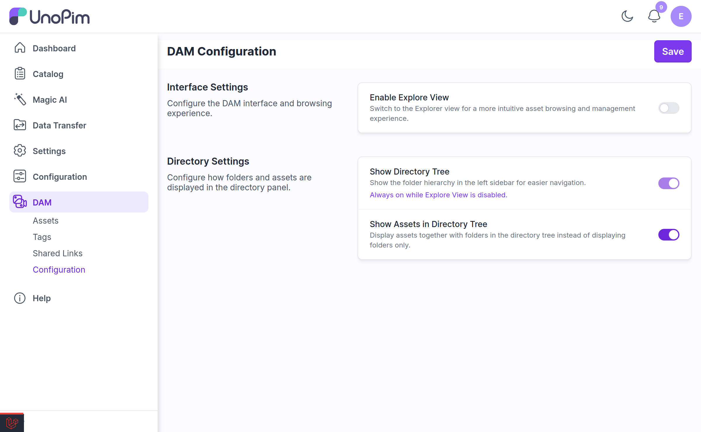
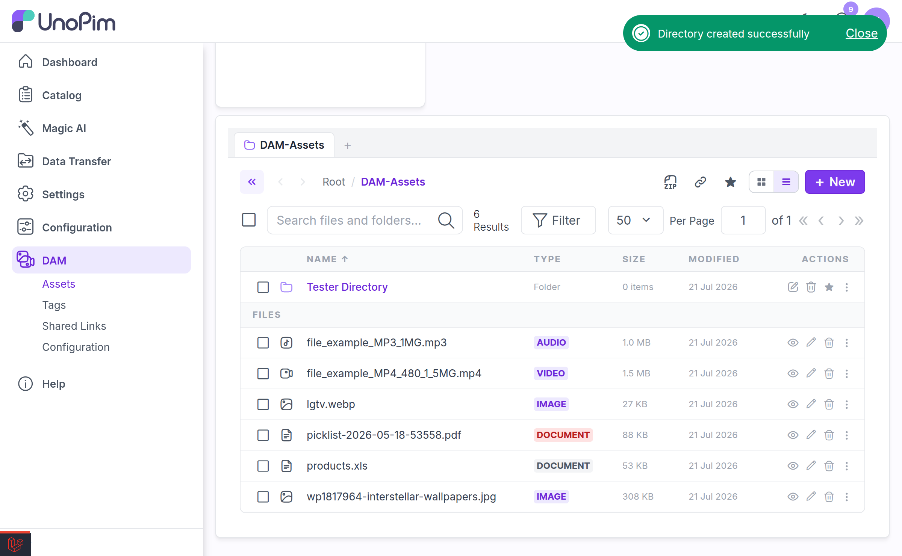
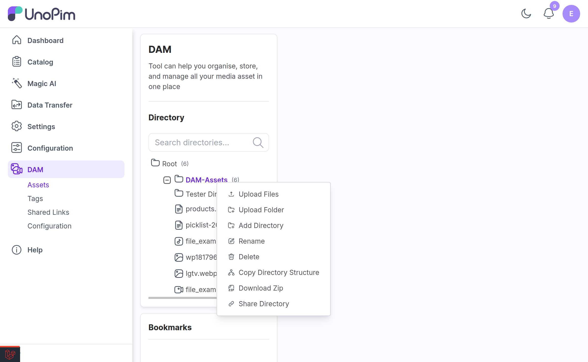
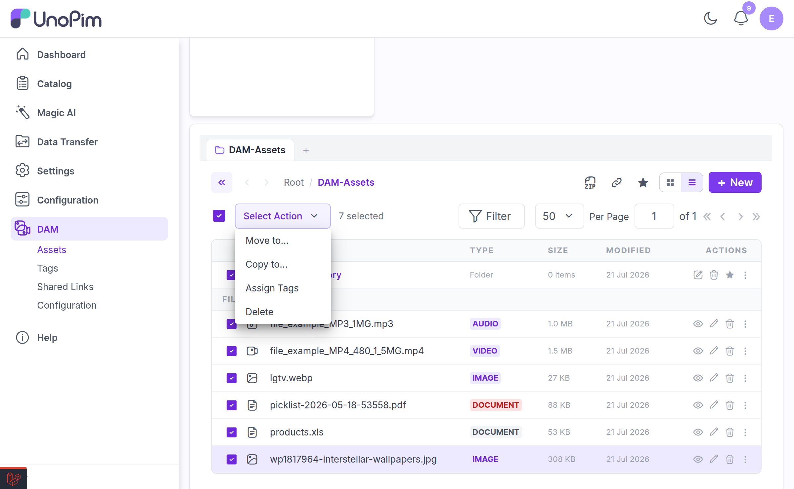
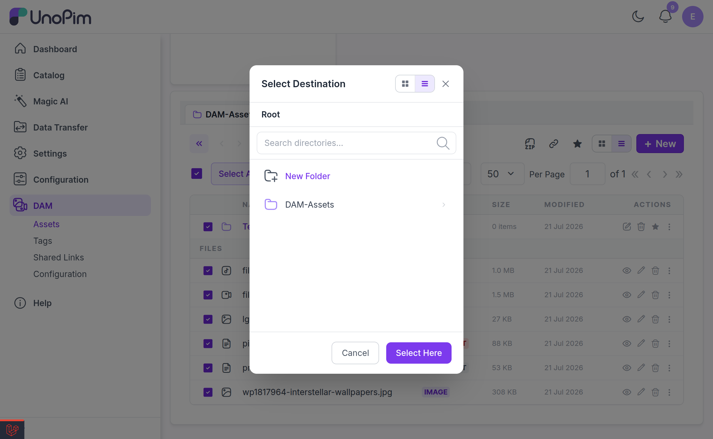

# Explorer View

Explorer is an alternative to the default asset grid — a file-manager style view for people who work in DAM all day and want to move things between folders quickly.

It is **off by default**. Turn it on at **DAM → Configuration → Enable Explore View**. See [Configuration](./configuration.md).

---

## The Explorer Layout

| Area | What it does |
|---|---|
| **Tab bar** | One or more open folders, each with its own history and selection |
| **Directory tree** | The folder hierarchy. Collapsible to reclaim width. |
| **Bookmarks panel** | Folders you have pinned. Enable with **Show Bookmark Panel**. |
| **Toolbar** | Search, filters, view toggle, per-page, ZIP download, share, bookmark star |
| **Content pane** | Folders first, then files — as a grid or a list |

---

## Tabs

Explorer lets you keep **several folders open at once**, like browser tabs. Open a second tab when you are moving files between two distant folders and do not want to keep walking the tree.

| Action | How |
|---|---|
| **New Tab** | Click **+** on the tab bar |
| **Open in new tab** | Right-click a folder → **Open in new tab** |
| **Close Tab** | Click **×** on the tab |

Each tab keeps its own **selection**. If you select items in one tab and switch to another, Explorer tells you rather than losing the selection:

> *"3 item(s) selected in another tab."* — with a **Select them here too** action.

### Navigation history

Each tab has **back** and **forward** arrows, exactly like a browser. They walk the folders you visited in that tab, not the folder hierarchy.

If a folder you are sitting in gets deleted by someone else, the tab recovers rather than erroring — you are returned to Root with the notice *"This folder was deleted — returned to Root."*

---

## Grid and List Views

Toggle between **Grid View** and **List View** with the view switch in the toolbar.

**Grid** shows thumbnail cards — best for images, where you recognise the file by looking at it.

**List** shows a dense table — best for documents and for scanning file sizes or dates. Its columns are:

| Column | Notes |
|---|---|
| **Name** | Folder or file name |
| **Type** | File type or *Folder* |
| **Size** | File size |
| **Modified** | Last updated |
| **Actions** | Per-row action menu |

### Sorting and paging

Sort by **Name**, **Size**, or **Modified**, ascending or descending. Page size runs from **50 to 250** items.

Your **selection survives a page change**, so you can select across pages and then act on the lot.

---

## Search

The Explorer search box is not limited to the folder you are standing in — it searches **the entire library**, and it matches on **both file name and tag**.

That means searching `winter` finds files literally named `winter-*` **and** files tagged `winter`, wherever they live. Clear the search to drop back to plain folder browsing.

> [!NOTE]
> Search results are still bound by your [directory permissions](./directory-permissions.md) — you never see a match from a folder your role cannot reach.

---

## Filters

Open **Filter** in the toolbar to narrow the view.

| Filter | Values |
|---|---|
| **File name** | Free text |
| **Extension** | e.g. `pdf`, `png` |
| **File type** | `image`, `video`, `audio`, `document`, `spreadsheet`, `csv` |
| **Tag** | Tag name |
| **Created** | From / to dates |
| **Updated** | From / to dates |
| **Properties** | Any property marked **Add to Filter** |

Like search, filters apply **across the whole library**, not just the current folder.

Custom property filters appear automatically — mark a property **Add to Filter** on an asset and its name becomes a filter here. See [Directory & Asset Management](./directory-and-asset-management.md).

---

## The Context Menu

Right-click any folder or file for its actions.

**On a folder:**

| Action | What it does |
|---|---|
| **Open** | Navigate into it |
| **Open in new tab** | Open it in a second tab |
| **Bookmark Directory** | Pin it to the bookmarks panel |
| **Upload Files** | Upload into this folder |
| **Upload Folder** | Upload a whole folder tree into it |
| **Add Directory** | Create a subfolder |
| **Rename** | Rename it |
| **Copy Directory Structure** | Recreate its folder skeleton elsewhere, without files |
| **Download Zip** | Download the folder as a ZIP |
| **Share Directory** | Create a [shared link](./shared-links.md) |
| **Copy** / **Paste** | Clipboard copy — see below |
| **Delete** | Delete recursively |

**On a file:**

| Action | What it does |
|---|---|
| **Preview** | Open the [preview modal](./asset-preview.md) |
| **Edit** | Open the asset edit page |
| **Rename** | Rename the file |
| **Copy** | Put it on the clipboard |
| **Download** | Download the original |
| **Delete** | Delete it |

> [!NOTE]
> The menu is permission-aware. Actions your role cannot perform are not shown, and if none are available you get *"No actions available."*

---

## Copy and Paste

Explorer has a real clipboard. **Copy** a file or a folder, navigate anywhere, then **Paste**.

While something is on the clipboard, a **Ready to paste** banner stays visible with a **Clear** action to abandon it.

Pasting a folder copies its entire contents. Large pastes are queued and run in the background — see [Background Operations](./background-operations.md).

---

## Bookmarks

With **Show Bookmark Panel** enabled, a bookmarks list sits below the directory tree. Pin the folders you return to daily and reach them in one click.

There are three ways to add one:

- **Drag a folder** onto the panel — it shows *"Drag a folder here to bookmark it"* when empty
- Right-click a folder → **Bookmark Directory**
- Click the **star** in the toolbar while inside the folder

Remove one with the **×** on the bookmark row.

> [!IMPORTANT]
> You can keep a **maximum of 20 bookmarks**. Beyond that, adding another is refused with *"Maximum 20 bookmarks reached."* Remove one you no longer use first.

Bookmarks are **per user** — yours are not visible to your colleagues.

---

## Bulk Operations

This is Explorer's main advantage over the standard grid. Select any mix of folders and files, then act on the whole selection.

Selecting shows *":count selected"* and a **Select Action** menu:

| Action | What it does |
|---|---|
| **Move to…** | Move the selection into another folder |
| **Copy to…** | Copy the selection into another folder |
| **Assign Tags** | Tag everything selected — see [Managing Tags](./tags.md) |
| **Delete** | Delete the selection |

Use **select all** and **clear selection** to manage large batches.

### Choosing a destination

**Move to…** and **Copy to…** open a **Select Destination** picker. It has its own search and grid/list toggle, so finding the target folder is not a chore.

If the folder you want does not exist yet, click **New Folder**, name it, and it is created **and selected** in one step — no need to cancel out, create the folder, and start over.

Confirm with **Select Here**.

### Deleting in bulk

Deleting asks for confirmation first, and it tells you exactly what is about to happen:

> *"Delete 12 item(s)? Folders will be deleted recursively and cannot be undone."*

Afterwards you get a per-type result — *"8 asset(s) deleted from 'Campaigns'."* and *"4 folder(s) deleted from 'Campaigns'."* — so a partial failure is never silent.

> [!WARNING]
> Recursive folder deletion cannot be undone. Everything inside the folder goes with it.

### Progress on long operations

Mass move, mass copy and recursive delete are **queued jobs**. Explorer polls their progress and shows a bar plus *"Operation is still running in the background"* for anything slow.

You can navigate away — the job keeps running. See [Background Operations](./background-operations.md) for the full picture, and note that a **queue worker must be running** or these operations never finish.

---

## Drag and Drop

Folder and file cards are draggable. Drag items onto a folder to move them into it, or onto the bookmarks panel to pin them.

Before a large drag completes, Explorer counts what you are about to move — folders are counted recursively — so the confirmation reflects the real number of files, not the number of icons you dragged.

---

## Collapsing the Sidebar

The directory tree and the whole left sidebar can each be collapsed with the toolbar toggles (**Toggle directory tree**, **Toggle sidebar**), giving the content pane the full window width. Useful on a laptop.

---

## Permissions

Every Explorer action re-checks your [directory permissions](./directory-permissions.md) **server-side**. You cannot move, copy, or paste into a folder your role has no access to, regardless of what the UI let you drag.

---

## Related

- [Configuration](./configuration.md) — enabling Explorer and its panels
- [Directory & Asset Management](./directory-and-asset-management.md) — the default (non-Explorer) view
- [Background Operations](./background-operations.md) — what happens after you start a bulk job
- [Managing Tags](./tags.md) — the Assign Tags mass action
