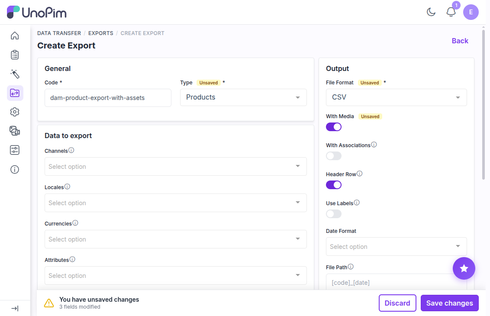

# Exporting Assets with Products and Categories

UnoPim lets you export your digital assets — images, videos, documents — together with your product and category data in a single export job. Everything comes down bundled together, and the archive you get back is the same shape the [importer](./import-assets.md#importing-an-asset-bundle-zip) reads, so you can move a catalogue between instances without rearranging anything.

---

## Step 1 — Go to Exports

From the left sidebar, navigate to **Data Transfer → Exports**. This page lists all your existing export profiles. You can view, edit, or re-run any of them from here.


To create a new one, click the **Create Export** button in the top-right corner.


---

## Step 2 — Fill in the Export Profile Details

On the Create Export screen, fill in the required fields:

- **Code** — a unique identifier for this export profile (e.g., `dam-product-export-with-assets`)
- **Type** — **Products** or **Categories**
- **File Format** — CSV, XLS, or XLSX
- **Channel, Locale, and Currency** — select the relevant settings for your export



### The With Media toggle

This is the one that decides whether asset **files** come with you.

| With Media | What you get |
|---|---|
| **Off** | The data file only. Asset columns still hold the asset paths, so the export is fine for an instance that already has the files. |
| **On** | A ZIP containing the data file **and** every asset assigned to the exported records. |

Turn it **on** when you are seeding a new instance or moving between environments; leave it **off** for a quick data-only extract.

Once all the details are filled in, click **Save** to create the profile.


---

## Step 3 — Run the Export

After saving, click **Export Now** to start the export job. You'll be able to see the job running in real time.


When the status changes to **Completed**, the export is done and your file is ready to download.


---

## Step 4 — Download the Export File

Click the **Download Exported File** button to save the file to your device.


With **With Media** on, the download is a **ZIP**. The data file sits at the root of the archive, and the asset files sit under an `assets/` folder that mirrors your DAM directory tree:

```
dam-product-export-with-assets-products.zip
├── products.csv
└── assets/
    └── Root/
        └── Product Photography/
            └── Apparel/
                ├── apparel-linen-shirt.webp
                └── apparel-rain-shell.webp
```


Media coming from ordinary image, file, or gallery attributes is written alongside, under its own paths — only DAM assets live under `assets/`.

Each asset column in the data file holds the same paths, comma-separated:

```csv
sku,type,family,name,product_image
APP-LINEN-SHIRT,simple,default,Linen Shirt,assets/Root/Product Photography/Apparel/apparel-linen-shirt.webp
```

An asset assigned to many records is written into the archive **once**, not once per row.

---

## Step 5 — Verify the Exported Assets

Once you've extracted the ZIP, open the **assets** folder and confirm that:

- All assigned assets are present
- The folder structure matches your DAM directory tree
- File names match what was set in UnoPim
- Image types and file formats are correct


> **Tip:** If an asset is missing from the export, check that it was actually assigned to the product or category, and that **With Media** was on when the profile ran.

---

## Feeding it Back In

The archive you just downloaded can be uploaded straight to an import profile — no unpacking, no path editing. DAM recreates the folders, brings the files into the library, and links them to the imported records.

See [Importing an asset bundle](./import-assets.md#importing-an-asset-bundle-zip).

---

## Related

- [Importing Products & Categories with Assets](./import-assets.md) — the other half of the round trip
- [Asset Products](./asset-products.md) — how assets get assigned in the first place
- [Asset Categories](./asset-categories.md) — asset fields on categories
