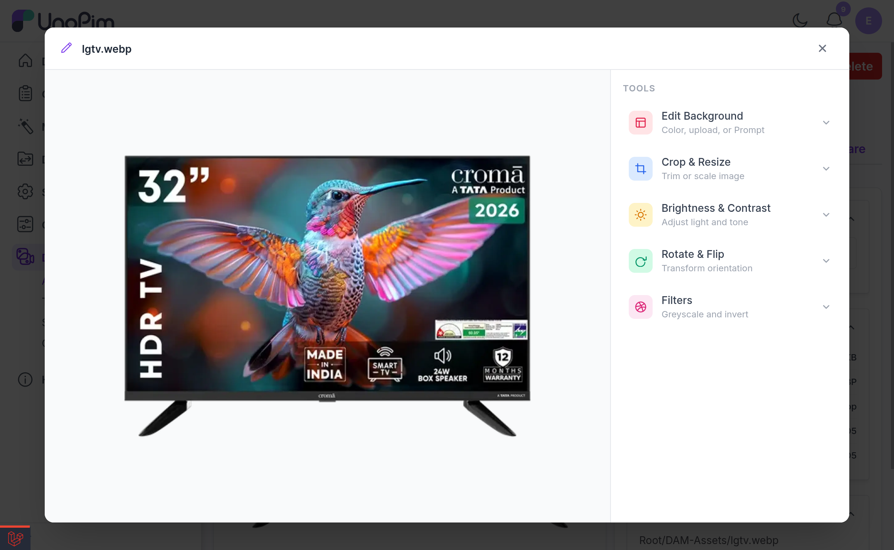
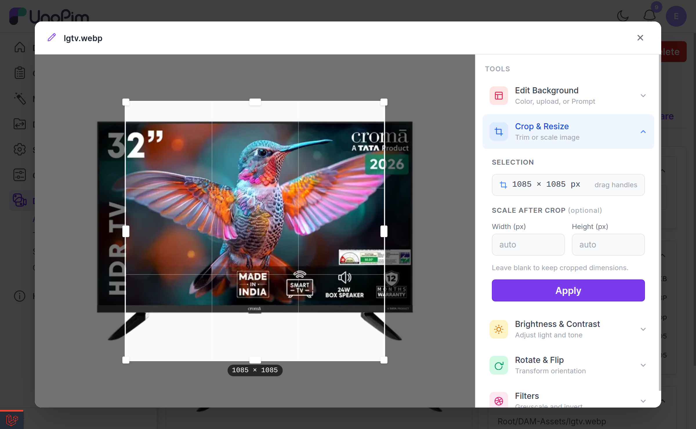
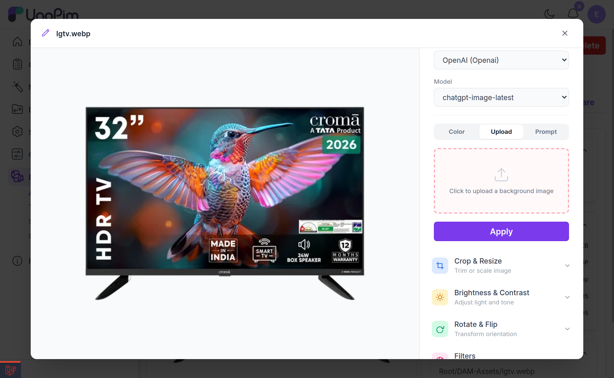
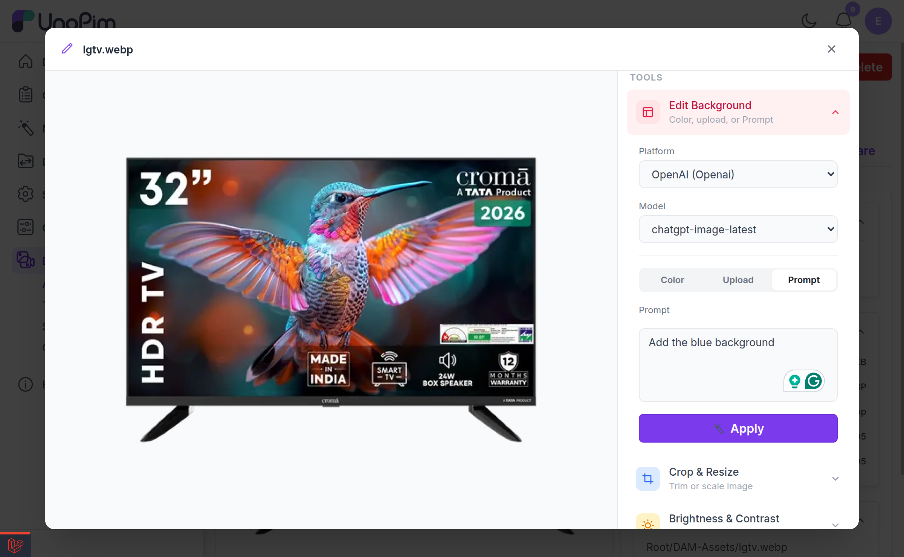

# Image Editor

DAM ships a built-in image editor so you can crop, adjust, and re-background images without leaving UnoPim or round-tripping through Photoshop.

Open an image preview and click **Edit image** to launch it.

> [!WARNING]
> Every edit **overwrites the original file**. There is no separate "save as copy" — if you need to keep the untouched original, download it or duplicate the asset before editing.

> [!NOTE]
> All editor operations require the **Edit** permission (`dam.asset.edit`) plus access to the directory the asset lives in.

---

## The Tools

The editor's left rail holds five tools in an accordion.

### 1. Crop & Resize

*Trim or scale image.*

Drag the handles on the image to set the crop selection. Optionally set an output **Width (px)** and **Height (px)** to scale the result after cropping — leave both blank to keep the cropped dimensions as they are.

You must provide at least a crop region or output dimensions, otherwise the editor responds:

> Provide at least a crop region or output dimensions.

### 2. Brightness & Contrast

*Adjust light and tone.*

Four sliders: **Brightness**, **Contrast**, **Sharpen**, and **Blur**.

### 3. Rotate & Flip

*Transform orientation.*

Rotate by **0°, 90°, 180°, or 270°**, and flip **horizontally** or **vertically**.

### 4. Filters

*Greyscale and invert.*

Toggle **Greyscale** and/or **Invert**. At least one must be selected:

> Select at least one filter to apply.

### 5. Edit Background

*Color, upload, or Prompt.*

The background editor has three tabs, described in detail below.

---

## Editing the Background

### Color tab

Pick from around two dozen named swatches — None, White, Silver, Light Gray, Gray, Slate, Dark Gray, Charcoal, Black, Light Red, Red, Light Yellow, Yellow, Light Green, Green, Light Cyan, Cyan, Light Blue, Blue, Light Purple, Purple, Light Pink, Pink, Light Rose, Rose — or choose any colour with the **Custom** colour picker.

A **Normal / AI** switch controls how the replacement is done:

| Mode | How it works | Needs AI? |
|---|---|---|
| **Normal** | Local flood-fill background replacement, with a live preview as you pick colours. Fast, free, and works best on images with a clean, uniform background. | No |
| **AI** | The AI provider re-generates the image on the chosen background colour. Handles complex subjects and soft edges (hair, fur, glass) far better. | Yes |

### Upload tab

Click to upload your own background image. The AI composites the asset's subject onto the background you supply.

### Prompt tab

Describe the background you want in plain English — for example *"a soft-focus marble kitchen counter in warm morning light"* — and the AI generates it behind your subject.

---

## Setting Up AI Backgrounds

The three AI-powered background features (AI colour mode, Upload, and Prompt) need an AI provider configured. **DAM does not have its own API key setting** — it reuses UnoPim's **Magic AI** platforms.

### Steps

1. Go to UnoPim's **Magic AI** settings and create a platform.
2. Choose one of the supported providers — **OpenAI**, **Gemini**, or **xAI**. Other providers cannot generate images and will not appear in the editor.
3. Enter that provider's API key and save.
4. Reopen the image editor. The platform and model dropdowns in the background tabs will now be populated.

### Supported models

If you do not pick a model explicitly, DAM resolves a sensible default per provider:

| Provider | Default model | Also available |
|---|---|---|
| **OpenAI** | `gpt-image-1` | `gpt-image-1-mini`, `gpt-image-1.5` |
| **Gemini** | `gemini-2.0-flash-preview-image-generation` | `gemini-2.5-flash-image` |
| **xAI** | `grok-2-image` | — |

The generated image is requested at the aspect ratio closest to the source (`3:2`, `2:3`, or `1:1`) at high quality, then scaled back to the original pixel dimensions so the asset's size never changes.

### Common errors

| Message | What it means |
|---|---|
| *No AI platforms with image generation support found. Configure an OpenAI, Gemini, or xAI platform.* | No usable Magic AI platform exists yet — follow the steps above. |
| *This AI provider does not support image generation.* | The selected platform's provider cannot generate images. Switch to OpenAI, Gemini, or xAI. |
| *AI returned no image.* | The provider accepted the request but returned nothing — usually a transient provider issue or a prompt that was refused. Try again or reword the prompt. |
| *Failed to load AI platforms.* | DAM could not reach the Magic AI settings. Check that the Magic AI module is enabled. |

---

## Related

- [Previewing Assets](./asset-preview.md) — where the editor is launched from
- [Setup](./setup.md) — granting the Edit permission
