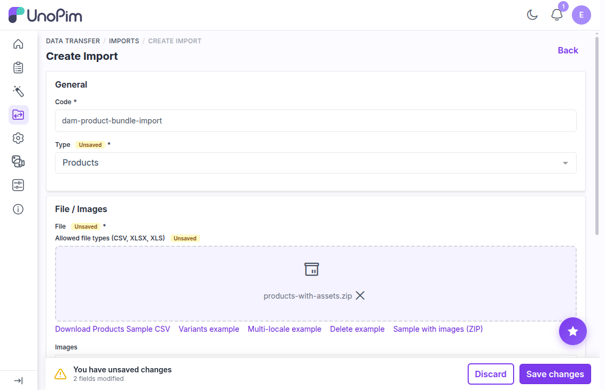
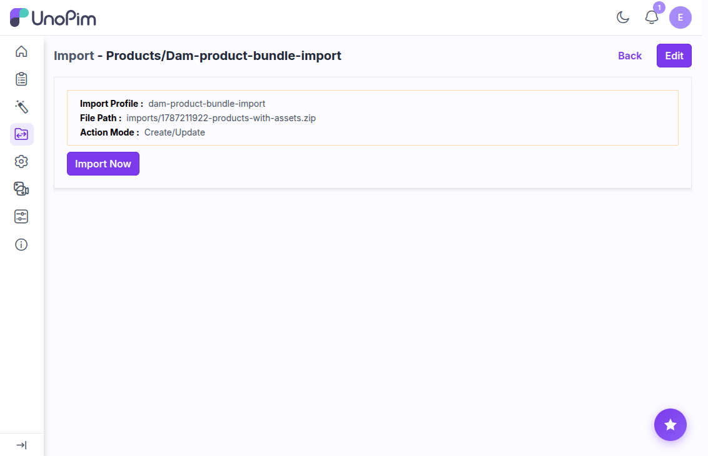
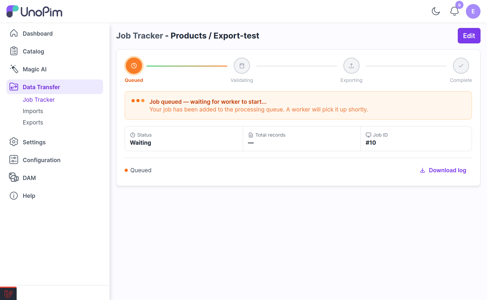
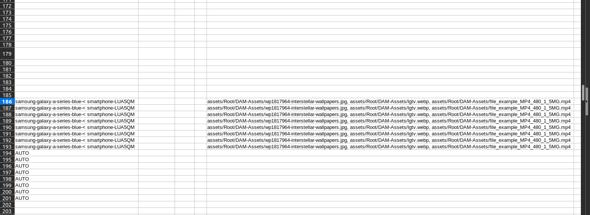

# Importing Products and Categories with Assets

Just as you can [export](./export-assets.md) products and categories with their assets, you can **import** them back. This is how you move a catalogue between environments, or set media on thousands of products without touching each one.

There are two ways to do it, and the difference is whether the asset **files** travel with the data:

| You upload | DAM does | Use it when |
|---|---|---|
| **A CSV / XLSX** | Links assets that are **already** in the library | The target instance already holds the files |
| **A ZIP bundle** | Recreates the folders and files, **then** links them | You are seeding a new instance, or moving between environments |

The ZIP bundle is the newer of the two and is what an export with **With Media** produces, so the round trip works without you rearranging anything.

---

## How Asset Columns Work

An asset attribute column holds the asset's **storage path** — not its ID, and not its file name.

```csv
sku,type,family,name,product_image
APP-LINEN-SHIRT,simple,default,Linen Shirt,assets/Root/Product Photography/Apparel/apparel-linen-shirt.webp
APP-RAIN-SHELL,simple,default,Rain Shell,assets/Root/Product Photography/Apparel/apparel-rain-shell.webp
```

Paths always begin with `assets/`, followed by `Root/` and then the folder names exactly as they appear in the directory tree.

To assign **several assets** to one product, separate the paths with commas:

```csv
sku,type,family,name,product_image
APP-LINEN-SHIRT,simple,default,Linen Shirt,"assets/Root/Product Photography/Apparel/apparel-linen-shirt.webp,assets/Root/Product Photography/Apparel/apparel-rain-shell.webp"
```

The same applies to category imports and their asset fields.

> [!TIP]
> Do not hand-type these paths. Run an export first and edit the file it produces — the export writes exactly the format the import expects.

---

## Importing a Data File Only

This is the original behaviour, and it is still the right choice when the files are already in the library.

> [!IMPORTANT]
> **A plain CSV or XLSX import uploads nothing.** It only links assets that already exist in DAM. Upload your files first — see [Uploading Assets](./uploading-assets.md) — then run the import to attach them.

---

## Importing an Asset Bundle (ZIP)

Upload the ZIP an export produced and DAM will unpack it, put the files into the library, and then link them to your records — in one job.

### What the archive must look like

The data file sits at the **root** of the archive, and the asset files sit under an `assets/` folder that mirrors your directory tree:

```
products-with-assets.zip
├── products.csv
└── assets/
    └── Root/
        └── Product Photography/
            └── Apparel/
                ├── apparel-linen-shirt.webp
                └── apparel-rain-shell.webp
```

An archive zipped from a *folder* rather than from the folder's *contents* also works — DAM looks one level down for the `assets/` tree before giving up.

Only one data file is needed; DAM takes the first `.csv`, `.xlsx`, or `.xls` it finds at the archive root. If there is none, the job fails with *"The archive contains no CSV or Excel file to import."*

### Create the import

Go to **Data Transfer → Imports → Create Import**, choose **Products** or **Categories**, and upload the `.zip`.



> [!NOTE]
> The hint under the file field still reads *"Allowed file types (CSV, XLSX, XLS)"*. With DAM installed, `.zip` is accepted as well for the **Products** and **Categories** import types — the label simply has not caught up.

Save the profile, and the archive is stored against it ready to run.



### What happens when it runs

1. The archive is extracted to a private working folder.
2. Every file under `assets/` is brought into the library:
   - **Missing folders are created** to match the paths in the archive.
   - **A path that is new** becomes a new asset, and its thumbnail and metadata are queued.
   - **A path that already exists** is treated as *the same asset*. If the file differs it becomes a new revision — the asset keeps its ID, its comments, its tags, and everything linked to it, and only the file behind it changes. If the file is byte-for-byte identical, nothing is touched and no thumbnails are re-rendered.
3. The data file is imported, and each asset path in it resolves to the asset that was just ingested.
4. The working folder is discarded when the job completes or is cancelled.

> [!TIP]
> Because re-importing the same bundle is a no-op when nothing has changed, you can safely re-run a bundle import to pick up only the files you actually edited.

### Blocked files

The same upload rules apply inside a bundle as at the upload boundary — executable and script files are rejected rather than ingested. See [Blocked file types](./uploading-assets.md#blocked-file-types).

### Archive safety limits

A bundle legitimately carries video and other large binaries, so the limits are wide. They exist to bound a malicious archive, not to size your assets:

| Env var | Default | What it caps |
|---|---|---|
| `DAM_IMPORT_BUNDLE_MAX_ENTRY_SIZE` | `524288000` (500 MB) | The largest single file in the archive |
| `DAM_IMPORT_BUNDLE_MAX_TOTAL_SIZE` | `5368709120` (5 GB) | The total size everything expands to |
| `DAM_IMPORT_BUNDLE_MAX_ENTRIES` | `50000` | How many files the archive may contain |
| `DAM_IMPORT_BUNDLE_MAX_COMPRESSION_RATIO` | `200` | How far one entry may expand before it is treated as a zip bomb |

Exceed one and the job stops with a message naming the limit — for example *"The archive expands to more than 5120 MB."* Raise them in `.env` and run `php artisan config:clear`.

---

## Step by Step

### Step 1 — Go to Imports

From the left sidebar, navigate to **Data Transfer → Imports**. Click **Create Import**.

### Step 2 — Fill in the Import Profile

| Field | What to enter |
|---|---|
| **Code** | A unique identifier, e.g. `dam-product-import` |
| **Type** | Products or Categories, matching your file |
| **File** | The CSV or XLSX — or the ZIP bundle |
| **Channel / Locale / Currency** | The scope the values apply to |

Click **Save** to create the profile.

### Step 3 — Validate and Run

Run **Validate** first. UnoPim checks the file structure and reports errors before anything is written.

Once validation passes, click **Import Now**. Progress is shown live, and the status changes to **Completed** when the job finishes.

> [!IMPORTANT]
> A queue worker must be running. Bundle extraction, asset ingestion, and thumbnail generation all happen on the queue.

### Step 4 — Verify the Links

Open one of the imported products and check the **Media** attribute group. The assets should be attached and previewable.

You can also confirm from the other direction: open the asset in DAM and check its [Linked Resources](./linked-resources.md) tab — the product or category you just imported should be listed there.

---

## When a Path Does Not Match

An asset path that matches nothing in the library is **reported in the job's error report**, against the error `dam_asset_not_found`:

> No asset was found at path "…". The value was left unset.

The row still imports and the product is still created or updated — only that asset is not attached. Each unresolved path is reported once, however many rows reference it.

If **every** path in a column fails to resolve, the asset attribute is left **untouched** rather than cleared, so a bad import cannot wipe media you already had.

So if products import successfully but come out with no media, open the error report first. The usual causes:

| Cause | Fix |
|---|---|
| The file was never uploaded to DAM | Upload it, or re-import as a [ZIP bundle](#importing-an-asset-bundle-zip) so the files travel with the data |
| The path is missing the `Root/` segment | Paths read `assets/Root/…`, not `assets/…` |
| The path has a typo, or a leading `/` | Match the path exactly as the export writes it |
| The file was uploaded to a different folder | Compare against a fresh export of a known-good record |
| The file name was auto-renamed on upload to avoid a clash | Check the real name in DAM — a duplicate upload becomes `file(1).jpg` |

> [!TIP]
> Test on a two-row file before importing thousands. Check that one product comes out with its media attached, then scale up.

---

## The Export → Import Round Trip

This is the reliable way to get the paths right: **export first, then edit that file**.

An export writes each asset column as the exact comma-separated paths that an import expects, so a file exported from one UnoPim instance can be imported into another without reformatting.



Check the comma separated assets file path after export.



1. Run an export of the products or categories you want to change — see [Exporting Assets](./export-assets.md). Turn **With Media** on if the target instance does not have the files.
2. Open the exported file and edit the asset columns.
3. Import it — the data file on its own, or the whole ZIP.

---

## Related

- [Exporting Assets with Products & Categories](./export-assets.md) — the other half of the round trip
- [Uploading Assets](./uploading-assets.md) — getting files into the library first
- [Asset Products](./asset-products.md) — assigning assets by hand
- [Linked Resources](./linked-resources.md) — verifying what an asset is attached to
- [Configuration](./configuration.md#asset-bundle-imports-env-only) — tuning the bundle limits
