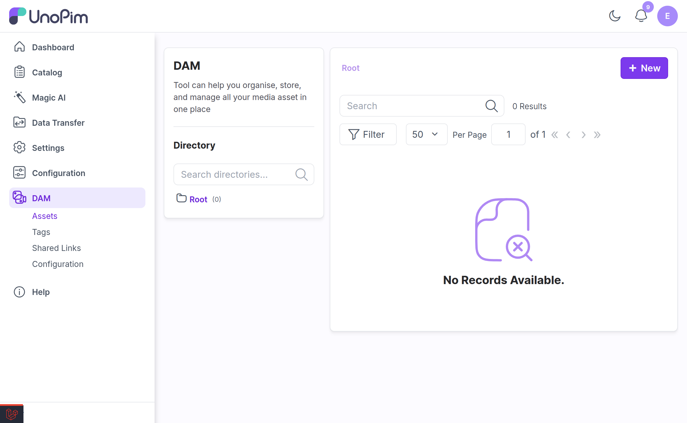

# UnoPim DAM Installation Guide

Digital Asset Management - Installation Documentation

---

## Installation Overview

UnoPim DAM offers two installation methods to suit your project needs:

1. **Composer Installation** - Quick and straightforward setup
2. **Manual Installation** - For custom configurations and direct control

Choose the method that best fits your project setup.

---

## Requirements

| Requirement | Version |
|---|---|
| **UnoPim** | v2.1.x |
| **PHP** | 8.3 or higher |

### Optional server tools

DAM leans on four command-line tools. All are optional — DAM runs without them — but each one silently disables a feature if it is missing, so installing them up front saves a lot of confusion later (and a [thumbnail backfill](./commands.md#dambackfill-thumbnails)).

```bash
# Debian / Ubuntu
sudo apt install ffmpeg poppler-utils libimage-exiftool-perl imagemagick

# RHEL / Alma / Rocky
sudo dnf install ffmpeg poppler-utils perl-Image-ExifTool ImageMagick

# macOS (Homebrew)
brew install ffmpeg poppler exiftool imagemagick
```

| Tool | Used for | What breaks without it |
|---|---|---|
| `ffmpeg` | Video first-frame thumbnails | Videos show a generic file-type icon |
| `poppler-utils` (`pdftoppm`) | PDF first-page thumbnails | PDFs show a generic file-type icon |
| `exiftool` | Embedded metadata (EXIF, IPTC, XMP, ID3) and audio cover art | The **Metadata** tab falls back to basic EXIF for images only; audio cover art never appears |
| `imagick` (PHP ext.) | Rasterising SVGs for **Custom Download** | Downloading an SVG as JPG/PNG/WebP fails |

> [!IMPORTANT]
> `exiftool` is the one people miss. Without it the Metadata tab still loads — it just quietly shows far less, with nothing in the UI explaining why. If metadata looks thin, check `exiftool -ver` on the server before anything else.

If you run UnoPim in Docker, add the same packages to the `apt-get install` line in **both** `dockerfiles/fpm.Dockerfile` and `dockerfiles/q.Dockerfile` — the queue worker needs them too, since thumbnail and metadata jobs run there.

---

## Composer Installation

Composer Installation is the recommended approach for quick setup.

### Step 1: Install the Package

Execute the following command:

```bash
composer require unopim/dam
```

| Command | Purpose |
|---|---|
| `composer require unopim/dam` | Downloads and installs the DAM package and updates Composer dependencies. |

### Step 2: Run the installation command and Clear Cache

Run the following commands:

```bash
php artisan dam-package:install
php artisan optimize:clear
```

| Command | Purpose |
|---|---|
| `php artisan dam-package:install` | Runs the DAM package installer and applies required setup steps. |
| `php artisan optimize:clear` | Clears all cached files (bootstrap, configuration, routes, and views) to load the new changes. |

The installer is interactive and asks two questions:

| Prompt | Default | What to answer |
|---|---|---|
| *Run the migrations now?* | Yes | Say **yes** — DAM cannot work without its tables. |
| *Seed demo data?* | No | Say **yes** on an evaluation or development install to get a pre-populated library (Accessories, Audio and Video, Clothes, Documents). Say **no** on production. |

You can seed the demo data later at any time with [`php artisan dam:demo-data`](./commands.md#damdemo-data).

**Installation complete!** Your UnoPim DAM is now ready to use.



---

## Manual Installation

Installation without Composer

For the source code and latest version, visit the [UnoPim DAM GitHub repository](https://github.com/unopim/unopim-digital-asset-management).

### Step 1: Download and Setup the Extension

1. Download and unzip the extension
2. Rename the folder to `DAM`
3. Place it in the `packages/Webkul` directory within the project's root

### Step 2: Register the Package Provider

Add the following to `bootstrap/providers.php`:

At the top, add the use statement:

```php
use Webkul\DAM\Providers\DAMServiceProvider;
```

In the return array, in the Webkul package service providers section, add:

```php
DAMServiceProvider::class,
```

> [!NOTE]
> This registers `DAMServiceProvider` in Laravel so the module can bootstrap its services, routes, and package configuration during application startup.

### Step 3: Update Autoload Configuration

Register the DAM directory in `composer.json` under `autoload` > `psr-4`:

```json
"Webkul\\DAM\\": "packages/Webkul/DAM/src"
```

### Step 4: Run Installation Commands

Execute these commands to complete the installation:

```bash
composer dump-autoload
php artisan optimize:clear
php artisan migrate
php artisan vendor:publish --provider=Webkul\\DAM\\Providers\\DAMServiceProvider
php artisan db:seed --class=Webkul\\DAM\\Database\\Seeders\\DirectoryTableSeeder
```

| Command | Purpose |
|---|---|
| `composer dump-autoload` | Regenerates Composer's autoloader mapping to include the newly added namespace. |
| `php artisan optimize:clear` | Clears all cached files (bootstrap, configuration, routes, and views) to load the new changes. |
| `php artisan migrate` | Runs pending database migrations required by the DAM package. |
| `php artisan vendor:publish --provider=Webkul\\DAM\\Providers\\DAMServiceProvider` | Publishes DAM package resources and configuration files. |
| `php artisan db:seed --class=Webkul\\DAM\\Database\\Seeders\\DirectoryTableSeeder` | Seeds initial DAM directory data required by the module. |

### Step 5: Enable Queue Operations

Start the queue to execute actions, such as job operations, by running the following command:

```bash
php artisan queue:work
```

| Command | Purpose |
|---|---|
| `php artisan queue:work` | Starts a queue worker to process DAM background jobs. |

If the `queue:work` command is managed by a process manager like Supervisor, restart the relevant service after installing the module to apply the changes:

```bash
sudo supervisorctl restart unopim-worker
```

| Command | Purpose |
|---|---|
| `sudo supervisorctl restart unopim-worker` | Restarts the Supervisor-managed worker so it loads newly installed DAM code. |

**Installation complete!** Your UnoPim DAM is now ready to use.

---

## Post-Installation Setup

### Start the Queue Worker

To start the queue and execute actions such as job operations, run the following command:

```bash
php artisan queue:work
```

| Command | Purpose |
|---|---|
| `php artisan queue:work` | Starts a queue worker to process DAM background jobs. |

### Configure Queue with Process Manager

If the `queue:work` command is configured to run through a process manager like Supervisor, restart the Supervisor service after installing the module to apply the changes:

```bash
sudo service supervisor restart
```

| Command | Purpose |
|---|---|
| `sudo service supervisor restart` | Restarts Supervisor and its managed queue workers. |

> [!IMPORTANT]
> A queue worker is not optional. Uploads, thumbnail generation, and other DAM background jobs all run on the queue. Without a worker, uploads will appear to hang and thumbnails will never appear.

---

## Next Steps

1. [**Set up permissions**](./setup.md) — create roles and grant DAM permissions, and create the Asset attribute and category field.
2. [**Scope roles to directories**](./directory-permissions.md) — restrict a role to specific folders, if you need to.
3. [**Review the configuration**](./configuration.md) — directory tree behaviour, Explorer view, upload tuning.

---

**Your UnoPim DAM installation is complete and ready to use.**

> [!NOTE]
> Already running an older DAM version? See [Upgrading DAM](./upgrading.md) instead.