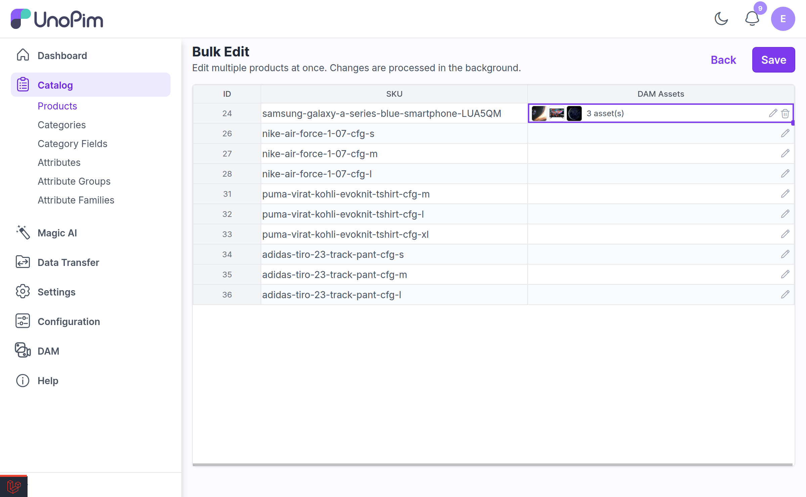
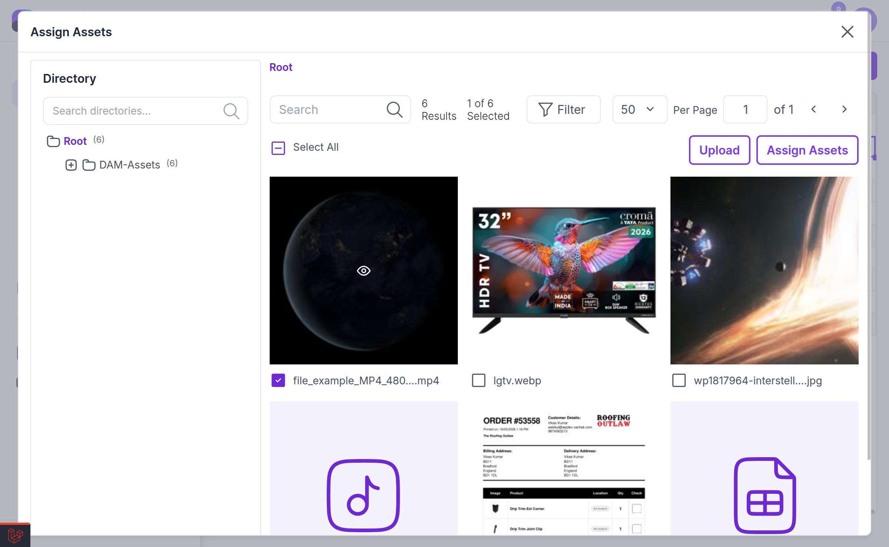

# Assets in Product Bulk Edit

DAM plugs into UnoPim's **Product Bulk Edit** spreadsheet, so you can set asset attributes on many products at once instead of opening each product individually.

---

## How It Works

Any product attribute of type **Asset** (see [Setup](./setup.md#create-product-asset-attribute)) becomes an editable cell in the bulk-edit spreadsheet. The cell shows a thumbnail of the currently selected asset and a button that opens the DAM **asset picker**.

1. Go to **Catalog → Products**, select the products you want to change, and open **Bulk Edit**.

2. Find the asset attribute column.

3. Click the picker button in the cell.
4. Choose an asset from the DAM library and confirm.

5. Repeat for the other rows, then save the spreadsheet.

The picker is the same one used on the product edit page — with the directory tree, directory search, and filters — and it honours your [directory permissions](./directory-permissions.md), so you can only select assets from directories your role can reach.

The same asset-picker cell is available for **category fields** of type Asset.

---

## Drag and Drop

You can drag an asset from the picker directly onto the target cell instead of clicking through the confirm button.

---

> [!NOTE]
> This is bulk editing of **asset attributes on products**. It is not a bulk editor for the DAM assets themselves — DAM's own asset gallery has two mass actions, **Assign Tags** and **Delete**. To change many assets' tags at once, see [Managing Tags](./tags.md#mass-assigning-from-the-gallery).

---

## Related

- [Setup](./setup.md) — creating an Asset attribute and a category asset field
- [Asset Products](./asset-products.md) — assigning assets to a single product
- [Managing Tags](./tags.md) — mass actions on DAM assets
