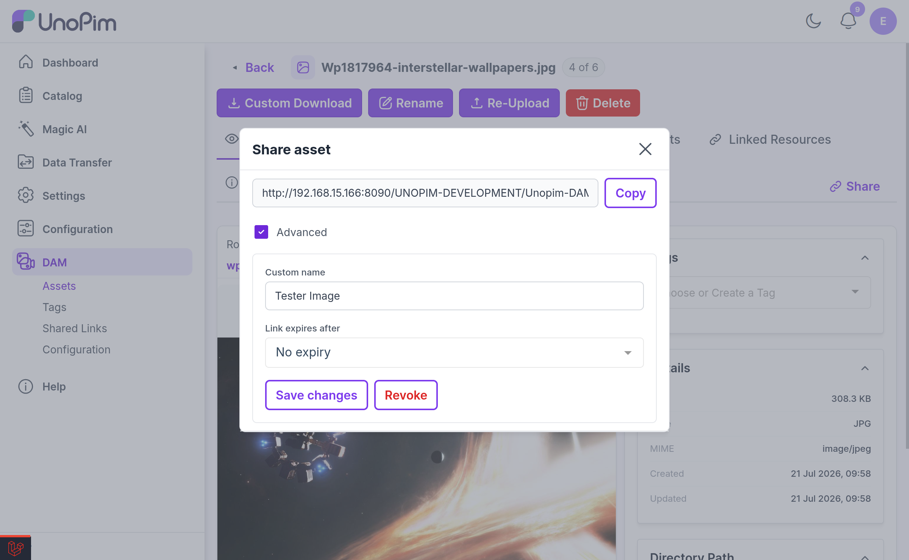
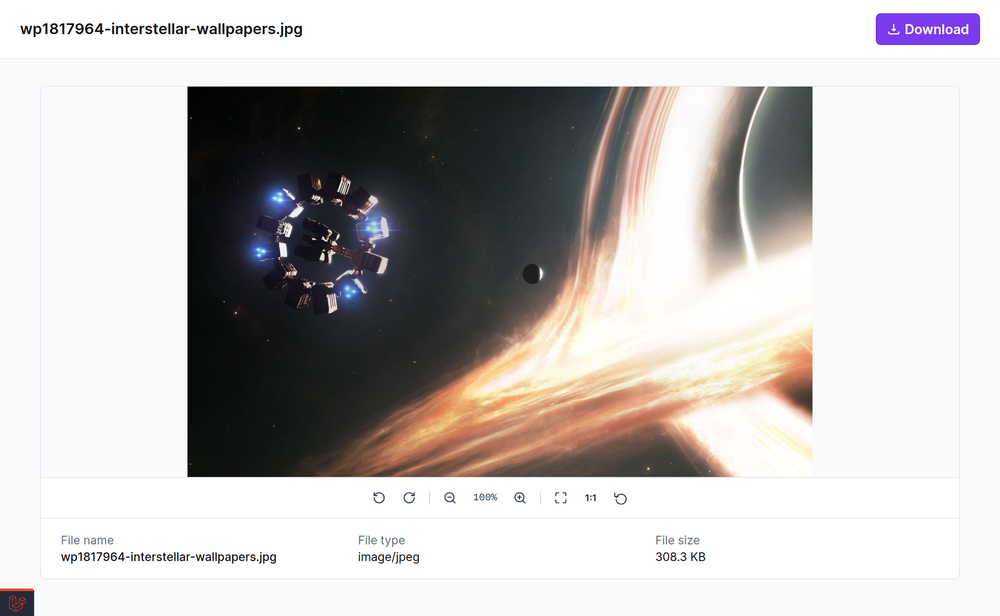
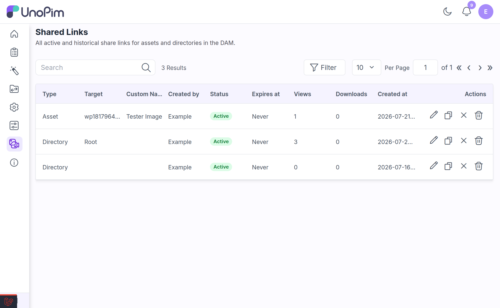

# Shared Links

Shared links let you hand an asset or a whole directory to someone who has **no UnoPim account** — a client, a printer, an agency — by sending them a single URL. They see a clean public viewer; they never touch your admin panel.

---

## How Sharing Works

A share is a randomly generated, unguessable token that maps to one asset or one directory:

```
https://yourdomain.com/share/8f2b91ac04e7d5136ba0c7e29f14d83b6a5c0e77
```

Access is controlled by three things:

- the **token** itself, which is 40 random characters and cannot be guessed;
- an optional **expiry date**, after which the link stops working;
- **revocation**, which lets you switch a link off at any moment.

> [!IMPORTANT]
> Shared links are **not password-protected**. Anyone holding the URL can open it until it expires or you revoke it. Treat a share URL as a secret, and set an expiry on anything sensitive.

---

## Creating a Share

### Sharing an asset

Open the asset and click **Share** (available on the asset edit page and in the preview modal).

### Sharing a directory

Right-click the directory in the tree and choose **Share Directory**.

Both open the same share dialog.

### Share options



| Option | What it does |
|---|---|
| **Custom name** | An optional label shown to the recipient instead of the raw file or directory name. Leave blank to keep the original name. Max 255 characters. |
| **Link expires after** | How long the link stays valid: **1 day**, **7 days**, **30 days**, or **1 year**. Defaults to 7 days. |
| **No expiry** | Switch this on for a link that never expires. Use sparingly. |

Once created, the link is ready to copy and send:

The dialog also lists every **active link** already created for that asset or directory, with its view and download counts, its expiry date, and buttons to **Copy**, **Revoke**, **Delete**, or **Reauthorize**.

> [!NOTE]
> Creating a share needs the **Share** permission — `dam.asset.share` for assets, `dam.directory.share` for directories — plus access to the directory the target lives in.

---

## What the Recipient Sees

**Asset shares** open a single-asset viewer with the same zoom/pan image viewer, custom video and audio players, and PDF renderer used inside DAM, plus a download button.



**Directory shares** open a gallery of everything in that directory, paginated 24 assets at a time with infinite scroll and a **Per page** control. Recipients can open any individual asset, or grab the lot with **Download all as ZIP**.

Every public page is branded *"Powered by Unopim DAM"* in the footer.

If the link is no longer usable, the recipient gets a clear page rather than an error:

| State | Page shown |
|---|---|
| Past its expiry date | **Link expired** |
| Manually revoked | **Link revoked** |
| Token does not exist | **Link not found** |

### Rate limits

Public share endpoints are throttled per IP address to protect your server from abuse:

| Endpoint | Limit |
|---|---|
| Thumbnails | 1,200 per minute |
| Page views | 120 per minute |
| Downloads | 20 per minute |

---

## Managing Shares

Go to **DAM → Shared Links** for a single view of every link ever created — active, expired, and revoked.



### Columns

| Column | Notes |
|---|---|
| **Type** | Asset or Directory. Filterable and sortable. |
| **Target** | The asset file name or directory name. Searchable. |
| **Custom Name** | The label shown to recipients, if you set one. Searchable and sortable. |
| **Created by** | The admin who made the link. Searchable. |
| **Status** | An **Active**, **Expired**, or **Revoked** badge. |
| **Expires at** | The expiry date, or **Never**. Filterable and sortable. |
| **Views** | How many times the link was opened. Sortable. |
| **Downloads** | How many times the file was downloaded. Sortable. |
| **Created at** | Filterable and sortable. |

The grid is sorted newest-first and shows 25 rows per page.

### Row actions

| Action | What it does | Permission |
|---|---|---|
| **Copy link** | Copies the public URL to your clipboard. | — |
| **Edit** | Change the custom name and the expiry date. | `dam.shares.revoke` |
| **Revoke** | Switches the link off. The URL stops working immediately but the record is kept, so you keep the audit trail and the view/download counts. | `dam.shares.revoke` |
| **Delete** | Permanently removes the share record. | `dam.shares.delete` |

### Revoke vs. Delete vs. Reauthorize

This is the distinction that matters most in practice:

- **Revoke** is reversible. The link is switched off, but the token is retained.
- **Reauthorize** turns a revoked link back on — and crucially, **the original URL starts working again**. The person you sent it to does not need a new link. You will see: *"Share link reauthorized — the original URL is active again."*
- **Delete** is permanent. The token is destroyed. Anyone holding that URL gets **Link not found**, forever, and you cannot bring it back.

> [!TIP]
> If you are switching a link off because you are not sure whether it leaked, **Delete** it. Revoking keeps the token alive, and a reauthorize by any admin would make the leaked URL live again.

---

## Related

- [Directory Permissions](./directory-permissions.md) — controlling who can create shares
- [Setup](./setup.md) — granting the Share and Shared Links permissions
