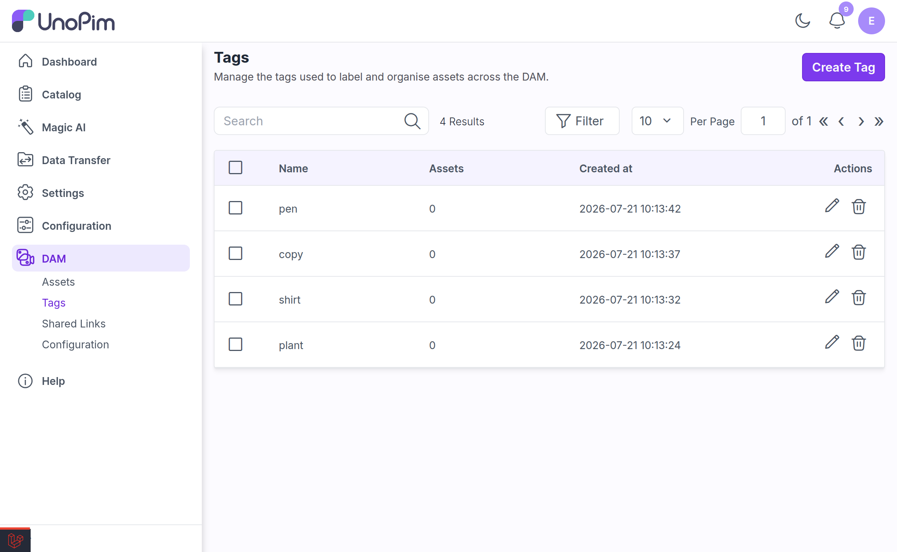
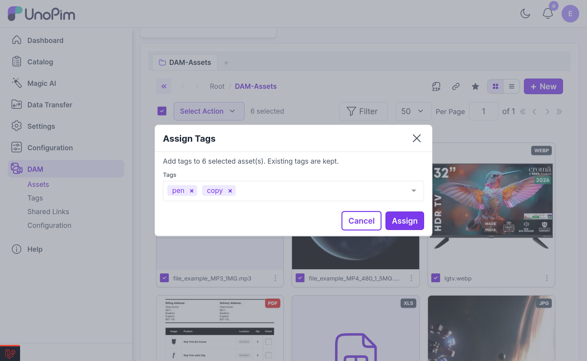

# Managing Tags

Tags are free-form labels you attach to assets — `summer-campaign`, `approved`, `hero-image` — so you can find and group them regardless of which folder they live in.

DAM gives tags a dedicated management page at **DAM → Tags**, and three ways to attach them to assets.

---

## The Tags Page

Go to **DAM → Tags** to see every tag in the system.

| Column | Notes |
|---|---|
| **Name** | The tag itself. Searchable, filterable, and sortable. |
| **Assets** | How many assets currently carry this tag. Useful for spotting typo-tags with a count of 1. |
| **Created at** | Filterable and sortable. |

The grid is sorted newest-first, 25 rows per page.

### Actions

| Action | What it does | Permission |
|---|---|---|
| **Create Tag** | Opens the Create Tag modal. | `dam.tags.create` |
| **Edit** | Rename a tag. The change applies everywhere it is used. | `dam.tags.update` |
| **Delete** | Remove the tag and detach it from every asset. | `dam.tags.delete` |
| **Mass delete** | Select several tags and delete them in one go. | `dam.tags.delete` |

---

## Tagging Assets

### From the asset edit page

Open an asset and use the **Tags** field — *"Choose or Create a Tag"*. Pick an existing tag, or type a new name and it will be created and attached in one step.

Attaching a tag the asset already has returns *"Tag already exists"* — nothing is duplicated.

### Mass-assigning from the gallery

To tag many assets at once:

1. Select the assets in the gallery (you can select folders too — see below).

2. Open the mass-action menu and choose **Assign Tags**.

3. In the **Assign Tags** modal, search for tags or type a new name and press enter to add it.

4. Apply.

When folders are part of the selection, the modal tells you the tagging will run recursively:

Two things worth knowing:

- **Existing tags are kept.** Mass-assign only *adds* tags. It never strips the tags an asset already has.
- **Folders are tagged recursively.** If you include folders in the selection, every asset inside them — at any depth — receives the tags. The modal tells you so: *"Add tags to the selected assets and every asset inside the selected folders, recursively."*

Tags that do not exist yet are created automatically as part of the mass-assign.

### Mass-assigning from the Explorer

The same **Assign Tags** action is available in the [Explorer](./explorer.md). Select any mix of folders and files, open **Select Action**, and choose **Assign Tags**.

It opens the identical modal and behaves identically — additive, recursive through folders, and creating any tags that do not yet exist. Use whichever view you are already working in.

> [!NOTE]
> Tagging assets — from either surface — requires the **Update** permission (`dam.asset.update`).

---

## Tags and History

Tag changes are recorded in the asset's **History** tab, so you can see who added or removed a tag and when.

---

## Finding Assets by Tag

Tags are searchable and filterable from the asset gallery's filter panel, so `tag = approved` gives you every approved asset across every folder in the library.

---

## Related

- [Tag API](./tag.md) — managing tags programmatically
- [Directory & Asset Management](./directory-and-asset-management.md) — the asset gallery and its filters
