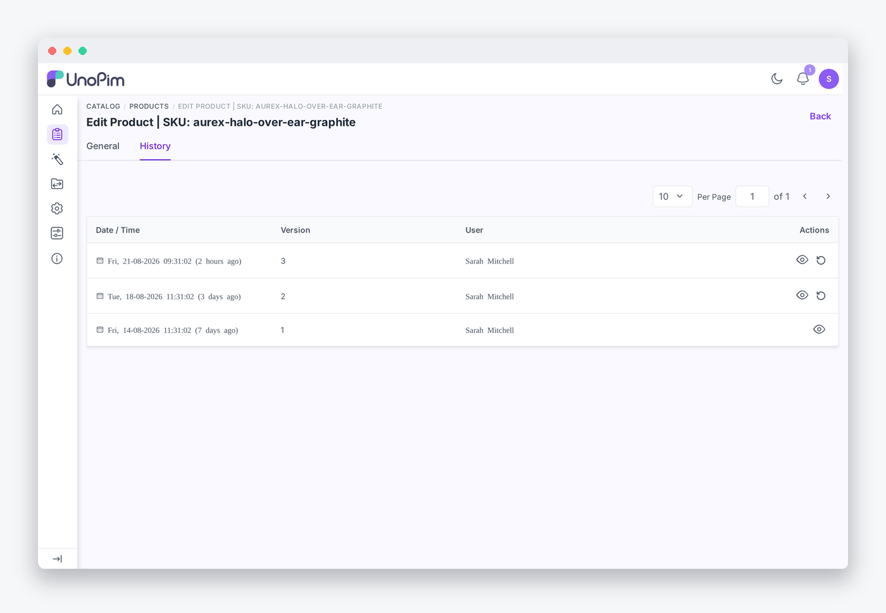
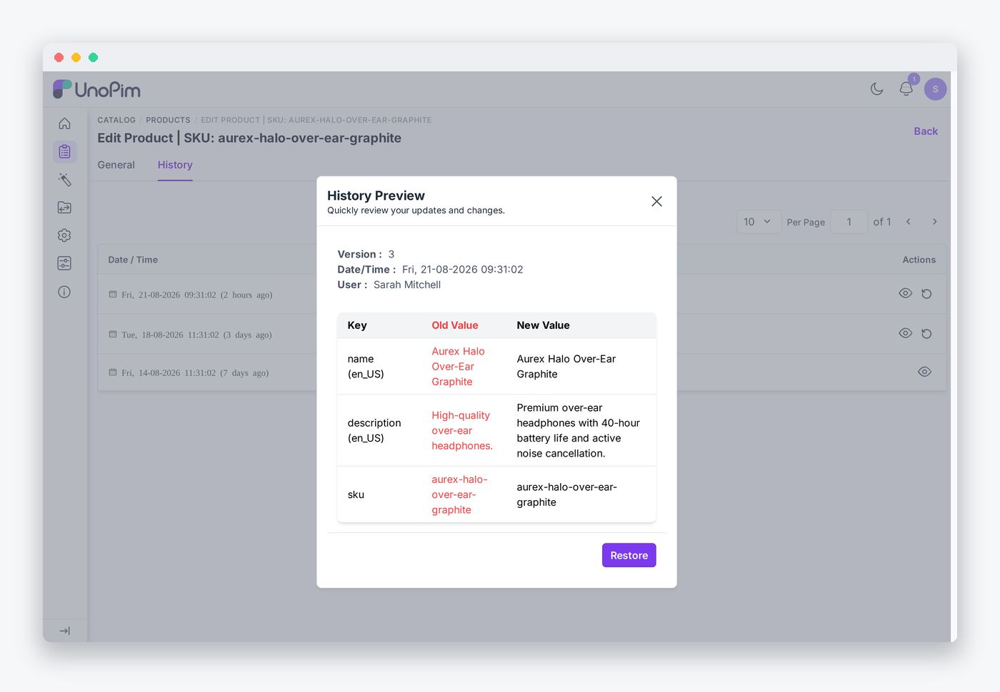

# File Preview

The extension enriches the History tab with inline file thumbnails so catalog teams can see what a field contained at each point in time — without leaving the page.

## Inline thumbnails

When a history row contains a file path or a JSON array of file paths, the extension automatically renders a thumbnail in the grid cell instead of plain text.



- **Images** — rendered as a small preview image.
- **Videos** — the first frame is extracted and shown as a still thumbnail (requires `ffmpeg`).
- **Audio** — a waveform/audio icon is shown.
- **PDFs** — the first page is rendered as an image thumbnail (requires `pdftoppm` / poppler-utils).
- **Documents** (doc, docx, xls, xlsx, csv, ppt, pptx, txt) — a file-type icon is shown.
- **Multi-file JSON arrays** — rendered as a thumbnail grid, one thumbnail per file.

Plain text values (names, codes, numbers) continue to appear as text. File detection is automatic — no configuration is needed for standard fields.

## Supported file types

| Category | Extensions |
|---|---|
| Image | `jpg` `jpeg` `png` `gif` `webp` `svg` `bmp` |
| Video | `mp4` `mov` `webm` `avi` `mkv` |
| Audio | `mp3` `wav` `ogg` `m4a` `flac` |
| Document | `pdf` `doc` `docx` `xls` `xlsx` `csv` `ppt` `pptx` `txt` |

## Preview modal

Click any thumbnail to open the full preview modal.



- **Images** — displayed at full resolution with zoom support.
- **Videos** — played with a native video player (controls included).
- **Audio** — played with a native audio player.
- **Documents** — a **Download** button lets the user save the file locally.

Press **Escape** or click outside the modal to close it.

## Thumbnail generation

Thumbnails for PDFs and video frames are generated lazily on first access and then cached on disk. Subsequent loads of the same file are served from cache with no additional processing.

### Optional binaries

| Binary | Purpose | Install |
|---|---|---|
| `ffmpeg` | Extract the first frame from video files | `apt install ffmpeg` |
| `pdftoppm` (poppler-utils) | Render the first page of PDF files | `apt install poppler-utils` |

If either binary is not installed, the corresponding file type falls back to a generic document icon instead of a rendered thumbnail. Image and audio previews do not require any additional binaries.

Configure the binary paths in your `.env` file if they are not on `$PATH`:

```ini
FFMPEG_PATH=/usr/bin/ffmpeg
PDFTOPPM_PATH=/usr/bin/pdftoppm
```

## Multi-disk support

The extension checks both the DAM `private` disk and the standard `public` disk when resolving file URLs. DAM assets and non-DAM product images work side by side without any extra configuration.

## Overriding field rendering

By default the extension automatically detects file fields and renders them as thumbnails. In rare cases a field may need to be forced one way or the other:

- If a field stores a file but is not being rendered as a thumbnail, contact support to have it added as a file field override.
- If a field is showing a thumbnail when it should display plain text, it can be excluded from file detection the same way.

For most standard UnoPim fields this is not needed — the detection works automatically out of the box.
