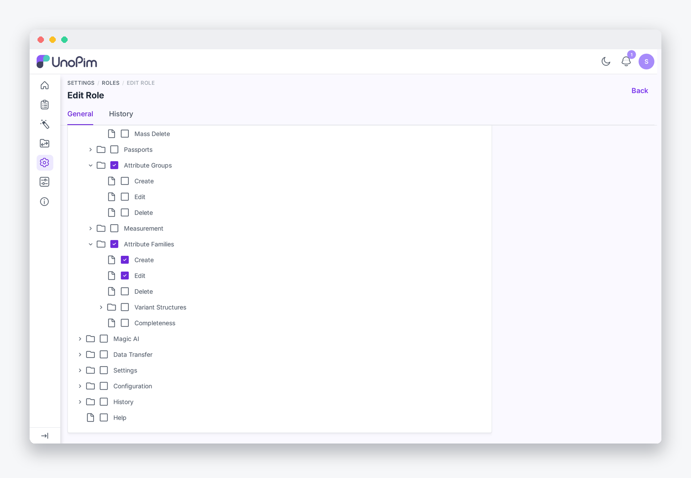

# Permissions

The extension adds two ACL permissions that control access to history features. Both are gated through **Settings → Roles**.

## Available permissions

| Permission | Key | What it allows |
|---|---|---|
| **History** | `history` | View the History tab on any record. |
| **History → Restore** | `history.restore` | Click the Restore button on any history row. |

## Setting up permissions

1. Go to **Settings → Roles** in your UnoPim admin panel.
2. Click **Edit** on the role you want to configure.
3. Locate the **History** section in the permission tree.
4. Enable the permissions appropriate for this role.
5. Click **Save**.

> [!NOTE]
> Roles without the **History** permission will not see the History tab at all. Roles with **History** but without **History → Restore** can view history but cannot click the Restore button.

## Permissive gate

The Restore button also appears for users who hold the entity's own edit permission, even if they do not have `history.restore` explicitly. The mapping is:

| Entity | Edit permission that also unlocks Restore |
|---|---|
| Products | `catalog.products.edit` |
| Categories | `catalog.categories.edit` |
| Category fields | `catalog.category_fields.edit` |
| Attributes | `catalog.attributes.edit` |
| Attribute groups | `catalog.attribute_groups.edit` |
| Attribute families | `catalog.families.edit` |
| Channels | `settings.channels.edit` |
| Admin users | `settings.users.users.edit` |
| Roles | `settings.roles.edit` |
| DAM assets | `dam.asset.update` |
| Webhook settings | `configuration.webhook.settings.update` |

This means a catalog manager with `catalog.products.edit` can restore products without needing the global `history.restore` permission granted separately.
