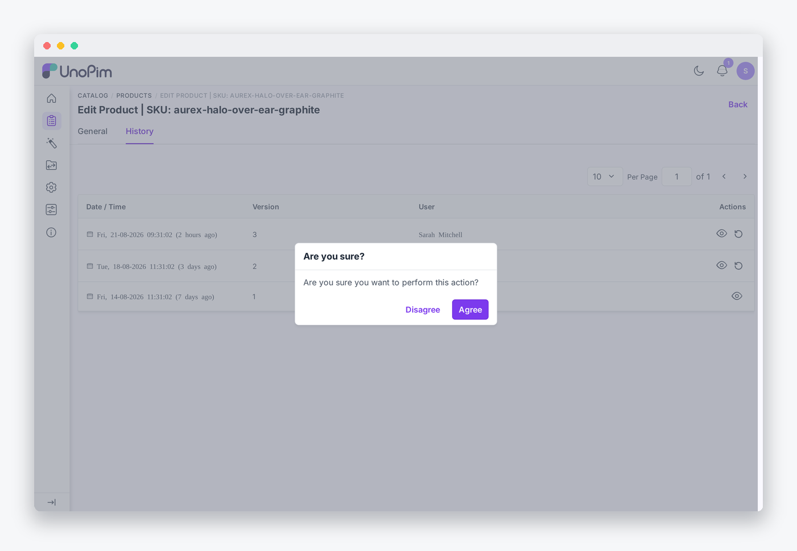

# Restoring Versions

The Restore feature lets you revert any record to exactly the state it was in at a previous point in its audit history. The restore covers the parent record, all translated rows, and any pivot relations — in a single database transaction.

## How to restore a version

1. Open a record (product, category, attribute, channel, etc.).
2. Navigate to the **History** tab.
3. Locate the version you want to go back to.
4. Click the **eye icon** on any version to preview what changed before committing.


5. Click the **Restore** icon on the version you want to revert to.


6. A confirmation dialog appears — click **Agree** to proceed.



6. A toast notification confirms the outcome:
   - **Restored** — the record was reverted successfully.
   - **No changes** — the selected version is identical to the current state.
   - **Failed** — an error occurred (details appear in the notification).

## What gets restored

Restoring a version reverts every audit row that shares the same `version_id` as the row you clicked. A typical save might produce several rows — a parent column change, a translated name, and a pivot relation — all grouped under one version ID. Clicking Restore on any one of them rolls back the entire group together.

### Covered entities out of the box

| Entity | What is reverted |
|---|---|
| **Products** | All product columns and DAM asset ID references |
| **Categories** | Category columns and DAM asset references |
| **Attributes** | Attribute columns and translation rows |
| **Attribute groups** | Group columns and translation rows |
| **Attribute families** | Family columns, translation rows, and group-mapping rows |
| **Channels** | Channel columns, translation rows, currencies pivot, locales pivot |
| **Admin users** | User columns |
| **Roles** | Role columns including the JSON-cast permissions array |
| **DAM assets** | Asset columns, properties, comments, resource mappings, and share records |
| **Webhook settings** | All key/value rows reverted through `updateOrCreate` |
| **Association types** | Field and translation rows |
| **Measurement families** | Translation rows |
| **Measurement units** | Unit columns |
| **Variant structures** | Variant structure columns |
| **Product passport templates** | Section and field rows |

## Soft-deleted records

If the record was deleted after the version you are restoring, the extension automatically un-trashes it before applying the old values. You do not need to restore the record manually first.

## Restore lineage

Every restore stamps the audit row it creates with three extra fields so the action is fully traceable:

| Field | What it records |
|---|---|
| `restored_from_version_id` | The version that was the source of this restore |
| `restored_by` | The admin user who clicked Restore |
| `restored_at` | The timestamp of the restore action |

The version-detail modal surfaces a **"Restored from version N"** badge on any row that was created by a restore.

## Restore behaviour modes

### Any-version restore (default)

By default, any version in history can be restored regardless of how old it is. Restoring applies the selected version's `old_values` to the model; the `save()` that follows creates a new audit row, so nothing in history is ever destroyed.

### One-step undo (opt-in)

To allow restoring only the single most-recent version, set this in `.env`:

```ini
HISTORY_PREVIEW_ANY_VERSION=false
```

Or publish the config and set:

```php
'allow_restore_any_version' => false,
```

In this mode the Restore button only appears on the latest version row. All previous rows remain visible for reference but cannot be restored directly.

> [!TIP]
> The default any-version mode is recommended for most teams. One-step undo is useful if you want to limit restores to a simple "undo last save" workflow.

## Asset file preservation

When a DAM asset is re-uploaded, the extension keeps the previous file on disk with a unique suffix (`photo (1).jpg`, `photo (2).jpg`, …) instead of overwriting it. This means that a restore can bring back not just the metadata but also the exact binary that was stored at that version.
