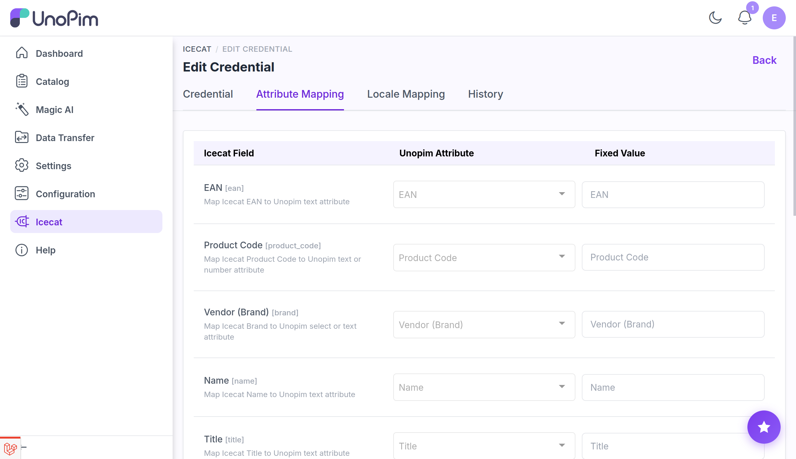

# Attribute Mapping

The **Attribute Mapping** tab on a credential controls which UnoPim attributes receive data from Icecat during enrichment. It is split into two sections: **Standard Attribute Mapping** and **Icecat Feature Attributes**.

Open it from **Icecat → Credentials → Edit → Attribute Mapping**.

## How the mapping screen works

Each row in the mapping table has three columns:

| Column | Purpose |
|---|---|
| **Icecat Field** | The Icecat field or feature being mapped (read-only). |
| **UnoPim Attribute** | The UnoPim attribute that receives the value from Icecat. Only attribute types compatible with the Icecat field are shown in the dropdown. |
| **Fixed Value** | An optional constant written to this field for every enriched product, regardless of what Icecat returns. |

For each row you can set either a **UnoPim Attribute** or a **Fixed Value** — not both. Selecting a mapping disables the fixed value input, and entering a fixed value disables the attribute dropdown.

---

## Standard Attribute Mapping

The top section covers Icecat's built-in product fields. Map these to the UnoPim attributes that should store the corresponding values.

| Icecat Field | Compatible UnoPim attribute types | Notes |
|---|---|---|
| **EAN** | Text | Used to look up the product in Icecat. |
| **Product Code** | Text | Used together with Brand to look up the product when EAN is absent. |
| **Vendor (Brand)** | Select, Text | Used together with Product Code for lookup. |
| **Name** | Text | |
| **Title** | Text | |
| **Description** | Textarea | |
| **Short Description** | Textarea | |
| **Summary Description** | Textarea | |
| **Short Summary Description** | Textarea | |
| **Pictures** | Image, Gallery | Multiple images are supported. |

> **Important:** Map at least one of **EAN** *or* the combination of **Product Code + Vendor (Brand)** to a UnoPim attribute. The connector uses these identifiers to find the matching product in Icecat. Without them, enrichment cannot proceed.

---

## Icecat Feature Attributes

The lower section lets you add Icecat technical specification features — such as dimensions, connectivity specs, or performance figures — as additional enrichment fields.

**Prerequisite:** Run the [Icecat Feature Mapping import](./import-feature-mapping) job at least once first. This downloads the full Icecat feature list for the selected credential and locale into the UnoPim database, making it available in the feature selector below.

### Add a feature attribute

1. In the **Icecat Feature Attributes** section, open the **Select Feature Type** dropdown and choose an Icecat feature (e.g., `Display size`, `RAM capacity`).
2. The **Attribute Type** is pre-selected based on the feature's Icecat data type. Change it if needed.
3. Click **Add**.
4. The feature row appears in the mapping table (highlighted). Set either a UnoPim attribute or a fixed value for it.
5. Click **Save Mappings**.

### Remove a feature attribute

Click the **delete** icon on the feature row and confirm the prompt. The feature reappears in the **Select Feature Type** dropdown so it can be re-added later.

---

## Save the mapping

Click **Save Mappings** to store all changes. The updated mapping is used immediately by subsequent import jobs and single-product fetch operations on this credential.

---

## What's next

- [Locale Mapping](./locale-mapping) — map UnoPim locales to Icecat locales.
- [Import: Feature Mapping](./import-feature-mapping) — download the Icecat feature list (required before adding feature attributes).
- [Import: Attributes](./import-attributes) — auto-create UnoPim attributes from your configured feature mappings.
- [Import: Enrich Product](./import-enrich-product) — bulk-enrich products using these mappings.
