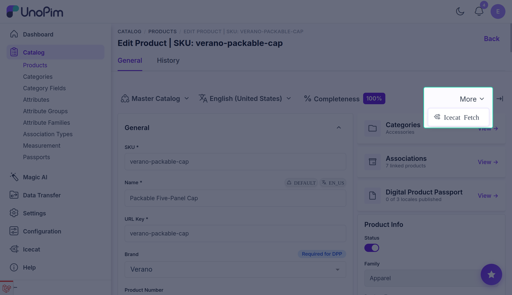
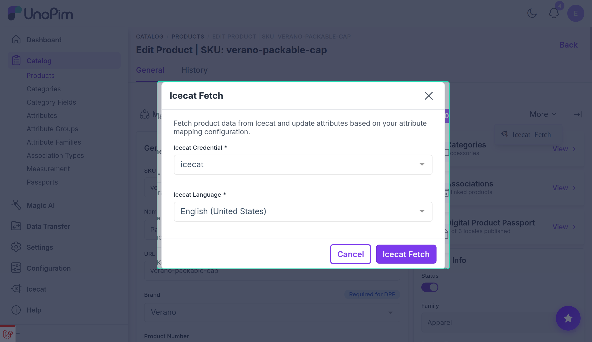

# Single Product Fetch

You can enrich a single product on demand directly from the product edit page, without running a batch import job. This is useful for testing your mapping configuration or for enriching individual products as needed.

## Prerequisites

- An active Icecat credential with attribute mapping configured. See [Setup Icecat Credentials](./setup-credentials) and [Attribute Mapping](./attribute-mapping).
- The product must have an EAN value, or both a Product Code and Brand value, populated — the same eligibility rules that apply to the [bulk import job](./import-enrich-product).

## How to fetch Icecat data for a single product

### Step 1 — Open the product

Navigate to **Catalog → Products** and open the product you want to enrich.

### Step 2 — Open the More menu

On the product edit page, click the **More** (⋮) menu in the top-right action area.

### Step 3 — Select Icecat Fetch

Click **Icecat Fetch** from the dropdown. A modal dialog opens.

### Step 4 — Choose a credential and locale

| Field | Description |
|---|---|
| **Icecat Credential** | Select the credential to use for this fetch. If only one active credential exists, it is pre-selected automatically. |
| **Icecat Language** | Select the UnoPim locale to fetch content in. |

### Step 5 — Click Icecat Fetch

Click the **Icecat Fetch** button to submit the request. A spinner is shown while the connector queries the Icecat API.

- On **success**, a confirmation flash message appears and the page reloads with the updated attribute values.
- On **failure**, the error reason is shown inside the modal (e.g., product not found in Icecat, or no mappable values returned).

## Notes

- The single-product fetch uses the same attribute mapping as the bulk import job. Make sure the credential's mapping is saved before using this feature.
- Images are downloaded from Icecat and stored on the `public` disk, the same as in the bulk job.
- The fetch always retrieves the latest data from Icecat at the time of the request.
