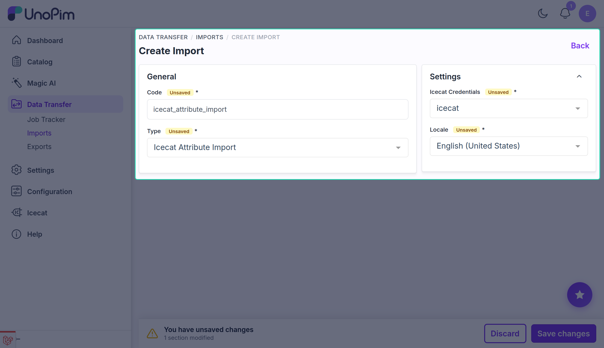
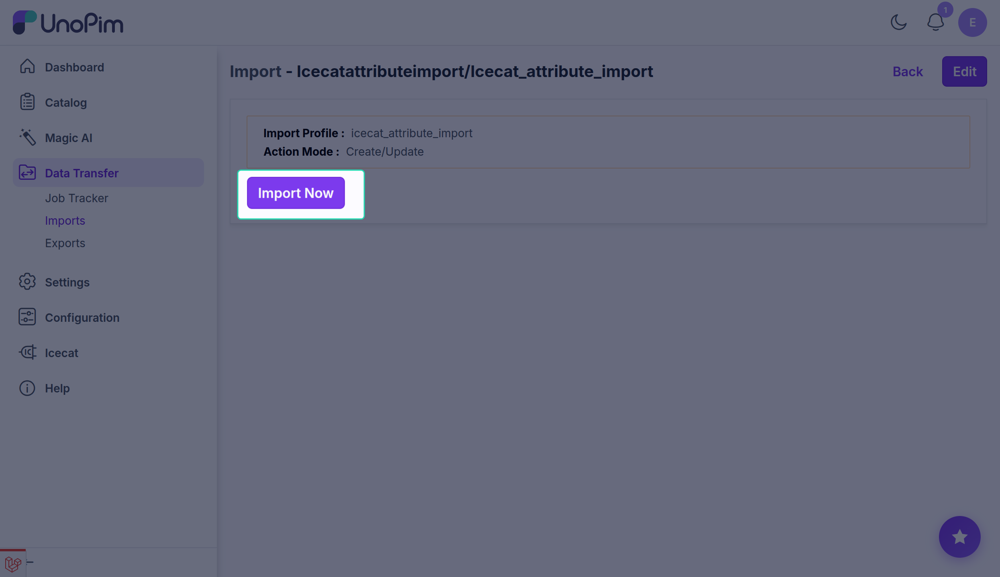
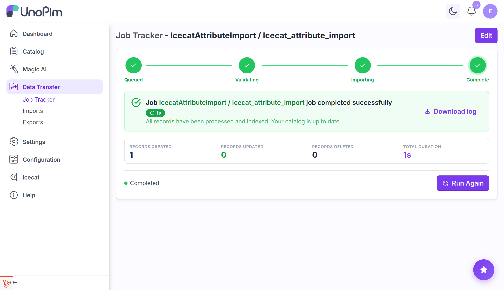

# Import: Attributes

The **Icecat Attribute Import** job reads the feature attributes configured on a credential's [Attribute Mapping](./attribute-mapping) tab and automatically creates or updates the corresponding UnoPim attributes.

Run this job after adding or changing feature attribute mappings on a credential so the UnoPim attributes exist before you run the product enrichment job.

## Prerequisites

1. An active Icecat credential. See [Setup Icecat Credentials](./setup-credentials).
2. Feature attributes added to the credential's Attribute Mapping tab. See [Attribute Mapping](./attribute-mapping).
   - The [Icecat Feature Mapping import](./import-feature-mapping) must have been run first to populate the feature selector.

## How to run the Attribute import

### Step 1 — Go to Data Transfer → Imports

Navigate to **Data Transfer → Imports** from the main sidebar menu.

### Step 2 — Create Import

Click **Create Import** and enter a unique **Code** for this job.

**Example:** `icecat_attribute_import_en_us`

### Step 3 — Select Type

In the **Type** dropdown, select **Icecat Attribute Import**.

### Step 4 — Configure the filters

| Filter | Required | Notes |
|---|---|---|
| **Icecat Credentials** | Yes | Select the credential whose feature mappings should be used. |
| **Locale** | Yes | Select the locale used for attribute labels and option values. |

### Step 5 — Save

Click **Save** to store the import job.

### Step 6 — Import Now

Click **Import Now** (or **Run**) to start the job.

### Step 7 — Monitor progress

Track the job in the **Job Tracker**. When complete, the **Created / Updated** count reflects how many UnoPim attributes were created or updated.

## What the job does

For each feature attribute listed in the credential's Attribute Mapping configuration, the job:

1. Creates a new UnoPim attribute with the feature's code, label, and type — if it does not already exist.
2. Updates the label and type of an existing attribute — if it already exists.
3. One failed attribute is logged and skipped; the rest of the batch continues.

## After the job completes

Go back to the credential's **Attribute Mapping** tab and map each newly created attribute to its feature row, then save.

## What's next

- [Import: Enrich Product](./import-enrich-product) — bulk-enrich products once attributes are mapped.
