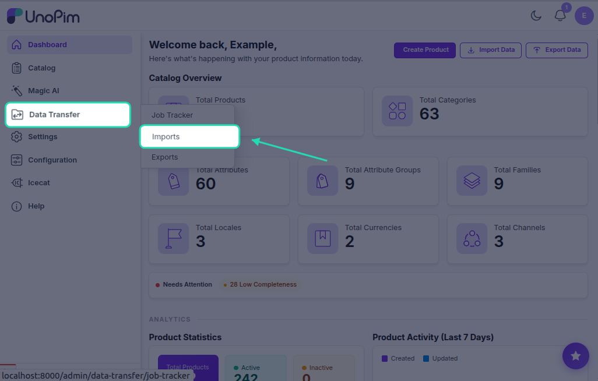
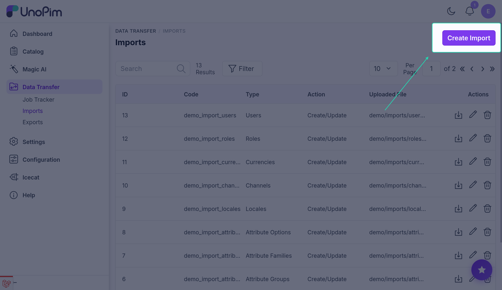
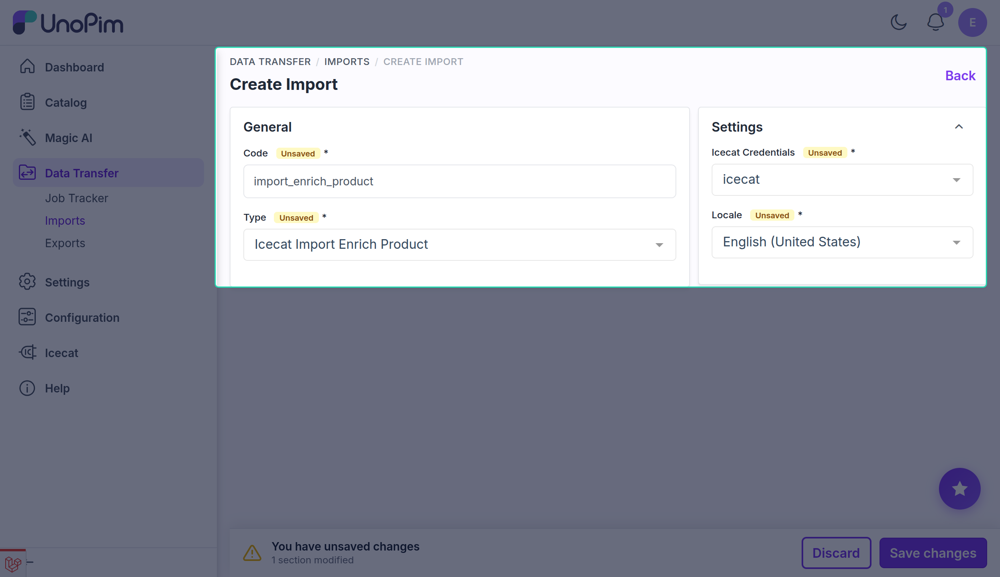
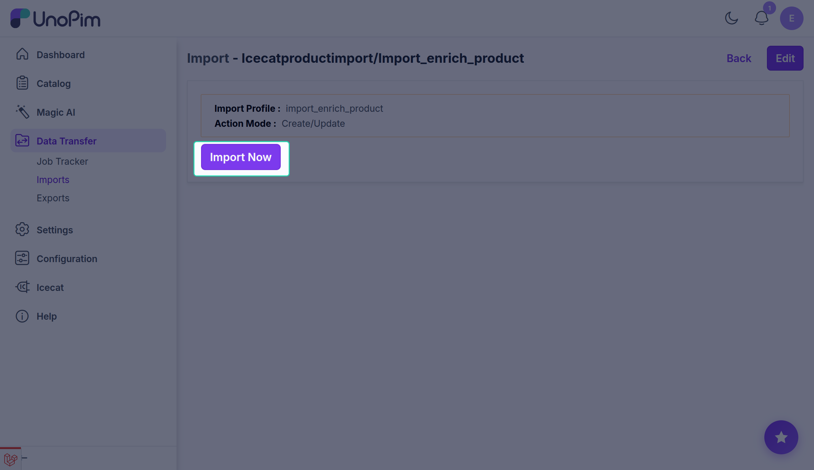

# Import: Enrich Product

The **Icecat Import Enrich Product** job queries the Icecat API for each eligible UnoPim product and writes the returned data back into UnoPim using the credential's attribute mapping configuration. This is the main bulk enrichment job.

## Prerequisites

Before running this job, complete the following in order:

1. [Setup Icecat Credentials](./setup-credentials) — create and activate a credential.
2. [Attribute Mapping](./attribute-mapping) — map at least the EAN or Product Code + Brand fields, plus any feature attributes you want.
3. [Locale Mapping](./locale-mapping) — map UnoPim locales to Icecat locales.
4. [Import: Feature Mapping](./import-feature-mapping) — download the Icecat feature list (required if you added feature attributes).
5. [Import: Attributes](./import-attributes) — create the UnoPim attributes for your feature mappings.

## Product eligibility

A product is eligible for enrichment if at least one of the following conditions is met:

- The **EAN** attribute is mapped and the product has an EAN value populated.
- Both the **Product Code** and **Vendor (Brand)** attributes are mapped and both have values populated on the product.

Products that don't meet either condition are skipped with a log entry.

## How to run the Enrich Product import

### Step 1 — Go to Data Transfer → Imports

Navigate to **Data Transfer → Imports** from the main sidebar menu.



### Step 2 — Create Import

Click **Create Import** and enter a unique **Code** for this job.

**Example:** `icecat_enrich_products_en_us`



### Step 3 — Select Type

In the **Type** dropdown, select **Icecat Import Enrich Product**.



### Step 4 — Configure the filters

| Filter | Required | Notes |
|---|---|---|
| **Icecat Credentials** | Yes | Select the active credential whose mapping configuration should be used. |
| **Locale** | Yes | Select the UnoPim locale to enrich. The connector maps this to the corresponding Icecat locale via the credential's Locale Mapping tab. |

### Step 5 — Save

Click **Save** to store the import job.

### Step 6 — Import Now

Click **Import Now** (or **Run**) to start the job.



### Step 7 — Monitor progress

Track the job in the **Job Tracker**. Live **Created / Updated / Skipped** counts update as the job runs. Open the job detail to see per-product log entries, including any errors or skipped records.

## What the job does

```
Job starts
    ↓
Loads all UnoPim products with EAN or (Product Code + Brand) populated
    ↓
For each product:
    Queries Icecat API using the matching identifier
    ↓
    Maps returned fields to UnoPim attributes
    (standard fields + configured feature attributes)
    ↓
    Downloads and stores product images from Icecat
    ↓
    Writes attribute values via UnoPim's value API
    ↓
One failed record is logged and skipped — the batch continues
    ↓
Job summary: created / updated counts reported
```

## Re-running the job

You can re-run the job at any time. On subsequent runs the job **updates** existing attribute values with the latest data from Icecat rather than creating duplicates.

## Troubleshooting

**"No products are eligible for Icecat enrichment"**
The job found no products with an EAN value, or no products with both Product Code and Brand mapped and populated. Check the credential's Attribute Mapping tab and verify that the relevant attribute values exist on your products.

**"No Icecat attributes are configured for import on this credential"**
No feature attributes have been added to the credential's Attribute Mapping tab. Add features there and re-run the [Attribute import](./import-attributes) before retrying.

**Jobs stuck in "Pending"**
No queue worker is running. Start one:

```bash
php artisan queue:work
```

Then re-queue the job from **Data Transfer → Imports**.

## What's next

- [Single Product Fetch](./fetch-product) — enrich a single product on demand without running a batch job.
