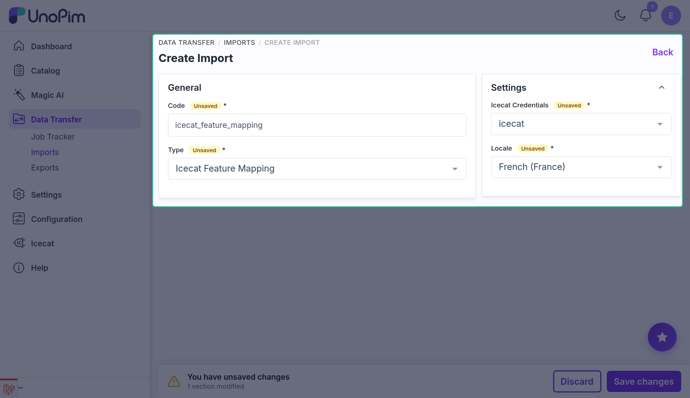
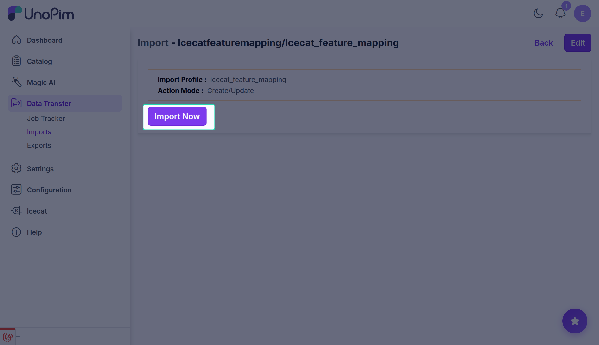
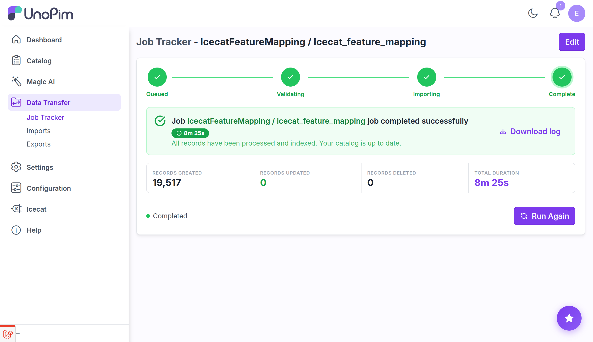

# Import: Feature Mapping

The **Icecat Feature Mapping** import job downloads the full list of Icecat specification features for a given credential and locale into the UnoPim database. Once imported, these features appear in the **Select Feature Type** dropdown on the credential's [Attribute Mapping](./attribute-mapping) tab, where you can add them to your enrichment configuration.

**Run this job once before configuring feature attributes on a credential.** Re-run it whenever Icecat releases new specification categories or when you switch to a new credential or locale.

## Prerequisites

- An active Icecat credential. See [Setup Icecat Credentials](./setup-credentials).

## How to run the Feature Mapping import

### Step 1 - Go to Data Transfer → Imports

Navigate to **Data Transfer → Imports** from the main sidebar menu.

### Step 2 - Create Import

Click **Create Import** and enter a unique **Code** for this job.

**Example:** `icecat_feature_mapping_en_us`

### Step 3 - Select Type

In the **Type** dropdown, select **Icecat Feature Mapping**.

### Step 4 - Configure the filters

| Filter | Required | Notes |
|---|---|---|
| **Icecat Credentials** | Yes | Select the active credential to download features for. |
| **Locale** | Yes | Select the UnoPim locale whose Icecat feature list to download. |

### Step 5 - Save

Click **Save** to store the import job.

### Step 6 - Import Now

Click **Import Now** (or **Run**) to start the job.

### Step 7 - Monitor progress

Track the job in the **Job Tracker**. When complete, the **Created / Updated** count reflects how many Icecat features were stored.

## After the job completes

Open the credential's **Attribute Mapping** tab. The **Select Feature Type** dropdown is now populated with the downloaded Icecat features, ready for you to add to the enrichment mapping.

## What's next

- [Attribute Mapping](./attribute-mapping) - add feature attributes to the credential's mapping configuration.
- [Import: Attributes](./import-attributes) - auto-create UnoPim attributes from the features you have added.
