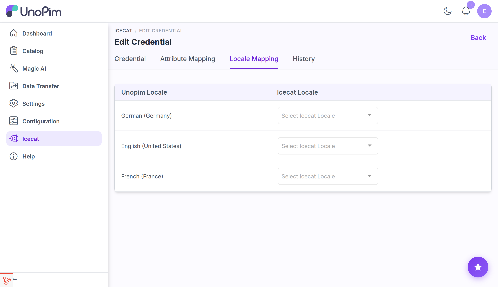

# Locale Mapping

The **Locale Mapping** tab on a credential maps each of your active UnoPim locales to an Icecat locale ID. This tells the connector which Icecat language variant to pull for each UnoPim locale when enriching products.

Open it from **Icecat → Credentials → Edit → Locale Mapping**.

## How the mapping screen works

The table lists every active UnoPim locale in the left column. For each row, select the corresponding Icecat locale from the dropdown on the right.

| Column | Description |
|---|---|
| **UnoPim Locale** | An active locale configured in your UnoPim installation (e.g., `English (United States)`). |
| **Icecat Locale** | The Icecat language variant to fetch content in (e.g., `English`). |

## Configure locale mapping

1. Navigate to **Icecat → Credentials → Edit → Locale Mapping**.
2. For each UnoPim locale you intend to enrich, select the matching Icecat locale from the dropdown.
3. Click **Save**.

## How locale mapping is used at import time

When you run an import job or a single-product fetch and select a UnoPim locale (e.g., `en_US`), the connector looks up the Icecat locale mapped to that UnoPim locale and requests product content in that language from the Icecat API.

If no mapping exists for the selected locale, the connector falls back to the Icecat default language.

## What's next

- [Import: Feature Mapping](./import-feature-mapping) — download the Icecat feature list for a credential and locale.
- [Import: Enrich Product](./import-enrich-product) — run a bulk enrichment job using this locale mapping.
- [Single Product Fetch](./fetch-product) — fetch Icecat data for one product on demand.
