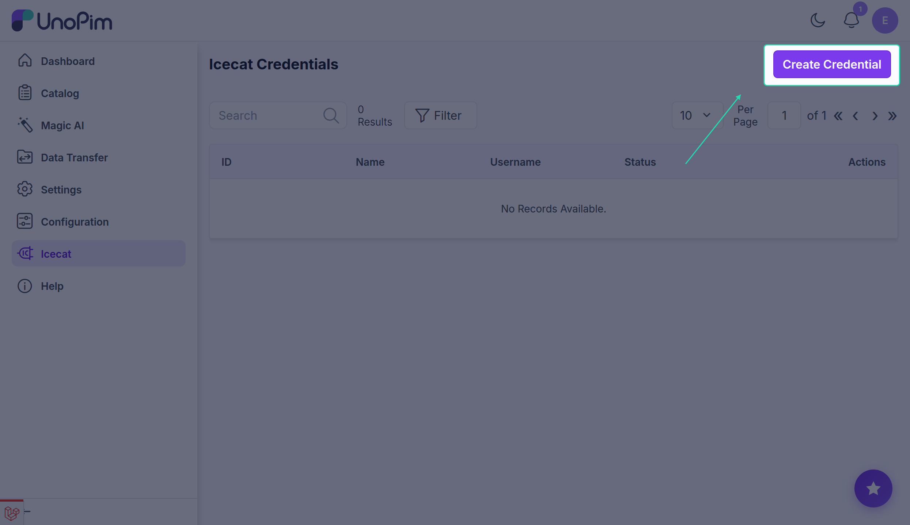
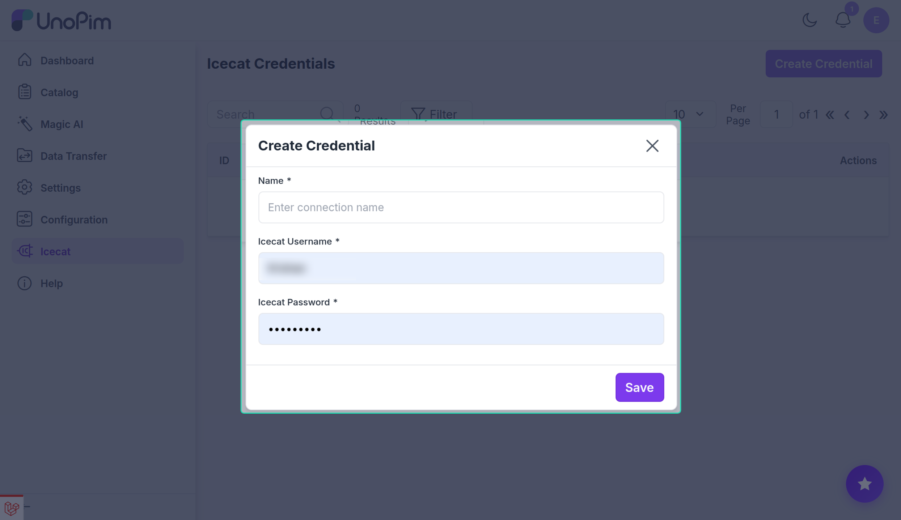
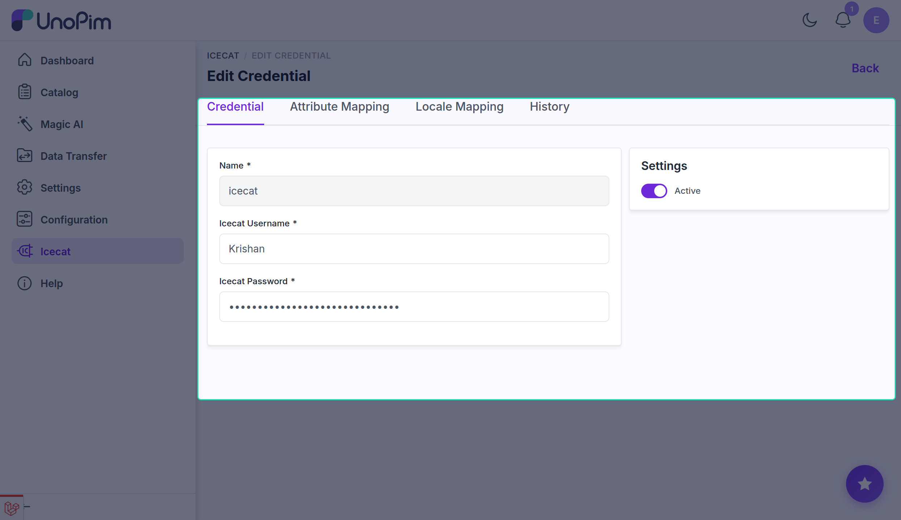

# Setup Icecat Credentials

Once the connector is installed, connect your Icecat account to UnoPim by creating a credential. Each credential stores your Icecat login details and holds all mapping configuration for that connection. You can create multiple credentials — one per Icecat account or use-case.

## Step 1 — Open the Credentials page

Log in to your UnoPim admin panel and navigate to **Icecat → Credentials**, then click **Create Credential**.

## Step 2 — Fill in your Icecat account details

| Field | What to enter |
|---|---|
| **Name** | A unique label for this connection (e.g., `Production Icecat`). Must be unique across credentials. |
| **Icecat Username** | Your Icecat account username. |
| **Icecat Password** | Your Icecat account password. Stored encrypted and never shown after saving. |

## Step 3 — Save the credential

Click **Save**. The credentials are validated live against the Icecat API before they are stored. If the username or password is incorrect, the form displays an error and nothing is saved.

> **Note:** When editing an existing credential, leave the **Password** field blank to keep the previously saved value.

## Managing credentials

Each credential appears as a row in the **Icecat → Credentials** grid with columns for **ID**, **Name**, **Username**, and **Status**.

| Action | How |
|---|---|
| **Edit** | Click the **Edit** action on any row to update the name, username, password, or active status, and to configure attribute and locale mappings. |
| **Delete** | Click **Delete** on a row to permanently remove the credential and all its mapping configuration. |
| **Activate / Deactivate** | Open the credential's edit page and toggle the **Active** switch. Only active credentials can be selected in import jobs and the single-product fetch. |

## What's next

After saving a credential, configure what Icecat data maps to which UnoPim attributes:

- [Attribute Mapping](./attribute-mapping) — map Icecat fields to UnoPim attributes.
- [Locale Mapping](./locale-mapping) — map Icecat locales to UnoPim locales.
