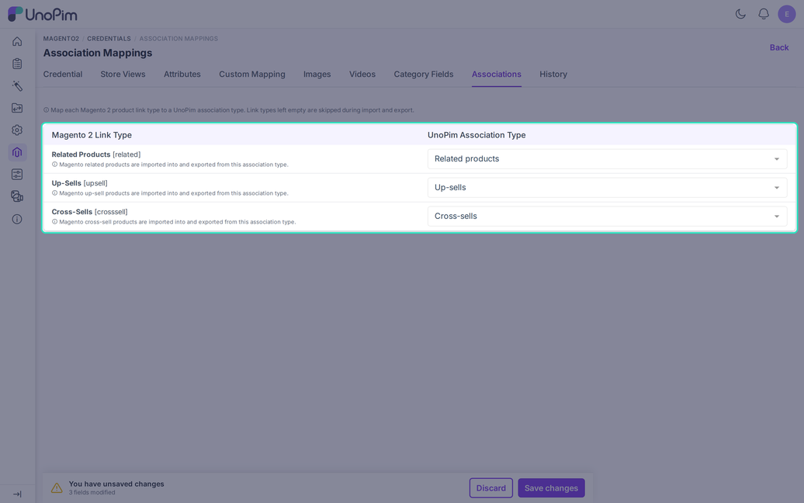

# Association Mapping

The **Associations** tab links Magento product relations to UnoPim association types. Both the product association import and the product export use it.

Open it from **Magento2 > Credentials**, click a credential, then choose **Associations**.

## The Three Link Types

Magento has three kinds of product links. Each row maps one of them to a UnoPim association type.

| Magento link type | Where shoppers see it |
|---|---|
| **Related Products** `[related]` | Next to the product on the product page. |
| **Up-Sells** `[upsell]` | On the product page, as a better or larger alternative. |
| **Cross-Sells** `[crosssell]` | In the cart, as an add-on. |

Create the association types first under **Catalog > Association Types**. They then appear in each drop-down.

## Map the Types

1. Pick a UnoPim association type for each Magento link type.
2. Leave a row empty to skip that link type in both directions.
3. Click **Save**.

An association type can serve only one Magento link type. Using it twice shows "This association type is already mapped to another Magento link type".

## Used in Imports and Exports

- **Import**: the [Magento Product Association](./import-product#part-3-import-product-associations) job writes links into the mapped association types.
- **Export**: turn on **With Associations** in the [product export](./export-product). The connector then sends the mapped links, and the CSV export fills the `related_skus`, `upsell_skus`, and `crosssell_skus` columns.

## Good to Know

- A linked product must exist in Magento. Otherwise the link is skipped with the log line "Association link skipped: the linked product does not exist in Magento".
- The REST export keeps links that exist only in Magento.
- On import, a target that is not in UnoPim is dropped without a message. Import all products first.
