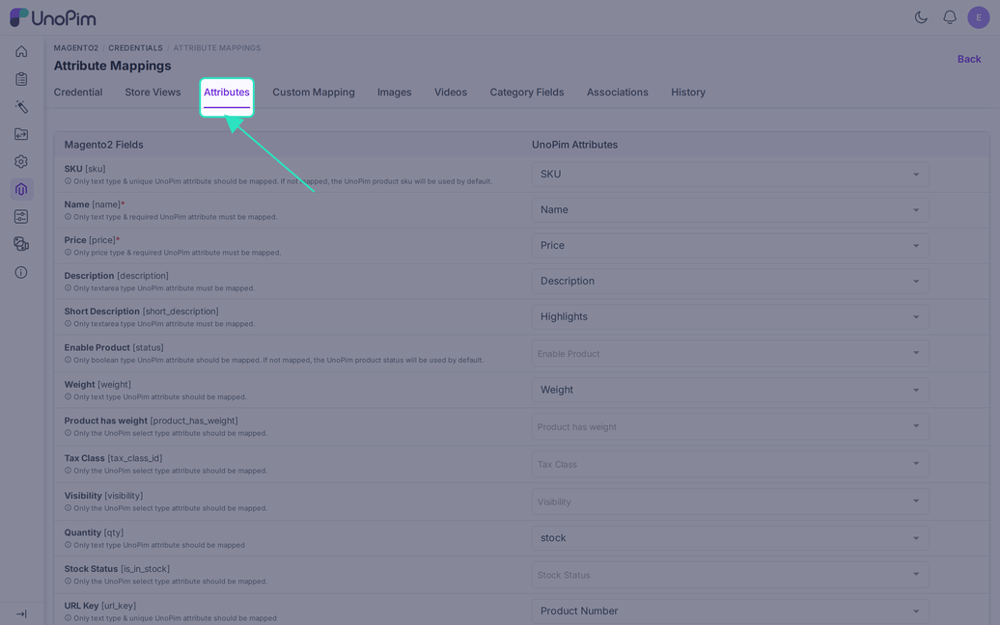
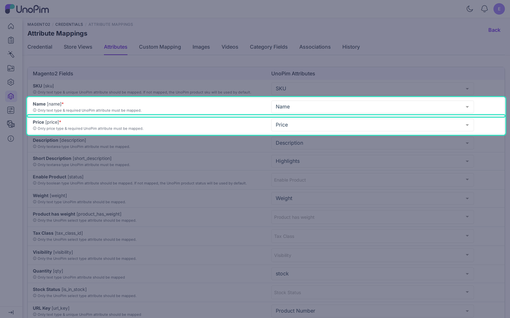
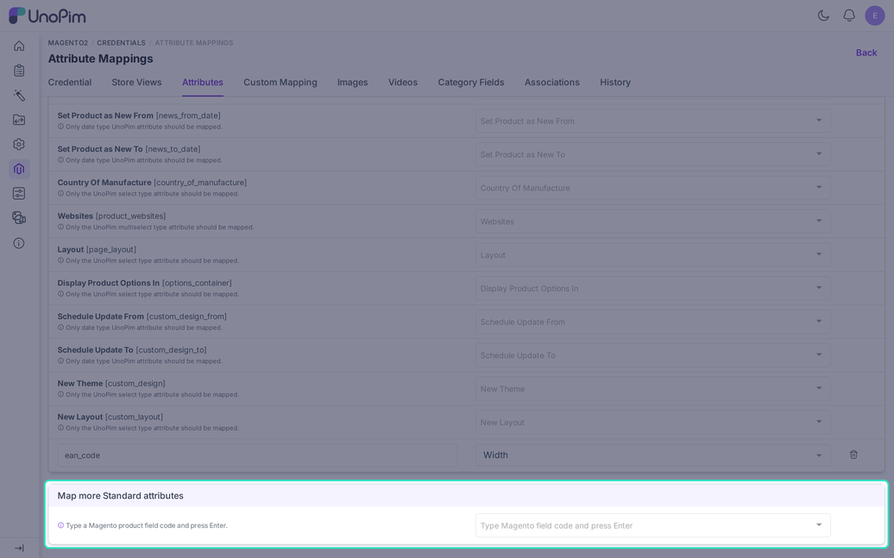

# Attribute Mapping

The **Attributes** tab tells the connector which UnoPim attribute feeds each standard Magento product field. Open it from **Magento2 > Credentials**, click a credential, then choose **Attributes**.

## How the Tab Works

The left column lists Magento product fields with their codes, such as `name` or `short_description`. The right column holds a drop-down of UnoPim attributes that fit the field.

Under each field label, a short hint says which attribute type is allowed. Pick the attribute and click **Save**.

## Required and Optional Fields

Only two fields must be mapped:

- **Name** `[name]`: a text attribute marked as required in UnoPim.
- **Price** `[price]`: a price attribute marked as required in UnoPim.

A product without a name or a price is skipped during export. The job log says why for each store view.

Other fields have safe defaults:

- **SKU** `[sku]`: if you leave it empty, the UnoPim SKU is used.
- **Enable Product** `[status]`: if you leave it empty, the UnoPim product status is used.
- **Visibility** `[visibility]`: variants default to "Not Visible Individually". New products default to "Catalog, Search".

> [!TIP]
> New credentials start with a ready-made mapping. UnoPim matches attributes with the same code and a compatible type, for example `name` to `name`. Check these defaults before your first export.

## Standard Fields and the Type They Expect

| Magento field | UnoPim attribute type |
|---|---|
| `name`, `meta_title`, `meta_keyword`, `meta_description` | Text (meta fields also accept Textarea) |
| `sku`, `url_key` | Text, set as unique |
| `description`, `short_description` | Textarea |
| `price`, `special_price`, `cost` | Price |
| `special_from_date`, `special_to_date`, `news_from_date`, `news_to_date`, `custom_design_from`, `custom_design_to` | Date |
| `status` | Boolean |
| `weight`, `qty` | Text, holding a plain number |
| `product_has_weight`, `tax_class_id`, `visibility`, `country_of_manufacture`, `page_layout`, `options_container`, `custom_design`, `custom_layout`, `is_in_stock` | Select |
| `product_websites` | Multiselect |

The tab shows a few more fields for special product types, such as gift cards. Each one has a hint with the type it needs.

## Select Fields Need Matching Options

For fields such as **Tax Class**, **Visibility**, and **Layout**, the option labels in UnoPim must match the Magento labels. UnoPim compares them in the language of each mapped store view.

For example, if every Magento store view maps to English, enter the Magento labels in the English label field of each UnoPim option.

Two fields use codes instead of labels:

- **Stock Status** `[is_in_stock]`: use option codes `in_stock` or `out_of_stock`. `1`, `0`, `true`, `false`, `yes`, and `no` also work. If you leave it empty, the stock status follows the quantity.
- **Websites** `[product_websites]`: the option codes must equal the Magento website codes.

## Stock Quantity

Map **Quantity** `[qty]` to send stock. If you turn on **Skip inventory update for existing products** in the export job, stock is sent only for new products.

## Map More Standard Attributes

Scroll to the bottom of the tab for **Map more Standard attributes**. Use it for Magento product fields that are not in the list above.

1. Type the Magento field code, for example `ean_code`, and press **Enter**.
2. Pick the UnoPim attribute that holds the value.
3. Click **Save**.

The connector checks every row when you save:

- A code starts with a letter and uses only letters, numbers, and underscores, up to 60 characters.
- A code that the connector already sends itself, such as `sku` or `price`, cannot be added here.
- A code or a UnoPim attribute can appear only once across this tab and [Custom Mapping](./custom-mapping).
- The UnoPim attribute must exist.

You can add up to 200 rows. Click the bin icon to remove one.

## Variant Attributes for Configurable Products

Attributes that make up a variant, such as **color** or **size**, belong on the [Custom Mapping](./custom-mapping) tab. A configurable product is skipped for its variants if one of these attributes is missing there. The job log then shows "Variants skipped: the configurable attributes are not mapped".

## Before You Run a Product Export

- Map **Name** and **Price**.
- Run the [attribute export](./export-attribute) first, so Magento knows every option you map.
- Check that the select-type options match the Magento labels.

Changes you save here apply to the next job run. You can review older versions on the **History** tab.
