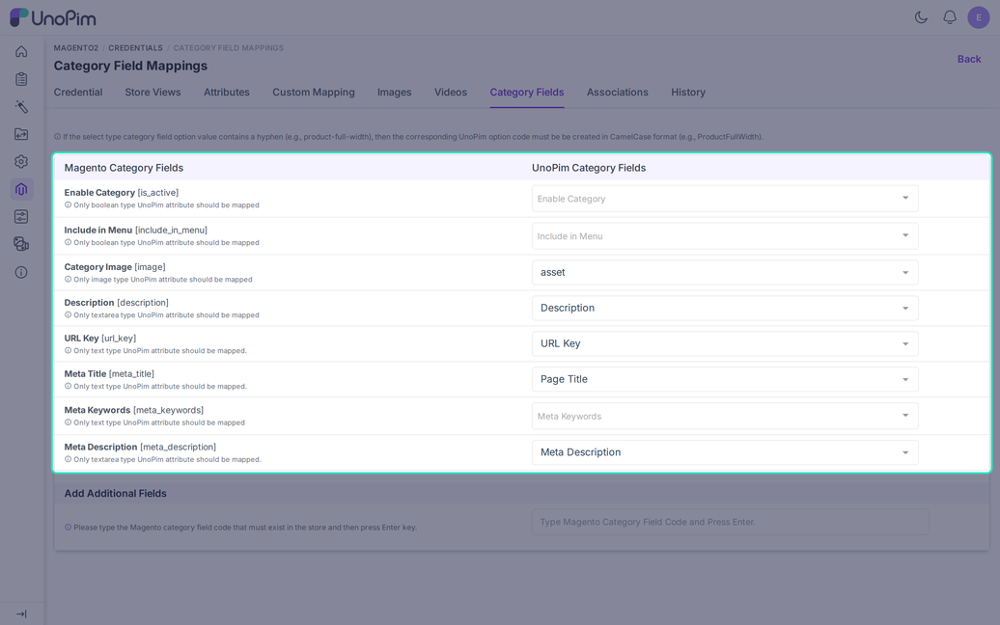

# Category Mapping

The **Category Fields** tab maps UnoPim category fields to Magento category fields. The category export and the category import both read it.

Open it from **Magento2 > Credentials**, click a credential, then choose **Category Fields**.

## What Is Sent Without a Mapping

If you map nothing, the export still creates every category. It sends:

- The **name**, taken from the locale of the "All Store View" row.
- **Enable Category** and **Include in Menu**. Both are on for a new category.

Everything else, including the URL key, stays empty until you map it.

## Fields You Can Map

| Magento field | UnoPim field type |
|---|---|
| **Enable Category** | Boolean |
| **Include in Menu** | Boolean |
| **Category Image** | Image |
| **Description** | Textarea |
| **URL Key** | Text |
| **Meta Title** | Text |
| **Meta Keywords** | Text |
| **Meta Description** | Textarea |

New credentials start with a default mapping where UnoPim has a field with a matching code.

## Add Extra Magento Category Fields

Use **Add Additional Fields** for a Magento category field that is not in the table.

1. Type the Magento category field code and press **Enter**.
2. Pick the UnoPim category field that holds the value.
3. Click **Save**.

The code cannot contain spaces or special characters, and you cannot add the same code twice. If UnoPim already has a category field with that code, it is linked for you.

## Select Fields With a Hyphen

A Magento select option may contain a hyphen, such as `product-full-width`. Create the UnoPim option code in CamelCase, for example `ProductFullWidth`. The export converts it back to the hyphen form.

## Images

A category image is exported only when **With Media** is on in the category export job. The import downloads the Magento image into UnoPim when the field is mapped.

## Good to Know

- If a mapped UnoPim category field is deleted later, the export logs "The mapped category field no longer exists and was not exported".
- If the design "from" date is later than the "to" date, UnoPim drops both dates and logs a warning.
- The category import reads these mappings too. A Magento value that has no mapped field is not imported.
