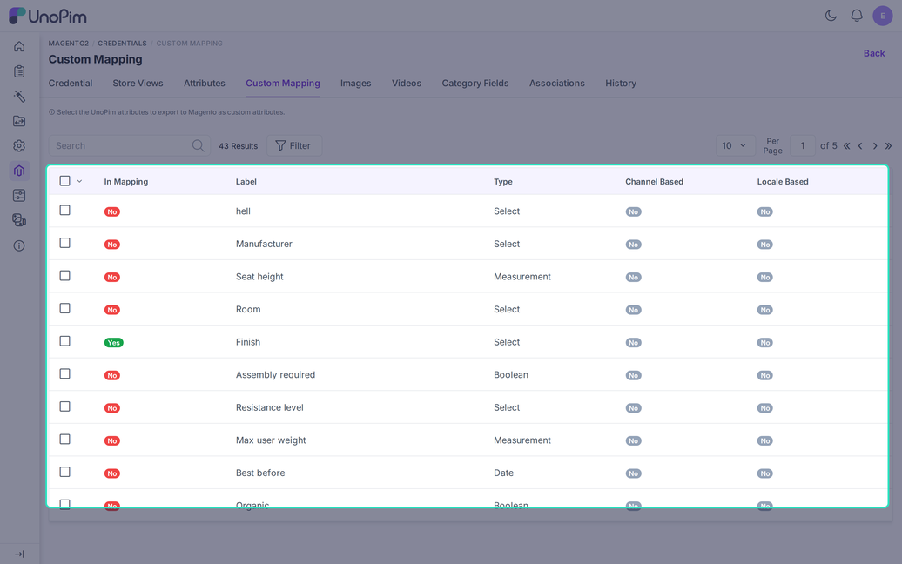

# Custom Mapping

The **Custom Mapping** tab picks the UnoPim attributes that the connector sends to Magento as custom attributes. Use it for product data that is not one of the standard Magento fields, such as material, manufacturer, or finish.

Open it from **Magento2 > Credentials**, click a credential, then choose **Custom Mapping**.

## What the Grid Shows

Every UnoPim attribute that can be exported appears as one row.

| Column | Meaning |
|---|---|
| **In Mapping** | `Yes` when the attribute is already part of the mapping. |
| **Label** and **Code** | The attribute name and its code in UnoPim. |
| **Type** | The UnoPim attribute type. |
| **Channel Based** and **Locale Based** | Whether the value changes by channel or locale. |

Use the search box and **Filter** to find an attribute. The grid hides attributes that are already mapped on the **Attributes** tab or that Magento reserves.

## Add or Remove Attributes

1. Tick the rows you want. Use the box in the header to select a whole page.
2. Open the mass action menu and choose **Update Mapping**.
3. Choose **Add to mapping** or **Remove from mapping**.

UnoPim reports how many rows it changed and how many it skipped, for example "3 attribute(s) added to the mapping, 1 skipped". A row is skipped if its type cannot be exported or its code is reserved.

## Supported Attribute Types

These types can be sent as Magento custom attributes:

- Text and Textarea
- Price
- Boolean
- Select, Multiselect, and Checkbox
- Date and Datetime
- Measurement

Image and gallery attributes are not allowed here. Use [Image Mapping](./image-mapping) for them.

## Where the Mapping Is Used

- **Magento Product exports** send the mapped values as custom attributes.
- **Magento Attribute export** creates the mapped attributes in Magento when you do not pick attributes in the job.
- **Magento Attribute Set export** assigns the mapped attributes to the attribute set.

## Variant Attributes

For a configurable product, add every attribute that makes up a variant, such as **color** or **size**. If one is missing, the variants are skipped and the log shows "Variants skipped: the configurable attributes are not mapped".

## Good to Know

- Select and multiselect values need an option ID from Magento. Run the [attribute export](./export-attribute) before the product export.
- A value that cannot be converted is not sent. The log names the attribute, for example "Attribute `finish` was not sent".
- A multiselect value is joined with a pipe (`|`) in the CSV export.
