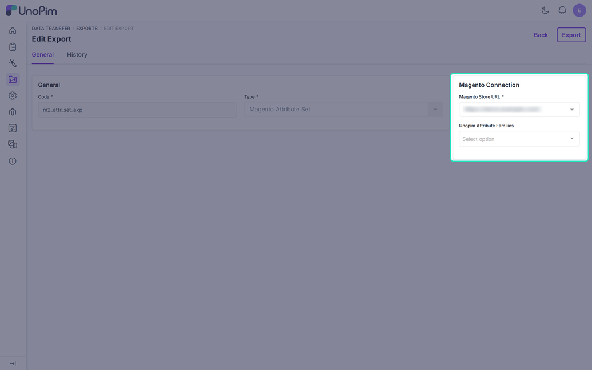

# Export Magento Attribute Set

The **Magento Attribute Set** job sends UnoPim attribute families to Magento as attribute sets. It also creates the attribute groups and assigns attributes to them.

Run the [attribute export](./export-attribute) first. An attribute that does not exist in Magento yet cannot be assigned.

## Before You Start

Magento builds a new attribute set from an existing one. Open the credential and set **Export Attribute Families Based on** to the Magento set you want to copy. If it is empty, the job is skipped. See [Setup Credentials](./setup-credentials).

## Create the Job

Go to **Data Transfer > Exports > Create Export** and choose **Magento Attribute Set** as the **Type**. Enter a unique **Code**.

| Filter | Required | What it does |
|---|---|---|
| **Magento Store URL** | Yes | The credential to export to. |
| **Unopim Attribute Families** | No | The families to export. Leave empty to export all. |

Click **Save**, then **Export**.

## What the Job Does

- Creates a Magento attribute set for each family, copied from the base set.
- Creates the attribute groups that exist in the UnoPim family.
- Assigns attributes that are on the [Custom Mapping](./custom-mapping) tab and not yet in the base set.

Image and gallery attributes are left out. Use [Image Mapping](./image-mapping) for those.

## Messages You May See

- "Run the Magento Attribute Job first": an attribute is missing in Magento.
- "This attribute set cannot be updated": the name is already used by another set in Magento. The message includes Magento's reply.
- A hint after each run reminds you to add missing attributes to the mapping and run the attribute export again.

## After the Run

Open **Stores > Attributes > Attribute Set** in Magento and check the new sets and groups. Then run the [product export](./export-product), so each product lands in the right set.
